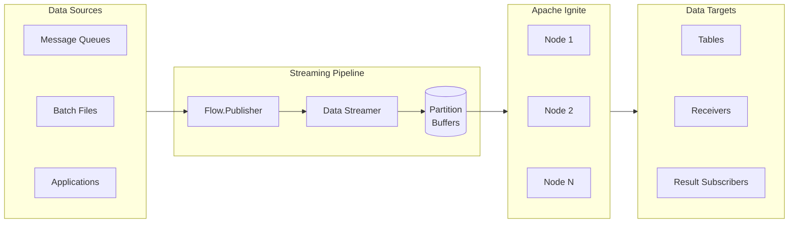
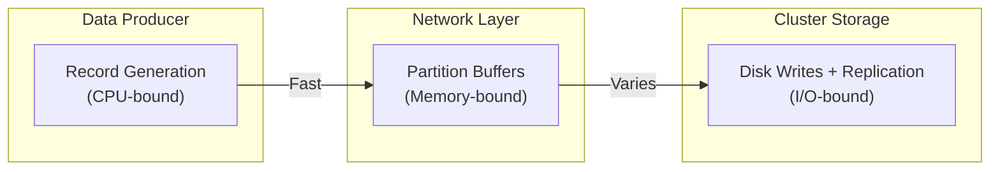
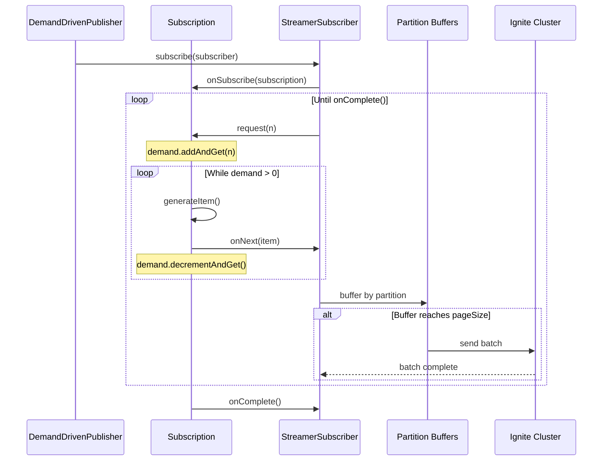
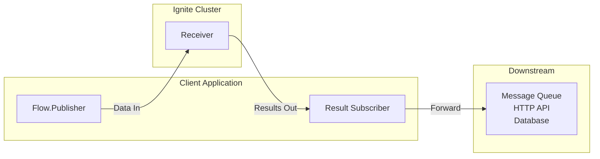

import Tabs from '@theme/Tabs';
import TabItem from '@theme/TabItem';

Apache Ignite는 데이터를 받는 쪽이자 데이터 소스로서 스트리밍 아키텍처에 참여합니다. Data Streamer API는 임의의 Java Flow 발행자로부터 항목을 받아 키로 파티셔닝한 뒤, 처리를 위해 클러스터 노드에 묶어서 전달합니다. 데이터를 테이블로 스트리밍하거나, 수신기로 데이터를 변환하고 여러 테이블로 라우팅하거나, 계산 결과를 다운스트림 시스템으로 반환할 수 있습니다.



데이터 스트리밍은 최소 한 번 전달(at-least-once) 보장을 제공합니다. 정상 동작 시 각 항목은 정확히 한 번 전달됩니다. 묶음(batch)이 실패해 재시도되면, 그 묶음의 일부 항목이 다시 전달될 수 있습니다. 멱등 연산(upsert)을 사용하거나 안전하게 다시 삽입할 수 있는 기본 키를 사용하여, 중복 가능성을 처리하도록 데이터 모델을 설계하세요.

## Data Streamer API 사용 {#using-data-streamer-api}

[Data Streamer API](../../api-reference/native-clients/java/data-streamer-api)는 Java Flow API(`java.util.concurrent.Flow`)의 발행자-구독자(publisher-subscriber) 모델을 사용합니다. 데이터 항목을 테이블 뷰로 스트리밍하는 발행자를 만들면, 스트리머가 이 항목을 클러스터 전체에 분산합니다. `DataStreamerOptions` 객체는 묶음 크기, 병렬성, 자동 플러시 간격, 재시도 한도를 구성합니다.

### 데이터 스트리머 구성 {#configuring-data-streamer}

`DataStreamerOptions`는 데이터가 클러스터로 흘러 들어가는 방식을 제어합니다.

<Tabs>
<TabItem value="java" label="Java">

```java
DataStreamerOptions options = DataStreamerOptions.builder()
    .pageSize(1000)
    .perPartitionParallelOperations(1)
    .autoFlushInterval(5000)
    .retryLimit(16)
    .build();
```

</TabItem>
<TabItem value="dotnet" label=".NET">

```csharp
var options = new DataStreamerOptions
{
    PageSize = 1000,
    RetryLimit = 16,
    AutoFlushInterval = TimeSpan.FromSeconds(5)
};
```

</TabItem>
</Tabs>

| 옵션 | 기본값 | 설명 |
|--------|---------|-------------|
| `pageSize` | 1000 | 클러스터로 전송되는 묶음당 항목 수. |
| `perPartitionParallelOperations` | 1 | 파티션당 허용되는 동시 묶음 수. |
| `autoFlushInterval` | 5000 ms | 완성되지 않은 버퍼가 플러시되기까지의 시간. |
| `retryLimit` | 16 | 실패한 제출에 대한 최대 재시도 횟수. |

#### 메모리와 처리량 고려 사항 {#memory-and-throughput-considerations}

스트리머는 이 설정에 따라 버퍼를 할당합니다. 파티션당 클라이언트 메모리 사용량은 다음과 같습니다.

```text
memoryPerPartition = pageSize × perPartitionParallelOperations × avgRecordSize
```

파티션 25개, 평균 레코드 크기 1KB인 테이블의 경우:

| 구성 | 페이지 크기 | 병렬 연산 | 메모리 |
|---------------|-----------|--------------|--------|
| 기본값 | 1,000 | 1 | ~25 MB |
| 고처리량 | 500 | 8 | ~100 MB |

페이지 크기가 작고 병렬성이 높으면 더 자주, 더 작은 묶음이 만들어집니다. 이렇게 하면 클러스터의 체크포인트·복제 주기와 맞물리는 더 매끄러운 I/O 패턴이 나타납니다.

### 데이터 스트리밍 {#streaming-data}

각 항목은 스트리밍하기 전에 `DataStreamerItem<T>`로 감싸야 합니다.

- `DataStreamerItem.of(entry)`는 upsert를 수행합니다. 키가 없으면 항목을 삽입하고, 키가 이미 있으면 갱신합니다.
- `DataStreamerItem.removed(entry)`는 키로 항목을 삭제합니다. 항목 객체는 기본 키 필드만 포함하면 됩니다.

아래 예시는 `SubmissionPublisher`를 사용해 계정 레코드를 스트리밍합니다.

<Tabs>
<TabItem value="java" label="Java">

```java
public class DataStreamerExample {
    private static final int ACCOUNTS_COUNT = 1000;

    public static void main(String[] args) throws Exception {
        try (IgniteClient client = IgniteClient.builder()
                .addresses("127.0.0.1:10800")
                .build()) {
            RecordView<Account> view = client.tables().table("accounts").recordView(Account.class);

            streamAccountDataPut(view);
            streamAccountDataRemove(view);
        }
    }

    private static void streamAccountDataPut(RecordView<Account> view) {
        DataStreamerOptions options = DataStreamerOptions.builder()
                .pageSize(1000)
                .perPartitionParallelOperations(1)
                .autoFlushInterval(5000)
                .retryLimit(16)
                .build();

        CompletableFuture<Void> streamerFut;
        try (var publisher = new SubmissionPublisher<DataStreamerItem<Account>>()) {
            streamerFut = view.streamData(publisher, options);
            ThreadLocalRandom rnd = ThreadLocalRandom.current();
            for (int i = 0; i < ACCOUNTS_COUNT; i++) {
                Account entry = new Account(i, "name" + i, rnd.nextLong(100_000), rnd.nextBoolean());
                publisher.submit(DataStreamerItem.of(entry));
            }
        }
        streamerFut.join();
    }

    private static void streamAccountDataRemove(RecordView<Account> view) {
        DataStreamerOptions options = DataStreamerOptions.builder()
                .pageSize(1000)
                .perPartitionParallelOperations(1)
                .autoFlushInterval(5000)
                .retryLimit(16)
                .build();

        CompletableFuture<Void> streamerFut;
        try (var publisher = new SubmissionPublisher<DataStreamerItem<Account>>()) {
            streamerFut = view.streamData(publisher, options);
            for (int i = 0; i < ACCOUNTS_COUNT; i++) {
                Account entry = new Account(i);
                publisher.submit(DataStreamerItem.removed(entry));
            }
        }
        streamerFut.join();
    }
}
```

</TabItem>
<TabItem value="dotnet" label=".NET">

```csharp
using Apache.Ignite;
using Apache.Ignite.Table;

using var client = await IgniteClient.StartAsync(new("localhost"));
ITable? table = await client.Tables.GetTableAsync("accounts");
IRecordView<Account> view = table!.GetRecordView<Account>();

var options = new DataStreamerOptions
{
    PageSize = 10_000,
    AutoFlushInterval = TimeSpan.FromSeconds(1),
    RetryLimit = 32
};

await view.StreamDataAsync(GetAccountsToAdd(5_000), options);
await view.StreamDataAsync(GetAccountsToRemove(1_000), options);

async IAsyncEnumerable<DataStreamerItem<Account>> GetAccountsToAdd(int count)
{
    for (int i = 0; i < count; i++)
    {
        yield return DataStreamerItem.Create(
            new Account(i, $"Account {i}"));
    }
}

async IAsyncEnumerable<DataStreamerItem<Account>> GetAccountsToRemove(int count)
{
    for (int i = 0; i < count; i++)
    {
        yield return DataStreamerItem.Create(
            new Account(i, string.Empty), DataStreamerOperationType.Remove);
    }
}

public record Account(int Id, string Name);
```

</TabItem>
</Tabs>

## 대용량 스트리밍 {#high-volume-streaming}

위의 기본 예시는 중간 규모의 데이터 양에서는 잘 동작합니다. 수백만 개의 레코드를 스트리밍할 때는, 애플리케이션이 데이터를 생성하는 속도가 클러스터가 이를 영속화하는 속도를 대개 앞지릅니다. 이 섹션에서는 메모리를 제한된 범위로 유지하고 클러스터 부하를 안정적으로 유지하는 흐름 제어 메커니즘을 다룹니다.

### 배압 이해하기 {#understanding-backpressure}

배압(backpressure)은 느린 받는 쪽이 빠른 생산자에게 속도를 늦추라고 신호를 보낼 수 있게 하는 흐름 제어 메커니즘입니다. 배압이 없으면 빠른 생산자가 느린 받는 쪽을 압도하여 메모리가 무한정 늘거나 지연이 커지거나 데이터가 유실됩니다.

데이터 스트리밍에서는 세 컴포넌트가 서로 다른 속도로 동작합니다.



- **레코드 생성**은 CPU 속도로 실행되며, 초당 수백만 개의 레코드에 이를 수 있습니다
- **네트워크 전송**은 대역폭과 묶음 크기에 좌우됩니다
- **클러스터 스토리지**는 디스크 쓰기, 복제, 합의 프로토콜을 수반합니다

Java Flow API는 요청 기반 모델로 배압을 제공합니다. 받는 쪽(데이터 스트리머)은 `subscription.request(n)`을 호출하여 받아들일 수 있는 항목 수를 생산자(사용자의 발행자)에게 정확히 알려 줍니다. 생산자는 최대 `n`개 항목을 전달한 뒤 다음 요청을 기다려야 합니다. 이렇게 하면 가장 느린 컴포넌트가 전체 속도를 제어하는 풀 기반(pull-based) 흐름이 만들어집니다.

스트리머의 파티션 버퍼가 가득 차면 스트리머는 `request(n)` 호출을 멈춥니다. 잘 동작하는 발행자는 다음 요청이 올 때까지 생성을 일시 중지합니다. 이렇게 하면 메모리가 제한된 범위로 유지되고, 생산자가 다운스트림 컴포넌트를 압도하지 못하게 막습니다.

### 발행자 방식 선택 {#choosing-a-publisher-approach}

발행자가 배압 신호에 어떻게 반응하는지에 따라 메모리 사용량과 클러스터 부하 패턴이 결정됩니다. 흔히 쓰이는 방식은 두 가지입니다.

**SubmissionPublisher**(위 기본 예시에 나옴)는 내부 버퍼(기본 256개 항목)를 갖춘 기성 구현을 제공합니다. 레코드는 `submit()`으로 이 버퍼에 들어가고, 스트리머가 버퍼에서 가져옵니다. 버퍼가 가득 차면 `submit()`은 공간이 생길 때까지 블로킹됩니다. 이는 블로킹으로 배압을 제공하며, 데이터 소스가 일시 중지를 견딜 수 있을 때 잘 동작합니다.

**수요 기반 발행자**는 스트리머가 `request(n)`으로 요청할 때만 레코드를 생성합니다. 가득 찬 버퍼에서 블로킹하는 대신, 수요가 0이 되면 생성이 그냥 멈추고 새 요청이 오면 다시 시작됩니다. 이 방식은 `Flow.Publisher`와 `Flow.Subscription`을 구현해야 하지만, 데이터가 생성되는 시점을 정밀하게 제어할 수 있습니다.

| 고려 사항 | SubmissionPublisher | 수요 기반 발행자 |
|---------------|---------------------|------------------------|
| 배압 반응 | 버퍼가 가득 차면 `submit()`이 블로킹됨 | 수요가 0이면 생성이 멈춤 |
| 메모리 특성 | 발행자 버퍼 + 파티션 버퍼 | 파티션 버퍼만 |
| 구현 노력 | 최소(JDK 제공) | 커스텀 구현 필요 |
| 사용 사례 | 기존 데이터 소스, 중간 규모 | 합성 데이터, 대용량, 제어된 생성 |

기존 컬렉션이나 외부 데이터 소스에서 스트리밍할 때는 `SubmissionPublisher`가 단순합니다. 수백만 개의 레코드를 생성하거나 변환할 때는, 수요 기반 발행자가 클러스터가 받아들일 준비가 됐을 때만 데이터를 만들어 예측 가능한 메모리 사용량을 제공합니다.

### Flow API 핸드셰이크 {#flow-api-handshake}

스트리밍 라이프사이클은 다음 순서를 따릅니다.

1. `view.streamData(publisher, options)`가 스트리밍을 시작합니다
2. 스트리머가 `publisher.subscribe(subscriber)`를 호출합니다
3. 발행자가 `subscriber.onSubscribe(subscription)`을 호출합니다
4. 스트리머가 항목을 받을 준비가 되면 `subscription.request(n)`을 호출합니다
5. 발행자가 `n`개 항목을 생성하고 각각에 대해 `subscriber.onNext(item)`을 호출합니다
6. 4~5단계는 발행자가 `subscriber.onComplete()`를 호출할 때까지 반복됩니다

스트리머는 요청할 항목 수를 다음과 같이 계산합니다.

```text
desiredInFlight = Math.max(1, buffers.size()) × pageSize × perPartitionParallelOperations
toRequest = desiredInFlight - inFlight - pending
```

`toRequest`가 0이거나 음수이면, 스트리머는 더 이상 항목을 요청하지 않는 방식으로 배압을 적용합니다.

### 수요 기반 발행자 {#demand-driven-publisher}

수요 기반 발행자는 제어 흐름을 뒤집습니다. 레코드를 버퍼에 밀어 넣고 공간을 기다리는 대신, 발행자는 스트리머가 레코드를 요청하기를 기다렸다가 필요할 때 생성합니다. 이를 위해 두 인터페이스를 구현해야 합니다.

- **`Flow.Publisher<T>`**: 구독자를 받아 구독을 만드는 외부 클래스
- **`Flow.Subscription`**: 수요를 추적하고 항목을 전달하는 내부 클래스

구독은 남은 수요를 나타내는 `AtomicLong` 카운터를 유지합니다. 스트리머가 `request(n)`을 호출하면, 구독은 카운터를 늘리고 전달을 시작합니다. `onNext()` 호출마다 카운터가 줄어듭니다. 수요가 0에 도달하면, 발행자는 다음 `request(n)` 호출이 올 때까지 일시 중지합니다.



다음 구현은 이 패턴을 보여줍니다.

<Tabs>
<TabItem value="java" label="Java">

```java
public class DemandDrivenPublisher implements Flow.Publisher<DataStreamerItem<Tuple>> {

    private final long totalRecords;
    private final AtomicBoolean subscribed = new AtomicBoolean(false);

    public DemandDrivenPublisher(long totalRecords) {
        this.totalRecords = totalRecords;
    }

    @Override
    public void subscribe(Flow.Subscriber<? super DataStreamerItem<Tuple>> subscriber) {
        // Flow.Publisher allows only one subscriber
        if (subscribed.compareAndSet(false, true)) {
            subscriber.onSubscribe(new DemandDrivenSubscription(subscriber));
        } else {
            subscriber.onError(new IllegalStateException("Publisher already has a subscriber"));
        }
    }

    private class DemandDrivenSubscription implements Flow.Subscription {
        private final Flow.Subscriber<? super DataStreamerItem<Tuple>> subscriber;
        private final AtomicLong demand = new AtomicLong(0);
        private final AtomicLong generated = new AtomicLong(0);
        private final AtomicBoolean cancelled = new AtomicBoolean(false);

        DemandDrivenSubscription(Flow.Subscriber<? super DataStreamerItem<Tuple>> subscriber) {
            this.subscriber = subscriber;
        }

        @Override
        public void request(long n) {
            if (n <= 0 || cancelled.get()) {
                return;
            }
            // Accumulate demand from streamer
            demand.addAndGet(n);
            deliverItems();
        }

        @Override
        public void cancel() {
            cancelled.set(true);
        }

        private void deliverItems() {
            // Generate items only while demand exists
            while (demand.get() > 0 && !cancelled.get()) {
                long index = generated.get();

                if (index >= totalRecords) {
                    // Signal completion when all records are generated
                    subscriber.onComplete();
                    return;
                }

                // Generate record on-demand (replace with your data source)
                Tuple tuple = Tuple.create()
                    .set("id", index)
                    .set("data", "Record " + index);

                subscriber.onNext(DataStreamerItem.of(tuple));
                generated.incrementAndGet();
                demand.decrementAndGet();
            }
            // Loop exits when demand reaches zero; publisher pauses until next request(n)
        }
    }
}
```

</TabItem>
</Tabs>

발행자를 `streamData`와 함께 사용합니다.

<Tabs>
<TabItem value="java" label="Java">

```java
RecordView<Tuple> view = client.tables().table("records").recordView();

DataStreamerOptions options = DataStreamerOptions.builder()
    .pageSize(500)
    .perPartitionParallelOperations(8)
    .autoFlushInterval(1000)
    .build();

DemandDrivenPublisher publisher = new DemandDrivenPublisher(20_000_000);
CompletableFuture<Void> streamFuture = view.streamData(publisher, options);
streamFuture.join();
```

</TabItem>
</Tabs>

### 구성 튜닝 {#configuration-tuning}

`pageSize`와 `perPartitionParallelOperations` 설정은 묶음 크기와 동시성을 제어합니다. 이 둘의 상호작용은 처리량과 클러스터 부하에 영향을 줍니다.

| 구성 | 동작 | 절충 |
|---------------|----------|----------|
| `pageSize`가 크고 병렬성이 낮음(예: 1000 × 1) | 더 적고 큰 묶음 | 네트워크 오버헤드는 낮지만 I/O가 고르지 않음 |
| `pageSize`가 작고 병렬성이 높음(예: 500 × 8) | 더 자주, 더 작은 묶음 | 네트워크 오버헤드는 높지만 I/O가 더 안정적 |

클러스터 노드는 주기적으로 데이터를 디스크로 플러시하고 복제본을 동기화합니다. 묶음 크기와 타이밍은 스트리밍이 이러한 작업과 상호작용하는 방식에 영향을 줄 수 있습니다. 클러스터의 성능 메트릭을 모니터링하고 관찰된 동작을 바탕으로 설정을 조정하세요.

## 결과를 밖으로 스트리밍 {#streaming-results-out}

앞 섹션에서는 Ignite 테이블로 데이터를 스트리밍하는 방법을 다뤘습니다. 데이터를 Ignite로 통과시켜 결과를 다운스트림 시스템으로 전달하려면, 수신기와 결과 구독자를 함께 사용합니다. 수신기는 들어오는 묶음을 클러스터 노드에서 처리하고, 다음 파이프라인 단계로 전달되도록 애플리케이션으로 되돌아오는 결과를 반환합니다.

수신기는 클라이언트가 아니라 클러스터 노드에서 실행됩니다. 수신기 클래스는 스트리밍을 시작하기 전에 모든 클러스터 노드에 배포되어 있어야 합니다. 배포 옵션은 [코드 배포](./code-deployment)를 참고하세요.

결과 전달은 입력 스트리밍과 다릅니다. 스트리머는 결과 구독자의 `subscription.request(n)`에서 오는 배압 신호를 따르지 않습니다. 구독자가 항목을 몇 개 요청하든 상관없이, 결과는 클러스터가 생성하는 속도만큼 빠르게 도착합니다. 구독자는 블로킹 없이 결과를 처리하거나, 다운스트림 시스템이 클러스터보다 느릴 때는 결과를 내부에 버퍼링해야 합니다.



### 수신기 이해하기 {#understanding-receivers}

수신기는 세 타입 매개변수로 `DataStreamerReceiver<T, A, R>`를 구현합니다.

- **T**(페이로드 타입): 처리를 위해 클러스터 노드로 전송되는 데이터 타입
- **A**(인수 타입): 모든 수신기 호출에 전달되는 선택적 매개변수
- **R**(결과 타입): 클러스터 노드에서 구독자로 반환되는 데이터 타입

수신기의 `receive()` 메서드는 클라이언트가 아니라 클러스터 노드에서 실행됩니다. 각 호출은 같은 파티션을 공유하는 항목 묶음을 받아, 데이터 로컬 연산을 가능하게 합니다. 이 메서드는 처리한 각 항목의 결과를 담은 `CompletableFuture<List<R>>`를 반환하며, 결과가 필요 없으면 `null`을 반환합니다.

`DataStreamerReceiverContext` 매개변수는 수신기 안에서 Ignite API에 접근할 수 있게 합니다. `ctx.ignite()`로 테이블에 접근하거나, SQL을 실행하거나, 처리 중 다른 클러스터 작업을 수행하세요.

### 보강 예시 {#enrichment-example}

다음 예시는 데이터가 Ignite를 통과하는 흐름을 보여줍니다. 계정 이벤트가 스트림에 들어와 클러스터 노드에서 처리 메타데이터를 받고, 다운스트림 시스템으로 이어집니다. 이는 앞 섹션의 계정 스트리밍 예시를 보완합니다.

#### 1단계: 보강 수신기 만들기 {#step-1-create-an-enrichment-receiver}

수신기는 처리 메타데이터를 추가하여 들어오는 각 레코드를 변환합니다. 이 패턴은 타임스탬프 추가, 관련 데이터 조회, 클러스터 상태 대조 검증, 파생 필드 계산 등 모든 보강 시나리오에 적용됩니다.

수신기 클래스는 스트리밍을 시작하기 전에 모든 클러스터 노드에 배포되어 있어야 합니다. 스트리머가 노드로 묶음을 보내면, 그 노드는 수신기 클래스를 인스턴스화하고 그 `receive()` 메서드를 호출합니다.

<Tabs>
<TabItem value="java" label="Java">

```java
public class EnrichmentReceiver implements DataStreamerReceiver<Tuple, Void, Tuple> {
    @Override
    public CompletableFuture<List<Tuple>> receive(
            List<Tuple> page,
            DataStreamerReceiverContext ctx,
            Void arg) {

        String nodeName = ctx.ignite().name();
        Instant processedAt = Instant.now();

        List<Tuple> enriched = new ArrayList<>(page.size());

        for (Tuple item : page) {
            Tuple result = Tuple.create()
                .set("accountId", item.intValue("accountId"))
                .set("eventType", item.stringValue("eventType"))
                .set("amount", item.longValue("amount"))
                .set("processedAt", processedAt.toString())
                .set("processedBy", nodeName);

            enriched.add(result);
        }

        return CompletableFuture.completedFuture(enriched);
    }
}
```

</TabItem>
<TabItem value="dotnet" label=".NET">

```csharp
public class EnrichmentReceiver : IDataStreamerReceiver<IIgniteTuple, object?, IIgniteTuple>
{
    public ValueTask<IList<IIgniteTuple>?> ReceiveAsync(
        IList<IIgniteTuple> page,
        object? arg,
        IDataStreamerReceiverContext context,
        CancellationToken cancellationToken)
    {
        var nodeName = context.Ignite.Name;
        var processedAt = DateTime.UtcNow;

        var enriched = new List<IIgniteTuple>(page.Count);

        foreach (var item in page)
        {
            var result = new IgniteTuple
            {
                ["accountId"] = item["accountId"],
                ["eventType"] = item["eventType"],
                ["amount"] = item["amount"],
                ["processedAt"] = processedAt.ToString("O"),
                ["processedBy"] = nodeName
            };

            enriched.Add(result);
        }

        return ValueTask.FromResult<IList<IIgniteTuple>?>(enriched);
    }
}
```

</TabItem>
</Tabs>

#### 2단계: 전달 구독자 만들기 {#step-2-create-a-forwarding-subscriber}

결과 구독자는 클러스터 노드에서 돌아오는 보강된 레코드를 받습니다. 스트리머는 결과 측 배압을 무시하므로, 구독자는 들어오는 결과를 따라잡거나 내부에 버퍼링해야 합니다.

이 구독자는 흔한 패턴을 구현합니다. 즉, 묶음 임계값에 도달할 때까지 들어오는 결과를 버퍼링한 뒤, 그 묶음을 다운스트림 시스템으로 전달합니다. 묶어서 처리하면 다운스트림 작업(네트워크 호출, 디스크 쓰기)의 비용이 여러 레코드에 분산됩니다.

`onSubscribe()` 메서드는 배압 신호가 결과 전달에 영향을 주지 않으므로 `Long.MAX_VALUE`개 항목을 요청합니다. `onNext()` 메서드는 결과를 누적하고 버퍼가 가득 차면 플러시합니다. `onComplete()`와 `onError()` 메서드는 스트림이 끝나기 전에 버퍼에 남은 항목을 플러시합니다.

<Tabs>
<TabItem value="java" label="Java">

```java
class ForwardingSubscriber implements Flow.Subscriber<Tuple> {
    private final int batchSize;
    private final List<Tuple> buffer;
    private final Consumer<List<Tuple>> downstream;

    ForwardingSubscriber(Consumer<List<Tuple>> downstream, int batchSize) {
        this.downstream = downstream;
        this.batchSize = batchSize;
        this.buffer = new ArrayList<>(batchSize);
    }

    @Override
    public void onSubscribe(Flow.Subscription subscription) {
        subscription.request(Long.MAX_VALUE);
    }

    @Override
    public void onNext(Tuple item) {
        buffer.add(item);

        if (buffer.size() >= batchSize) {
            downstream.accept(new ArrayList<>(buffer));
            buffer.clear();
        }
    }

    @Override
    public void onError(Throwable throwable) {
        if (!buffer.isEmpty()) {
            downstream.accept(new ArrayList<>(buffer));
            buffer.clear();
        }
    }

    @Override
    public void onComplete() {
        if (!buffer.isEmpty()) {
            downstream.accept(new ArrayList<>(buffer));
            buffer.clear();
        }
    }
}
```

</TabItem>
<TabItem value="dotnet" label=".NET">

.NET에서는 `IAsyncEnumerable` 패턴이 결과를 자연스럽게 순회하도록 해줍니다. 버퍼링은 인라인으로 구현할 수 있습니다.

```csharp
var buffer = new List<IIgniteTuple>(batchSize);

await foreach (IIgniteTuple result in results)
{
    buffer.Add(result);

    if (buffer.Count >= batchSize)
    {
        await downstream.SendBatchAsync(buffer);
        buffer.Clear();
    }
}

if (buffer.Count > 0)
{
    await downstream.SendBatchAsync(buffer);
}
```

</TabItem>
</Tabs>

#### 3단계: 파이프라인 연결 {#step-3-wire-the-pipeline}

수신기용 `streamData()` 오버로드는 데이터가 파이프라인을 통과하는 방식을 제어하는 추가 매개변수를 받습니다.

| 매개변수 | 용도 |
|-----------|---------|
| `publisher` | 입력 데이터의 소스(사용자의 `Flow.Publisher` 또는 `SubmissionPublisher`) |
| `receiverDesc` | 수신기 클래스와 배포 단위를 식별하는 디스크립터 |
| `keyFunc` | 파티션 라우팅을 위해 각 입력 항목에서 키를 추출 |
| `payloadFunc` | 입력 항목을 수신기가 기대하는 페이로드 타입으로 변환 |
| `receiverArg` | 모든 수신기 호출에 전달되는 선택적 인수 |
| `resultSubscriber` | 수신기가 반환하는 결과를 받음(결과가 필요 없으면 `null` 가능) |
| `options` | 스트리밍 구성(묶음 크기, 병렬성, 플러시 간격) |

`keyFunc`는 각 항목을 어느 클러스터 노드가 처리할지 결정합니다. 키가 같은 파티션으로 해시되는 항목은 함께 묶여 그 파티션의 프라이머리 노드로 전송됩니다. 이렇게 하면 수신기가 같은 파티셔닝 방식을 공유하는 테이블에 접근할 때 데이터 로컬 연산이 가능해집니다.

`payloadFunc`는 키 추출 관심사를 수신기로 전송되는 데이터에서 분리합니다. 입력 항목에는 라우팅에만 쓰이는 필드가 있을 수 있는 반면, 수신기는 다른 형태를 필요로 할 수 있습니다. 입력 타입과 페이로드 타입이 같으면 `Function.identity()`를 사용하세요.

<Tabs>
<TabItem value="java" label="Java">

```java
// Source: account events from your data source
List<Tuple> accountEvents = List.of(
    Tuple.create().set("accountId", 1).set("eventType", "deposit").set("amount", 500L),
    Tuple.create().set("accountId", 2).set("eventType", "withdrawal").set("amount", 200L),
    Tuple.create().set("accountId", 3).set("eventType", "transfer").set("amount", 1000L)
);

// Downstream: where enriched events go next
Consumer<List<Tuple>> downstream = batch -> {
    // Send to Kafka, HTTP endpoint, another database, etc.
    messageBroker.send("enriched-events", batch);
};

// Configure receiver
DataStreamerReceiverDescriptor<Tuple, Void, Tuple> receiverDesc =
    DataStreamerReceiverDescriptor.builder(EnrichmentReceiver.class).build();

// Configure subscriber
ForwardingSubscriber resultSubscriber = new ForwardingSubscriber(downstream, 100);

// Use accounts table for partition routing
RecordView<Tuple> accountsView = client.tables().table("accounts").recordView();

Function<Tuple, Tuple> keyFunc = event -> Tuple.create().set("id", event.intValue("accountId"));
Function<Tuple, Tuple> payloadFunc = Function.identity();

// Stream data through Ignite
try (var publisher = new SubmissionPublisher<Tuple>()) {
    CompletableFuture<Void> streamFuture = accountsView.streamData(
        publisher,
        receiverDesc,
        keyFunc,
        payloadFunc,
        null,
        resultSubscriber,
        DataStreamerOptions.DEFAULT
    );

    accountEvents.forEach(publisher::submit);
}

streamFuture.join();
```

</TabItem>
<TabItem value="dotnet" label=".NET">

```csharp
// Source: account events from your data source
async IAsyncEnumerable<IIgniteTuple> GetAccountEvents()
{
    yield return new IgniteTuple
        { ["accountId"] = 1, ["eventType"] = "deposit", ["amount"] = 500L };
    yield return new IgniteTuple
        { ["accountId"] = 2, ["eventType"] = "withdrawal", ["amount"] = 200L };
    yield return new IgniteTuple
        { ["accountId"] = 3, ["eventType"] = "transfer", ["amount"] = 1000L };
}

// Configure receiver
var receiverDesc = ReceiverDescriptor.Of(new EnrichmentReceiver());

// Use accounts table for partition routing
var accountsView = (await client.Tables.GetTableAsync("accounts"))!.RecordBinaryView;

// Stream data through Ignite
IAsyncEnumerable<IIgniteTuple> results = accountsView.StreamDataAsync(
    GetAccountEvents(),
    receiverDesc,
    keySelector: e => new IgniteTuple { ["id"] = e["accountId"] },
    payloadSelector: e => e,
    receiverArg: null
);

// Forward to downstream
var buffer = new List<IIgniteTuple>(100);

await foreach (IIgniteTuple enrichedEvent in results)
{
    buffer.Add(enrichedEvent);

    if (buffer.Count >= 100)
    {
        await messageBroker.SendAsync("enriched-events", buffer);
        buffer.Clear();
    }
}

if (buffer.Count > 0)
{
    await messageBroker.SendAsync("enriched-events", buffer);
}
```

</TabItem>
</Tabs>

### 결과 흐름 관리 {#managing-result-flow}

대용량 스트림에서는 클러스터 노드가 결과를 생성하는 속도가 다운스트림 시스템이 이를 받아들일 수 있는 속도를 앞지를 수 있습니다. 배압 신호가 흐름을 제어하는 입력 스트리밍과 달리, 결과 전달은 구독자의 준비 상태와 상관없이 계속됩니다.

결과 흐름을 관리하려면 다음 패턴을 고려하세요.

- **제한된 큐**: 구독자와 다운스트림 작업 사이에 `BlockingQueue`를 둡니다. 구독자는 큐에 항목을 추가하고(가득 차면 블로킹), 별도 스레드가 다운스트림으로 큐를 비웁니다. 이렇게 하면 클러스터 처리량이 다운스트림 지연과 분리됩니다.

- **비동기 전달**: 다운스트림 클라이언트가 비동기 작업을 지원하면, `CompletableFuture`로 여러 진행 중 요청을 파이프라인 처리하세요. 이렇게 하면 네트워크 지연이 계속되는 결과 처리와 겹쳐집니다.

- **묶음 크기 정렬**: 전달 구독자의 묶음 크기를 다운스트림 시스템의 최적 묶음 크기에 맞추세요. 크기가 어긋나면 작은 작업이 너무 많아지거나, 지나치게 큰 묶음으로 인한 메모리 압박이 발생합니다.

구독자가 처리할 수 있는 속도보다 결과가 빠르게 도착하면, JVM 힙이 소진될 때까지 메모리 사용량이 늘어납니다. 클러스터 출력 대비 결과 처리량을 모니터링하고, 필요에 따라 묶음 크기를 조정하거나 버퍼링을 추가하세요.

## 실패 처리 {#handling-failures}

테이블로 스트리밍하든 수신기로 스트리밍하든, 네트워크 장애, 스키마 불일치, 클러스터 문제로 묶음 처리가 실패할 수 있습니다. 데이터 스트리머는 실패한 묶음을 `retryLimit` 횟수(기본 16회)까지 자동으로 재시도합니다. 모든 재시도를 소진한 항목은 `DataStreamerException`에 수집됩니다.

실패한 항목은 `failedItems()` 메서드로 가져옵니다.

<Tabs>
<TabItem value="java" label="Java">

```java
RecordView<Account> view = client.tables().table("accounts").recordView(Account.class);

List<DataStreamerItem<Account>> failedItems = new ArrayList<>();
CompletableFuture<Void> streamerFut;

try (var publisher = new SubmissionPublisher<DataStreamerItem<Account>>()) {
    streamerFut = view.streamData(publisher, options)
        .exceptionally(e -> {
            if (e.getCause() instanceof DataStreamerException dse) {
                failedItems.addAll(dse.failedItems());
            }
            return null;
        });

    Account entry = new Account(1, "Account name", rnd.nextLong(100_000), rnd.nextBoolean());
    publisher.submit(DataStreamerItem.of(entry));
} catch (DataStreamerException e) {
    failedItems.addAll(e.failedItems());
}

streamerFut.join();

// Handle failed items after streaming completes
if (!failedItems.isEmpty()) {
    // Log failures for investigation
    logger.error("Failed to stream {} items after {} retries",
        failedItems.size(), options.retryLimit());

    // Option 1: Write to dead-letter queue for later processing
    // Option 2: Retry with different options (e.g., smaller batch size)
    // Option 3: Use direct table operations for individual items
}
```

</TabItem>
<TabItem value="dotnet" label=".NET">

```csharp
ITable? table = await Client.Tables.GetTableAsync("my-table");
IRecordView<IIgniteTuple> view = table!.RecordBinaryView;
IList<IIgniteTuple> data = [new IgniteTuple { ["key"] = 1L, ["val"] = "v" }];

try
{
    await view.StreamDataAsync(data.ToAsyncEnumerable());
}
catch (DataStreamerException e)
{
    Console.WriteLine("Failed items: " + string.Join(",", e.FailedItems));

    // Items have exhausted retryLimit attempts
    // Investigate failure cause before retrying
}
```

</TabItem>
</Tabs>

### 지속적인 실패 처리 {#handling-persistent-failures}

항목은 다음과 같은 이유로 재시도를 소진한 뒤 실패합니다.

- **스키마 불일치**: 항목 필드가 테이블 스키마와 일치하지 않음
- **제약 조건 위반**: 중복 키 또는 외래 키 위반
- **클러스터 사용 불가**: 모든 재시도 동안 파티션 리더를 사용할 수 없음

실패한 항목을 재시도하기 전에:

1. 예외 원인을 살펴 실패 사유를 파악합니다
2. 데이터 문제(스키마 불일치, 제약 조건 위반)를 해결합니다
3. 실패가 사용 불가로 인한 것이면 클러스터 상태를 확인합니다
4. 실패한 항목이 적을 때는 스트리머를 다시 시작하기보다 직접 테이블 작업(`upsert`, `insert`)을 사용하는 것을 고려합니다

## 플러시 동작 튜닝 {#tuning-flush-behavior}

`autoFlushInterval` 설정(기본 5000ms)은 스트리머가 완성되지 않은 묶음을 보내기 전에 얼마나 기다릴지를 제어합니다. 이는 두 가지 시나리오를 해결합니다.

- **느린 데이터 소스**: 발행자가 데이터를 느리게 생성하면, 버퍼가 적절한 시간 안에 `pageSize`까지 차지 않을 수 있습니다. 자동 플러시는 완전한 묶음을 기다리지 않고도 데이터가 클러스터에 도달하도록 보장합니다.
- **고르지 않은 파티션 분포**: 데이터 키가 몇몇 파티션에 몰리면, 일부 파티션 버퍼는 차는 반면 다른 버퍼는 거의 비어 있습니다. 자동 플러시는 천천히 차는 파티션에서 부분 묶음을 보냅니다.

지연에 민감한 워크로드에는 더 짧은 간격을 설정하세요. 지연이 덜 중요한 처리량 중심의 대량 적재에는 더 긴 간격을 설정하거나 `pageSize`를 늘리세요.
