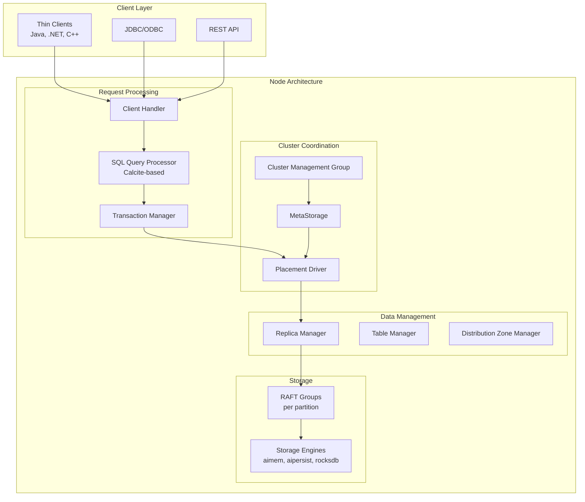
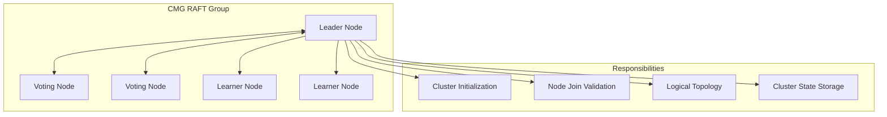
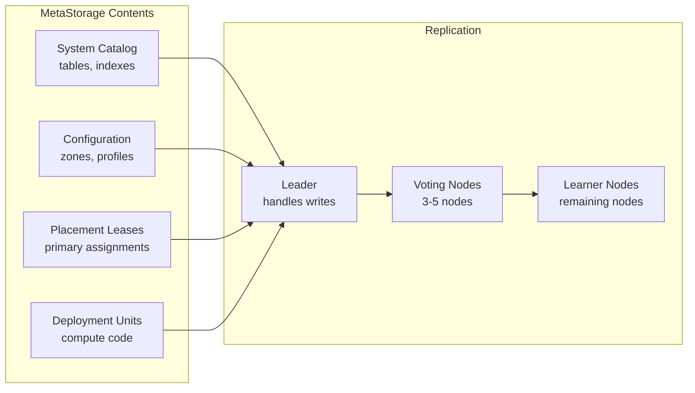
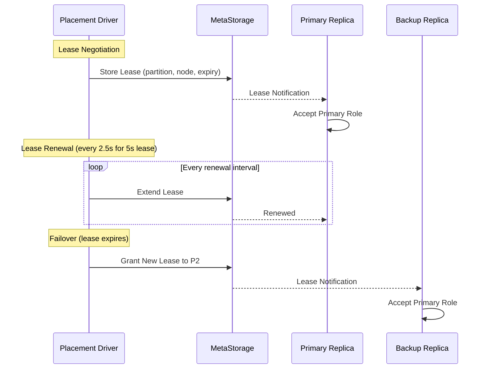
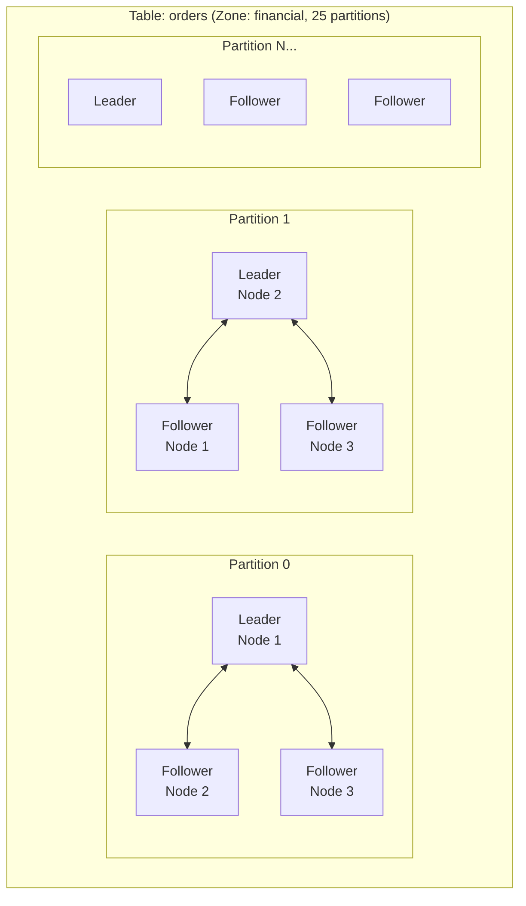
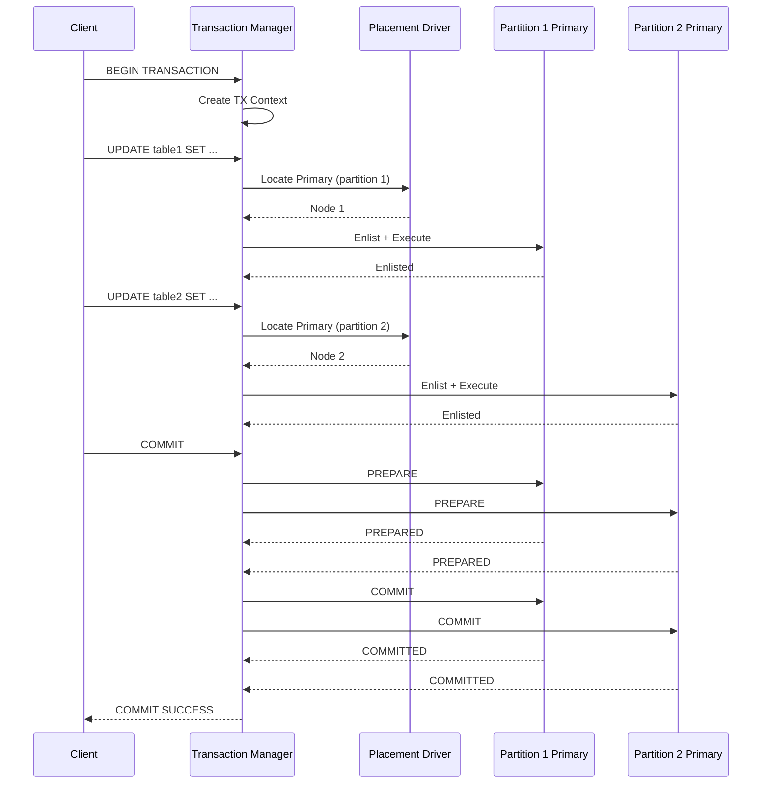
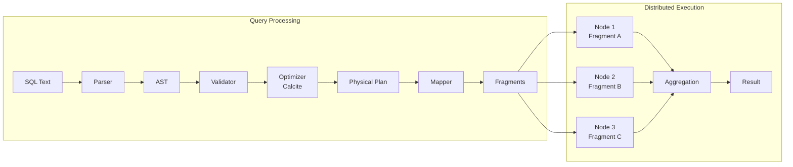
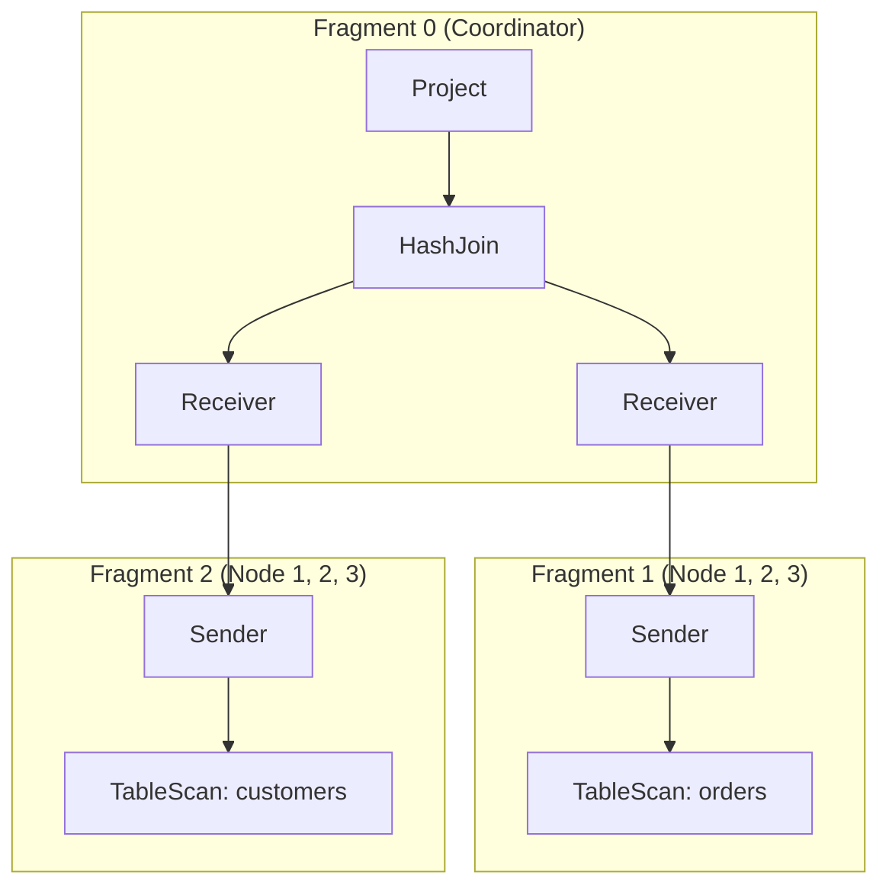
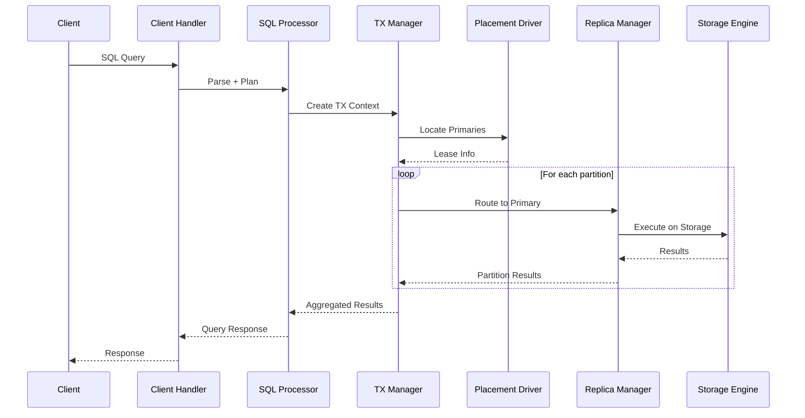

# 아키텍처 개요

Apache Ignite 3은 모듈형 컴포넌트 아키텍처로 구축된 분산 데이터베이스입니다. 모든 노드가 동일한 서비스 집합을 실행하므로 어떤 노드든 클라이언트 요청을 처리하고 데이터 저장에 참여할 수 있습니다. 이 문서는 [Apache Ignite 3란?](../core-concepts/what-is-ignite)에서 소개한 시스템 아키텍처를 더 자세히 다룹니다.

## 시스템 아키텍처 {#system-architecture}



## 노드 구성 요소 {#node-components}

모든 Ignite 노드는 동일한 구성 요소 집합을 실행합니다. 소프트웨어 수준에서는 "서버" 노드와 "코디네이터" 노드가 구분되지 않습니다. 노드 역할은 RAFT 그룹 멤버십과 배치 드라이버(placement driver)의 리스(lease) 할당에 따라 정해집니다.

### 핵심 서비스 {#core-services}

| 구성 요소 | 역할 |
|-----------|---------------|
| **클러스터 서비스** | 네트워크 통신, 노드 검색, 메시지 라우팅 |
| **볼트 관리자** | 노드별 데이터를 위한 로컬 영속 스토리지 |
| **하이브리드 시계** | MVCC를 위한 분산 타임스탬프 생성 |
| **장애 관리자** | 노드 장애 감지 및 처리 |

### 클러스터 조정 {#cluster-coordination}

| 구성 요소 | 역할 |
|-----------|---------------|
| **클러스터 관리 그룹(cluster management group, CMG)** | 클러스터 초기화, 노드 승인, 논리 토폴로지 |
| **메타스토리지** | 분산 메타데이터(스키마, 구성, 리스) |
| **배치 드라이버** | 시간 제한 리스 기반 프라이머리 복제본 선택 |

### 데이터 관리 {#data-management}

| 구성 요소 | 역할 |
|-----------|---------------|
| **테이블 관리자** | 테이블 라이프사이클과 분산 연산 |
| **복제본 관리자** | 파티션 복제본 라이프사이클과 요청 라우팅 |
| **분산 영역(distribution zone) 관리자** | 데이터 배치 정책과 파티션 할당 |
| **인덱스 관리자** | 인덱스 생성, 유지 관리, 비동기 구축 |

### 쿼리 및 트랜잭션 처리 {#query-and-transaction-processing}

| 구성 요소 | 역할 |
|-----------|---------------|
| **SQL 쿼리 프로세서** | 쿼리 파싱, 최적화, 분산 실행 |
| **트랜잭션 관리자** | ACID 트랜잭션 조정, 2PC 프로토콜 |
| **컴퓨트 컴포넌트** | 분산 작업 실행 |

## 클러스터 조정 {#cluster-coordination-1}

### 클러스터 관리 그룹(CMG) {#cluster-management-group-cmg}

CMG는 클러스터 전역 조정을 담당하는 전용 RAFT 그룹입니다.



CMG 멤버십은 클러스터 초기화 과정에서 확립됩니다. 일반적으로 노드 3~5개가 투표 멤버로 선택되며, 나머지 노드는 러너(learner)로 참여합니다. CMG는 새 노드를 클러스터에 승인하기 전에 검증합니다.

### 메타스토리지 {#metastorage}

메타스토리지는 RAFT로 모든 노드에 복제되는 분산 키-값 저장소입니다.



모든 클러스터 메타데이터 변경은 메타스토리지를 거칩니다. 각 노드는 로컬 복제본을 유지하며 RAFT 로그 복제로 업데이트를 받습니다. 워치(watch) 메커니즘은 메타데이터 변경을 실시간으로 알립니다.

### 배치 드라이버 {#placement-driver}

배치 드라이버는 시간 제한 리스로 프라이머리 복제본 선택을 관리합니다.



리스 속성:

- **기간**: 구성 가능, 기본값 5초
- **갱신**: 자동, 만료 간격의 절반마다
- **선택 우선순위**: 현재 보유자, 다음으로 RAFT 리더, 그다음 안정적인 할당
- **영속성**: 클러스터 전체에서 조회할 수 있도록 메타스토리지에 저장

## RAFT 복제 {#raft-replication}

Apache Ignite 3은 용도별로 여러 RAFT 그룹을 사용합니다.

| RAFT 그룹 | 용도 | 멤버 |
|------------|---------|---------|
| **CMG** | 클러스터 관리 | 투표 노드 3~5개 |
| **메타스토리지** | 클러스터 메타데이터 | 투표 노드 3~5개 + 러너 노드 |
| **배치 드라이버** | 리스 관리 | 배치 드라이버 노드 |
| **파티션 그룹** | 데이터 복제 | 파티션 할당에 포함된 노드 |

### 파티션 RAFT 그룹 {#partition-raft-groups}

각 테이블 파티션은 자체 RAFT 그룹을 형성합니다.



파티션 RAFT 그룹은 다음을 제공합니다.

- **쓰기 선형화**: 모든 쓰기가 리더를 거칩니다
- **복제**: 로그 항목이 팔로워에 복제됩니다
- **자동 장애 조치**: 장애 발생 시 새 리더가 선출됩니다
- **상태 머신**: B+ 트리를 사용하는 다중 버전 저장 구조

## 트랜잭션 처리 {#transaction-processing}

### 트랜잭션 조정 {#transaction-coordination}

트랜잭션 관리자는 2단계 커밋(two-phase commit, 2PC)으로 분산 트랜잭션을 조정합니다.



### 동시성 제어 {#concurrency-control}

Apache Ignite 3은 하이브리드 동시성 제어 모델을 사용합니다.

| 트랜잭션 유형 | 동시성 제어 | 격리 |
|-----------------|---------------------|-----------|
| **읽기-쓰기** | 락 기반(MVCC 활용) | 직렬화 가능 |
| **읽기 전용** | 타임스탬프 기반 스냅샷 | 스냅샷 |

읽기-쓰기 트랜잭션은 프라이머리 복제본에서 락을 획득합니다. 읽기 전용 트랜잭션은 락을 획득하지 않고 MVCC 버전 체인에 대해 타임스탬프 기반 읽기를 수행합니다.

## 쿼리 실행 {#query-execution}

### SQL 처리 파이프라인 {#sql-processing-pipeline}



SQL 엔진은 Apache Calcite를 기반으로 하며, 쿼리를 다음 단계로 실행합니다.

1. **파싱**: SQL 텍스트를 추상 구문 트리로 변환
2. **검증**: 시스템 카탈로그를 기준으로 의미 검증 수행
3. **최적화**: Calcite 규칙을 사용한 비용 기반 최적화
4. **물리 계획 수립**: 물리 연산자(IgniteRel)로 변환
5. **매핑**: 계획 프래그먼트를 클러스터 노드에 할당
6. **실행**: 노드 간 데이터 교환을 동반한 분산 실행

### 프래그먼트 분산 {#fragment-distribution}

쿼리 계획은 서로 다른 노드에서 실행되는 프래그먼트로 분할됩니다.



교환 연산자(Sender/Receiver)는 프래그먼트 사이의 데이터 이동을 처리합니다. 콜로케이션(colocation) 최적화는 조인 대상 데이터가 같은 노드에 있을 때 교환 횟수를 줄입니다.

## 요청 흐름 {#request-flow}

일반적인 SQL 쿼리는 다음 구성 요소를 거쳐 처리됩니다.



## 구성 요소 초기화 순서 {#component-initialization-order}

구성 요소는 의존성 순서에 따라 시작됩니다.

```
VaultManager → ClusterService → CMG → MetaStorage → PlacementDriver →
ReplicaManager → TxManager → TableManager → SqlQueryProcessor
```

이 순서는 각 구성 요소가 시작되기 전에 의존성이 준비되도록 보장합니다.

## 다음 단계 {#next-steps}

- 스토리지 계층 세부 정보는 [스토리지 아키텍처](./storage-architecture)를 참고하세요
- 파티션 분산과 복제는 [데이터 파티셔닝](../core-concepts/data-partitioning)을 참고하세요
- 트랜잭션 처리 세부 정보는 [트랜잭션과 MVCC](../core-concepts/transactions-and-mvcc)를 참고하세요
