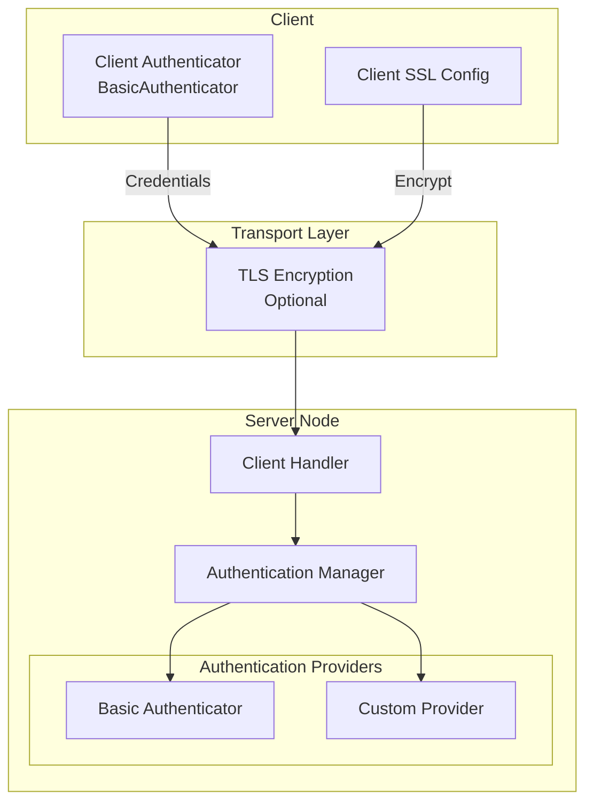
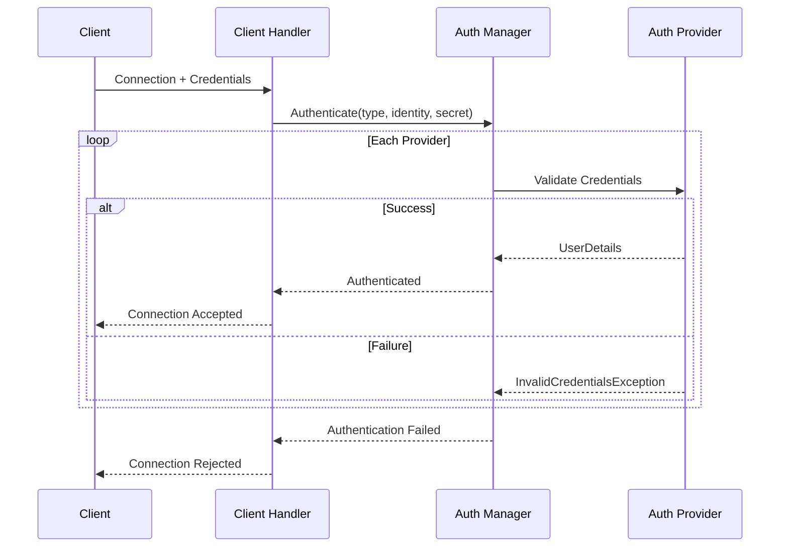
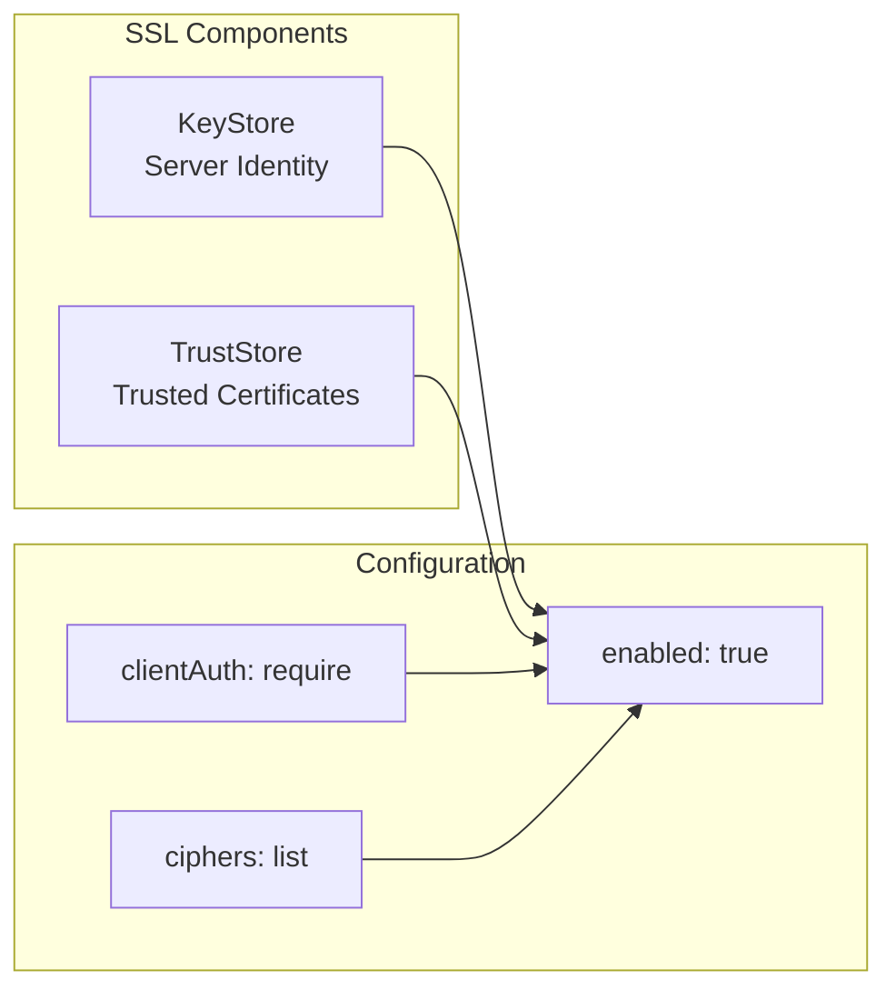

# 보안 아키텍처

Apache Ignite 3은 클러스터 접근을 보호하기 위해 인증과 전송 암호화(transport encryption)를 제공합니다. 보안 기능은 기본적으로 비활성화되어 있으며, 클러스터 구성에서 명시적으로 활성화해야 합니다.

## 보안 모델 {#security-model}

Apache Ignite 3 보안에서는 다음 사실이 특히 중요합니다. 클러스터 노드 단 하나에만 접근해도 클러스터에서 악의적인 작업을 수행할 수 있으며, 이를 막아줄 보호 메커니즘은 존재하지 않습니다.

따라서 Ignite 3 서버 노드의 모든 네트워크 포트는 보호된 서브네트워크, 이른바 비무장 지대(DMZ) 안에서만 사용할 수 있어야 합니다. 이 포트를 DMZ 밖으로 노출해야 한다면, 신뢰할 수 있는 인증 기관(Certification Authority)이 발급한 SSL 인증서로 접근을 제어할 것을 권장합니다. 자세한 내용은 [SSL/TLS 구성](/configure-and-operate/configuration/config-ssl-tls) 문서를 참고하세요.

## 보안 구성 요소 {#security-components}



보안 아키텍처는 서로 독립된 두 계층으로 구성됩니다.

- **인증(Authentication)**: 구성된 공급자(provider)로 클라이언트 신원을 검증합니다
- **전송 암호화**: SSL/TLS로 통신 채널을 보호합니다

두 계층은 서로 독립적으로 동작합니다. SSL 없이 인증만 활성화할 수 있지만, 이 경우 자격 증명(credential)이 평문으로 전송됩니다. 프로덕션 배포에서는 두 계층을 모두 활성화해야 합니다.

## 인증 {#authentication}

인증은 클러스터 접근을 허용하기 전에 클라이언트 신원을 검증합니다. 인증 관리자는 여러 공급자를 조율하며, 성공하는 공급자가 나올 때까지 순서대로 시도합니다.

### 인증 흐름 {#authentication-flow}



### 기본 인증 {#basic-authentication}

Apache Ignite 3은 사용자 이름과 비밀번호를 사용하는 기본 인증 기능을 제공합니다. 클러스터 보안 설정에서 사용자를 구성하세요.

```json
{
  "ignite": {
    "security": {
      "enabled": true,
      "authentication": {
        "providers": [
          {
            "type": "basic",
            "name": "default",
            "users": [
              { "username": "admin", "password": "admin123" },
              { "username": "reader", "password": "reader123" }
            ]
          }
        ]
      }
    }
  }
}
```

기본 인증을 사용하는 클라이언트 연결:

```java
IgniteClient client = IgniteClient.builder()
    .addresses("localhost:10800")
    .authenticator(BasicAuthenticator.builder()
        .username("admin")
        .password("admin123")
        .build())
    .build();
```

:::warning
기본 인증은 SSL/TLS를 활성화하지 않으면 자격 증명을 평문으로 전송합니다. 프로덕션 배포에서는 항상 SSL을 활성화하세요.
:::

### 사용자 정의 인증 공급자 {#custom-authentication-providers}

인증 프레임워크는 `Authenticator` 인터페이스로 사용자 정의 공급자를 지원합니다. 사용자 정의 공급자에는 다음이 필요합니다.

1. 서버 측 `Authenticator` 구현
2. `AuthenticationProviderConfigurationSchema`를 확장하는 구성 스키마
3. 클라이언트 측 `IgniteClientAuthenticator` 구현

이를 통해 외부 ID 공급자, LDAP 디렉터리, 사용자 정의 자격 증명 저장소와 통합할 수 있습니다.

## 전송 암호화 {#transport-encryption}

SSL/TLS는 클라이언트와 서버 간, 그리고 클러스터 노드 간 통신을 암호화합니다. 서로 다른 통신 채널은 세 가지 개별 SSL 구성으로 제어합니다.

| 구성 경로 | 용도 |
|-------------------|---------|
| `ignite.network.ssl` | 노드 간 클러스터 통신 |
| `ignite.clientConnector.ssl` | 클라이언트-노드 간 연결 |
| `ignite.rest.ssl` | REST API 엔드포인트 |

### SSL 구성 {#ssl-configuration}



SSL 구성 속성:

| 속성 | 기본값 | 설명 |
|----------|---------|-------------|
| `enabled` | false | 이 채널의 SSL을 활성화합니다 |
| `clientAuth` | none | 클라이언트 인증서 요구 수준: none, optional, require |
| `ciphers` | (empty) | 쉼표로 구분한 암호화 방식(cipher) 목록. 비워두면 JVM 기본값을 사용합니다 |
| `keyStore.type` | PKCS12 | 키스토어(keystore) 형식 |
| `keyStore.path` | (empty) | 키스토어 파일 경로 |
| `keyStore.password` | (empty) | 키스토어 비밀번호 |
| `trustStore.type` | PKCS12 | 트러스트스토어(truststore) 형식 |
| `trustStore.path` | (empty) | 트러스트스토어 파일 경로 |
| `trustStore.password` | (empty) | 트러스트스토어 비밀번호 |

### 노드 간 SSL {#node-to-node-ssl}

클러스터 통신에 SSL을 활성화합니다.

```bash
node config update ignite.network.ssl.enabled=true
node config update ignite.network.ssl.keyStore.path=/path/to/keystore.p12
node config update ignite.network.ssl.keyStore.password=keystorepass
node config update ignite.network.ssl.trustStore.path=/path/to/truststore.p12
node config update ignite.network.ssl.trustStore.password=truststorepass
```

상호 TLS(mutual TLS, mTLS)를 사용하려면 클라이언트 인증을 필수로 설정합니다.

```bash
node config update ignite.network.ssl.clientAuth=require
```

### 클라이언트 커넥터 SSL {#client-connector-ssl}

클라이언트 연결에 SSL을 활성화합니다.

```bash
node config update ignite.clientConnector.ssl.enabled=true
node config update ignite.clientConnector.ssl.keyStore.path=/path/to/keystore.p12
node config update ignite.clientConnector.ssl.keyStore.password=keystorepass
```

클라이언트 측 SSL 구성:

```java
SslConfiguration sslConfig = SslConfiguration.builder()
    .enabled(true)
    .trustStorePath("/path/to/truststore.p12")
    .trustStorePassword("truststorepass")
    .build();

IgniteClient client = IgniteClient.builder()
    .addresses("localhost:10800")
    .ssl(sslConfig)
    .authenticator(BasicAuthenticator.builder()
        .username("admin")
        .password("admin123")
        .build())
    .build();
```

### REST API SSL {#rest-api-ssl}

REST 엔드포인트에 SSL을 활성화합니다.

```bash
node config update ignite.rest.ssl.enabled=true
node config update ignite.rest.ssl.port=10400
node config update ignite.rest.ssl.keyStore.path=/path/to/keystore.p12
node config update ignite.rest.ssl.keyStore.password=keystorepass
```

## 보안 이벤트 {#security-events}

인증 시도는 이벤트 시스템에 기록됩니다. 보안 감사를 위해 다음 이벤트를 모니터링하세요.

- `USER_AUTHENTICATION_SUCCESS`: 인증 성공
- `USER_AUTHENTICATION_FAILURE`: 인증 실패 시도

## 구성 요약 {#configuration-summary}

프로덕션 환경의 최소 보안 구성은 다음과 같습니다.

```json
{
  "ignite": {
    "security": {
      "enabled": true,
      "authentication": {
        "providers": [
          {
            "type": "basic",
            "name": "default",
            "users": [
              { "username": "admin", "password": "secure_password" }
            ]
          }
        ]
      }
    },
    "clientConnector": {
      "ssl": {
        "enabled": true,
        "keyStore": {
          "path": "/path/to/keystore.p12",
          "password": "keystorepass"
        }
      }
    },
    "network": {
      "ssl": {
        "enabled": true,
        "clientAuth": "require",
        "keyStore": {
          "path": "/path/to/keystore.p12",
          "password": "keystorepass"
        },
        "trustStore": {
          "path": "/path/to/truststore.p12",
          "password": "truststorepass"
        }
      }
    }
  }
}
```

## 제한 사항 {#limitations}

Apache Ignite 3은 현재 인증만 제공합니다. 인가(authorization) 기능(역할 기반 접근 제어(role-based access control, RBAC), 권한 등)은 아직 구현되지 않았습니다. 인증된 모든 사용자는 클러스터 리소스에 동일한 접근 권한을 갖습니다.

## 다음 단계 {#next-steps}

- [인증 구성](/configure-and-operate/configuration/config-authentication) - 단계별 인증 설정
- [SSL/TLS 구성](/configure-and-operate/configuration/config-ssl-tls) - SSL 구성 가이드
- [클러스터 보안](/configure-and-operate/configuration/config-cluster-security) - 추가 보안 권장 사항
