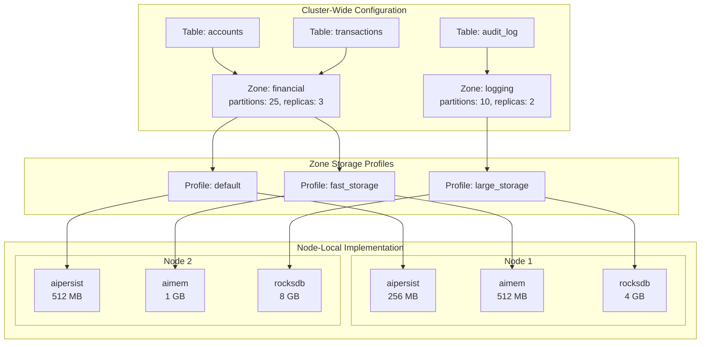
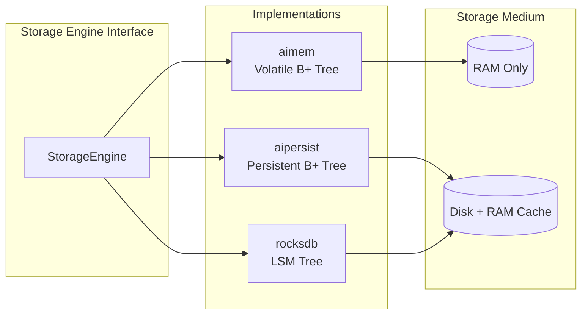
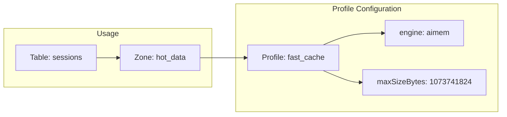

# 스토리지 아키텍처

Apache Ignite 3은 계층형 아키텍처로 논리적 데이터 구성과 물리적 스토리지 구현을 분리합니다. 테이블은 데이터 모델을 정의하고, 분산 영역(distribution zone)은 파티셔닝과 복제를 제어하며, 스토리지 프로파일(storage profile)은 엔진 매개변수를 구성하고, 스토리지 엔진(storage engine)은 물리적 읽기/쓰기 작업을 처리합니다.



이 아키텍처는 관심사를 두 가지 범위로 분리합니다.

- **클러스터 전역**: 테이블 스키마, 분산 영역 구성, 스토리지 프로파일 이름은 모든 노드에서 동일합니다
- **노드 로컬**: 스토리지 프로파일 구현(메모리 크기, 파일 경로)은 각 노드에서 독립적으로 구성합니다

이렇게 분리하면 이기종 클러스터를 구성할 수 있습니다. 하드웨어 성능이 서로 다른 노드가 각자에 맞는 크기로 스토리지를 할당받아 같은 분산 영역에 참여합니다.

## 스토리지 엔진 {#storage-engines}

스토리지 엔진은 물리적 데이터 작업을 구현합니다. 스토리지에서 페이지를 읽고, 변경된 페이지를 기록하고, 메모리 버퍼를 관리합니다. 각 엔진은 특정 접근 패턴에 최적화된 서로 다른 데이터 구조를 사용합니다.



| 엔진 | 데이터 구조 | 영속성 | 사용 사례 |
|--------|---------------|-------------|----------|
| `aimem` | B+ 트리 | 없음(휘발성) | 캐싱, 임시 데이터, 최저 지연 |
| `aipersist` | B+ 트리 | 체크포인트 기반 | 범용, 읽기/쓰기 균형 |
| `rocksdb` | Log-Structured Merge(LSM) 트리 | 미리 쓰기 로그(write-ahead log, WAL) | 쓰기 위주 워크로드 |

### AIMemory (aimem)

모든 데이터를 오프힙 메모리(off-heap memory)에 B+ 트리 구조로 저장합니다. 노드가 종료되면 데이터가 사라집니다. 메모리는 세그먼트 단위로 할당되며(데이터 영역당 최대 16개 세그먼트), 필요할 때 확장됩니다.

구성 세부 사항은 [AIMemory 스토리지 엔진](./storage-engines/aimem)을 참고하세요.

### AIPersist (aipersist)

데이터를 디스크의 파티션 파일에 저장하고, 인메모리 페이지 캐시(page cache)를 함께 사용합니다. 데이터와 인덱스 저장에는 B+ 트리를 사용합니다. 체크포인트 과정에서 더티 페이지(dirty page)를 주기적으로 디스크에 기록해 내구성을 확보합니다.

구성 세부 사항은 [AIPersist 스토리지 엔진](./storage-engines/aipersist)을 참고하세요.

### RocksDB (rocksdb)

:::warning
RocksDB 지원은 실험 단계입니다.
:::

RocksDB 라이브러리를 사용하며 저장 방식은 LSM 트리입니다. 순차적 디스크 쓰기로 처리량을 높이는 쓰기 위주 워크로드에 최적화되어 있습니다.

구성 세부 사항은 [RocksDB 스토리지 엔진](./storage-engines/rocksdb)을 참고하세요.

## 엔진 구성 {#engine-configuration}

엔진 수준 구성은 해당 엔진을 사용하는 모든 프로파일에 적용됩니다. 이 설정은 체크포인트 간격이나 플러시 지연처럼 엔진 전체에 영향을 주는 동작을 제어합니다.

```bash
# View current engine configuration
node config show ignite.storage.engines

# Configure checkpoint interval for aipersist (default: 180000ms)
node config update ignite.storage.engines.aipersist.checkpoint.intervalMillis=180000
```

엔진 구성을 변경한 뒤에는 노드를 다시 시작하세요.

## 스토리지 프로파일 {#storage-profiles}

스토리지 프로파일은 스토리지 엔진을 특정 구성 매개변수와 연결합니다. 분산 영역은 프로파일을 이름으로 참조하며, 영역 안의 각 테이블은 그 영역에 지정된 프로파일을 사용합니다.



프로파일 속성:

- **engine**: 스토리지 엔진 이름(`aimem`, `aipersist`, `rocksdb`)
- **엔진별 설정**: 메모리 크기, 버퍼 크기, 그 밖의 매개변수

### 기본 프로파일 {#default-profile}

Apache Ignite는 모든 노드에 `aipersist`를 사용하는 `default` 프로파일을 생성합니다. 분산 영역은 달리 구성하지 않으면 이 프로파일을 사용합니다.

```bash
# View configured profiles
node config show ignite.storage.profiles
```

### 프로파일 생성 {#creating-profiles}

노드 구성으로 프로파일을 생성합니다. 각 노드에는 이름과 엔진 유형이 일치하는 프로파일이 있어야 하며, 크기는 달라도 됩니다.

```bash
# Create an in-memory profile
node config update "ignite.storage.profiles:{cache_profile{engine:aimem,maxSizeBytes:536870912}}"

# Create a RocksDB profile
node config update "ignite.storage.profiles:{rocks_profile{engine:rocksdb,sizeBytes:1073741824}}"
```

프로파일을 추가한 뒤에는 노드를 다시 시작하세요.

## 테이블에서 프로파일 사용하기 {#using-profiles-with-tables}

스토리지 프로파일을 하나 이상 지정해 분산 영역을 만든 다음, 테이블을 해당 영역에 할당합니다.

```sql
-- Create a zone with multiple storage profiles
CREATE ZONE financial_zone
    WITH PARTITIONS=25, REPLICAS=3,
    STORAGE PROFILES ['default', 'fast_cache'];

-- Create a table using a specific profile
CREATE TABLE accounts (
    id INT PRIMARY KEY,
    balance DECIMAL(15,2)
) ZONE financial_zone STORAGE PROFILE 'default';

-- Create a table using the in-memory profile
CREATE TABLE rate_limits (
    client_id INT PRIMARY KEY,
    requests INT
) ZONE financial_zone STORAGE PROFILE 'fast_cache';
```

테이블을 생성한 뒤에는 영역이나 스토리지 프로파일을 변경할 수 없습니다. 노드에 필요한 프로파일이 없으면, 그 프로파일을 사용하는 테이블의 파티션을 저장하지 않습니다.
