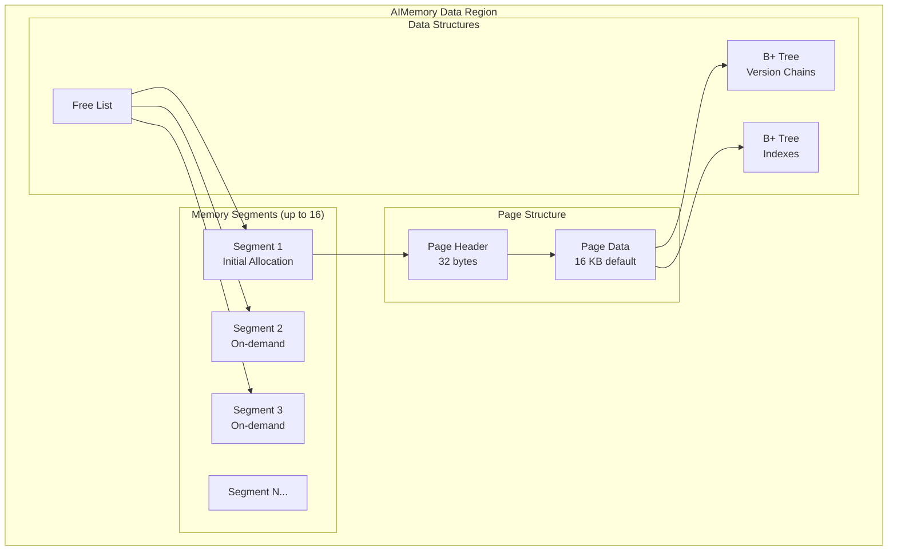

# AIMemory 스토리지 엔진

AIMemory 엔진(`aimem`)은 B+ 트리 구조를 사용해 모든 데이터를 오프힙 메모리에 저장합니다. 데이터는 휘발성이며 노드가 종료되면 사라집니다. 캐싱, 임시 테이블, 또는 영속성이 필요 없는 워크로드에 이 엔진을 사용하세요.

## 메모리 아키텍처 {#memory-architecture}



주요 특징:

- 메모리는 세그먼트 단위로 할당되며, `initSizeBytes`로 시작해 필요에 따라 확장됩니다
- 데이터 영역당 세그먼트는 최대 16개이며, 세그먼트 확장 단위는 최소 256 MB입니다
- 기본 페이지 크기는 16 KB이며, 1 KB~16 KB 범위에서 2의 거듭제곱 값으로 구성할 수 있습니다
- 페이지당 헤더와 락 구조에 32바이트의 오버헤드가 발생합니다

## 프로파일 구성 {#profile-configuration}

| 속성 | 기본값 | 설명 |
|----------|---------|-------------|
| `engine` | - | `"aimem"`이어야 합니다 |
| `initSizeBytes` | 동적 | 초기 메모리 할당량. 기본값은 `maxSizeBytes` 값입니다 |
| `maxSizeBytes` | 동적 | 최대 메모리. 기본값은 `max(256 MB, 20% of physical RAM)`입니다 |

## 엔진 구성 {#engine-configuration}

페이지 크기는 엔진 수준에서 구성되며 모든 aimem 프로파일에 적용됩니다.

| 속성 | 기본값 | 설명 |
|----------|---------|-------------|
| `pageSizeBytes` | 16384 | 페이지 크기(바이트 단위, 1024~16384, 2의 거듭제곱) |

```bash
# Configure engine-level page size
node config update ignite.storage.engines.aimem.pageSizeBytes=8192
```

## 구성 예시 {#configuration-example}

```json
{
  "ignite": {
    "storage": {
      "profiles": [
        {
          "engine": "aimem",
          "name": "cache_profile",
          "initSizeBytes": 536870912,
          "maxSizeBytes": 1073741824
        }
      ]
    }
  }
}
```

```bash
# CLI equivalent
node config update "ignite.storage.profiles:{cache_profile{engine:aimem,maxSizeBytes:1073741824}}"
```

## 사용법 {#usage}

```sql
-- Create a zone using the volatile profile
CREATE ZONE cache_zone
    WITH PARTITIONS=10, REPLICAS=2,
    STORAGE PROFILES ['cache_profile'];

-- Create a table for session data (acceptable to lose on restart)
CREATE TABLE sessions (
    session_id UUID PRIMARY KEY,
    user_id INT,
    data VARCHAR,
    expires_at TIMESTAMP
) ZONE cache_zone STORAGE PROFILE 'cache_profile';
```
