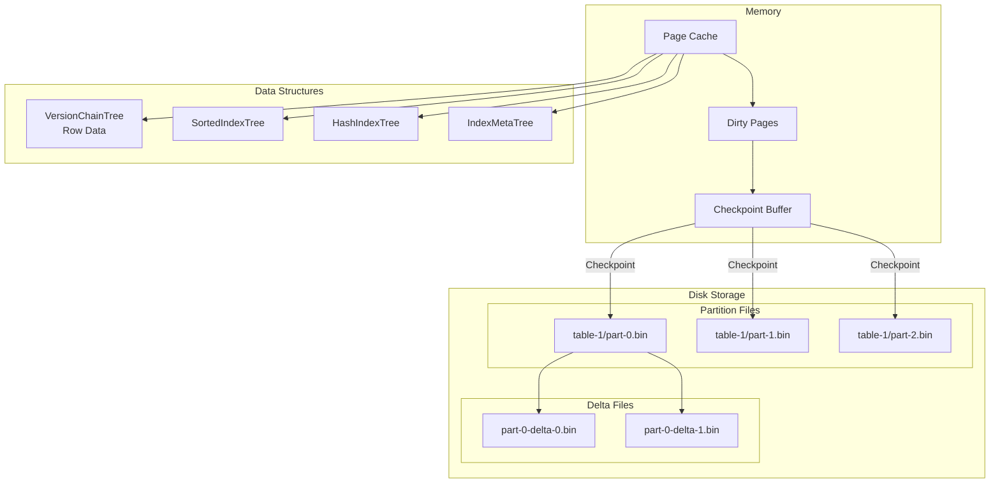
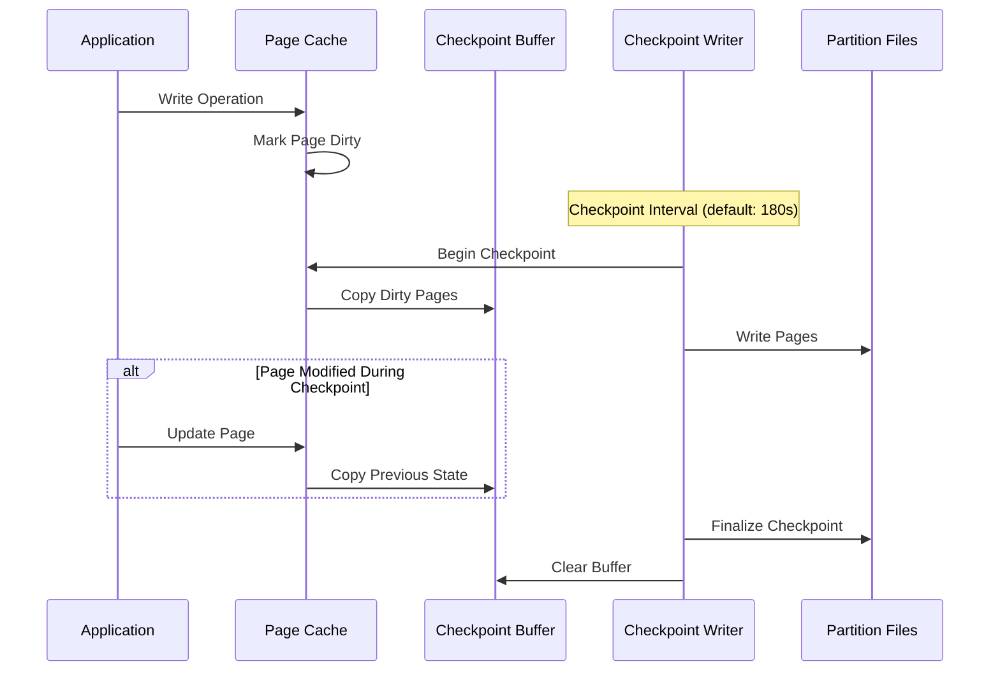
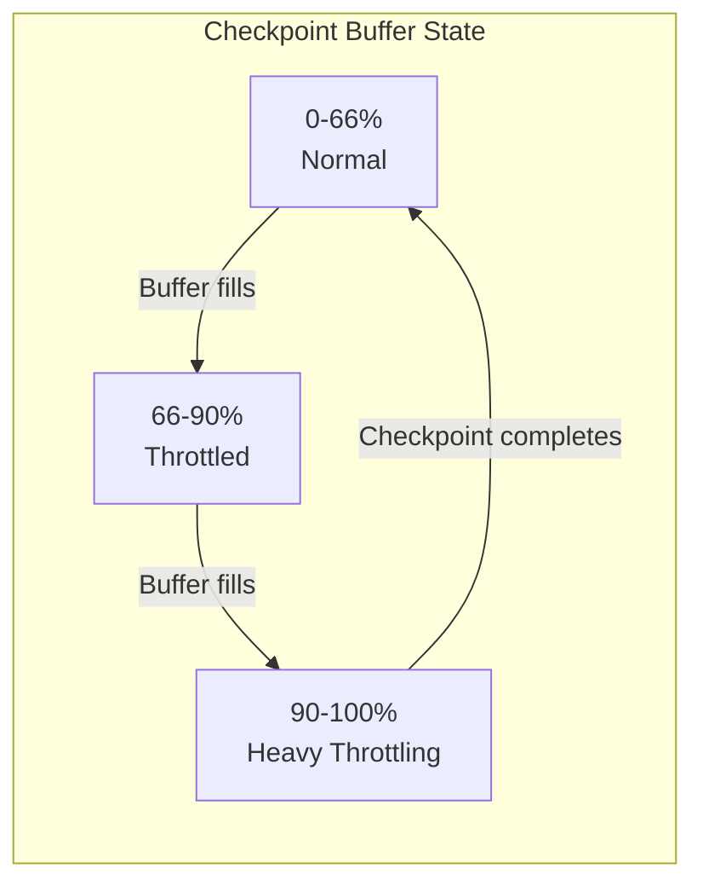

# AIPersist 스토리지 엔진

AIPersist 엔진(`aipersist`)은 B+ 트리 자료 구조와 체크포인트 기반 영속성을 사용해 내구성 있는 스토리지를 제공합니다. 데이터는 디스크의 파티션 파일에 저장되며, 빠른 접근을 위해 인메모리 페이지 캐시를 함께 사용합니다. 이 엔진이 기본 스토리지 엔진입니다.

## 스토리지 아키텍처 {#storage-architecture}



스토리지 구성:

- 각 파티션은 별도 파일(`table-{tableId}/part-{partitionId}.bin`)에 저장됩니다
- 델타 파일은 체크포인트 사이의 증분 변경 사항을 기록합니다
- B+ 트리는 버전 체인(행 데이터), 정렬 인덱스, 해시 인덱스, 메타데이터를 저장합니다
- 기본 페이지 크기: 16 KB

## 체크포인팅 {#checkpointing}

체크포인팅은 메모리의 더티 페이지를 디스크의 파티션 파일로 플러시합니다. 이 과정은 내구성을 보장하고 장애 복구를 지원합니다.



체크포인트 구성:

| 속성 | 기본값 | 설명 |
|----------|---------|-------------|
| `intervalMillis` | 180000 | 체크포인트 사이의 시간 간격(3분) |
| `intervalDeviationPercent` | 40 | 체크포인트가 동시에 발생하지 않도록 하는 무작위 편차 |
| `checkpointThreads` | - | 체크포인트 기록 스레드 수 |
| `compactionThreads` | - | 컴팩션 스레드 수 |

```bash
# Configure checkpoint interval to 2 minutes
node config update ignite.storage.engines.aipersist.checkpoint.intervalMillis=120000
```

## 쓰기 스로틀링 {#write-throttling}

체크포인트 버퍼가 용량의 3분의 2(66.7%)에 도달하면, 버퍼 포화를 막기 위해 쓰기 스로틀링이 활성화됩니다.



스로틀링 동작:

- 66% 미만: 정상 동작, 스로틀링 없음
- 66%~90%: 점진적 스로틀링, 체크포인트 우선순위가 높아짐
- 90% 초과: 강한 스로틀링, 업데이트가 크게 지연됨

쓰기 스로틀링이 발생한다면 디스크 I/O가 느리거나 쓰기 속도가 과도하다는 신호입니다. 스로틀링 메트릭을 모니터링해 병목 지점을 파악하세요.

## 프로파일 구성 {#profile-configuration}

| 속성 | 기본값 | 설명 |
|----------|---------|-------------|
| `engine` | - | `"aipersist"`이어야 합니다 |
| `sizeBytes` | 동적 | 스토리지 크기. 기본값은 `max(256 MB, 20% of physical RAM)`입니다 |

## 구성 예시 {#configuration-example}

```json
{
  "ignite": {
    "storage": {
      "profiles": [
        {
          "engine": "aipersist",
          "name": "persistent_profile",
          "sizeBytes": 2147483648
        }
      ]
    }
  }
}
```

```bash
# CLI equivalent
node config update "ignite.storage.profiles:{persistent_profile{engine:aipersist,sizeBytes:2147483648}}"
```

## 사용법 {#usage}

`default` 프로파일은 aipersist를 자동으로 사용합니다. 사용자 지정 프로파일은 다음과 같이 구성합니다:

```sql
-- Create a zone with the persistent profile
CREATE ZONE transaction_zone
    WITH PARTITIONS=25, REPLICAS=3,
    STORAGE PROFILES ['persistent_profile'];

-- Create a durable table
CREATE TABLE orders (
    order_id BIGINT PRIMARY KEY,
    customer_id INT,
    total DECIMAL(15,2),
    created_at TIMESTAMP
) ZONE transaction_zone STORAGE PROFILE 'persistent_profile';
```
