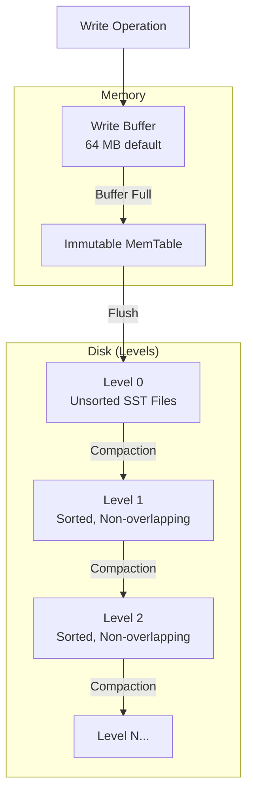

# RocksDB 스토리지 엔진

:::warning
RocksDB 지원은 실험적 기능입니다.
:::

RocksDB 엔진(`rocksdb`)은 RocksDB 라이브러리를 사용하며 Log-Structured Merge(LSM) 트리 스토리지 구조를 씁니다. LSM 트리는 쓰기를 메모리에 버퍼링한 뒤 정렬된 디스크 파일로 주기적으로 플러시해 쓰기 처리량을 최적화합니다.

## LSM 트리 아키텍처 {#lsm-tree-architecture}



LSM 트리 특성:

- **쓰기 경로(write path)**: 쓰기는 인메모리 버퍼로 들어간 뒤, 정렬된 문자열 테이블(SST) 파일로 Level 0에 플러시됩니다
- **컴팩션(compaction)**: 백그라운드 프로세스가 SST 파일을 병합하고 데이터를 더 낮은 레벨로 옮깁니다
- **읽기 경로(read path)**: 읽기는 쓰기 버퍼를 확인한 뒤 L0부터 아래로 레벨을 검색합니다
- **쓰기 증폭(write amplification)**: 컴팩션 과정에서 데이터가 여러 번 다시 쓰일 수 있습니다
- **공간 증폭(space amplification)**: 컴팩션 도중 여러 버전이 일시적으로 존재합니다

## RocksDB 사용 시점 {#when-to-use-rocksdb}

RocksDB는 다음에 적합합니다:

- 순차 디스크 쓰기가 처리량을 높이는 쓰기 위주 워크로드
- 추가 위주(append-mostly) 패턴을 갖는 시계열 데이터
- 읽기 증폭(쿼리당 여러 번의 디스크 읽기)을 감수할 수 있는 워크로드

다음 경우에는 aipersist를 고려하세요:

- 읽기 위주 또는 균형 잡힌 워크로드
- 일관된 지연 시간이 필요한 포인트 조회(point lookup)
- 쓰기 증폭에 민감한 워크로드

## 프로파일 구성 {#profile-configuration}

| 속성 | 기본값 | 설명 |
|----------|---------|-------------|
| `engine` | - | 반드시 `"rocksdb"`여야 합니다 |
| `sizeBytes` | 동적 | 스토리지 할당량. 기본값은 `max(256 MB, 20% of physical RAM)`입니다 |
| `writeBufferSizeBytes` | 67108864 | 쓰기 버퍼 크기(64 MB) |

## 엔진 구성 {#engine-configuration}

| 속성 | 기본값 | 설명 |
|----------|---------|-------------|
| `flushDelayMillis` | 100 | RAFT가 트리거하는 플러시 전 지연 시간 |

```bash
# Configure flush delay
node config update ignite.storage.engines.rocksdb.flushDelayMillis=50
```

## 구성 예시 {#configuration-example}

```json
{
  "ignite": {
    "storage": {
      "profiles": [
        {
          "engine": "rocksdb",
          "name": "write_heavy_profile",
          "sizeBytes": 4294967296,
          "writeBufferSizeBytes": 134217728
        }
      ]
    }
  }
}
```

```bash
# CLI equivalent
node config update "ignite.storage.profiles:{write_heavy_profile{engine:rocksdb,sizeBytes:4294967296,writeBufferSizeBytes:134217728}}"
```

## 사용법 {#usage}

```sql
-- Create a zone for write-heavy tables
CREATE ZONE logging_zone
    WITH PARTITIONS=10, REPLICAS=2,
    STORAGE PROFILES ['write_heavy_profile'];

-- Create a table for event logging
CREATE TABLE events (
    event_id BIGINT PRIMARY KEY,
    event_type VARCHAR,
    payload VARCHAR,
    created_at TIMESTAMP
) ZONE logging_zone STORAGE PROFILE 'write_heavy_profile';
```
