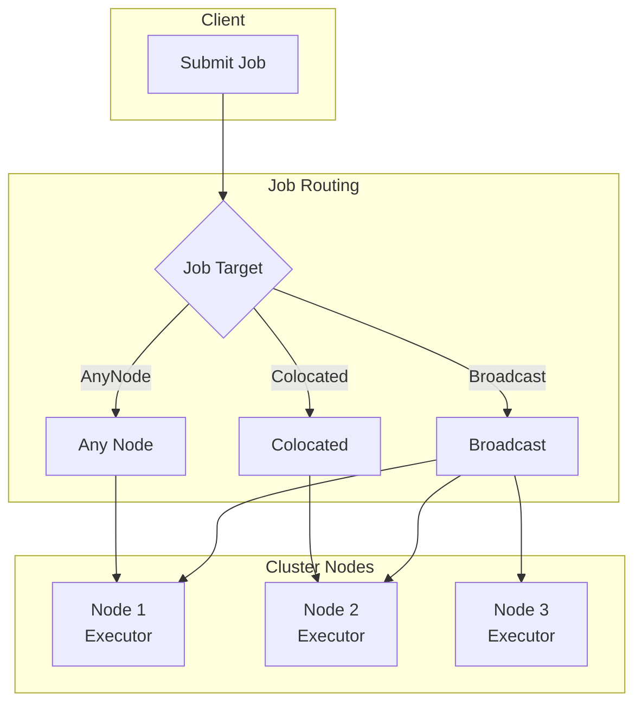
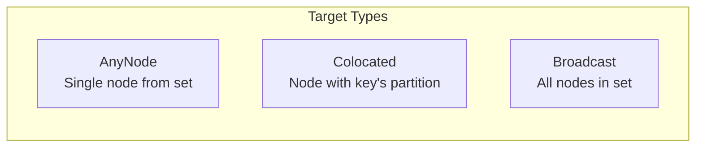
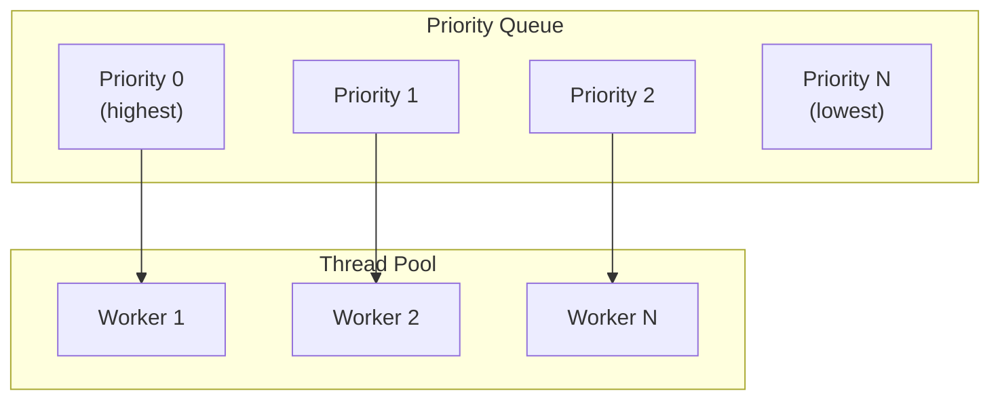
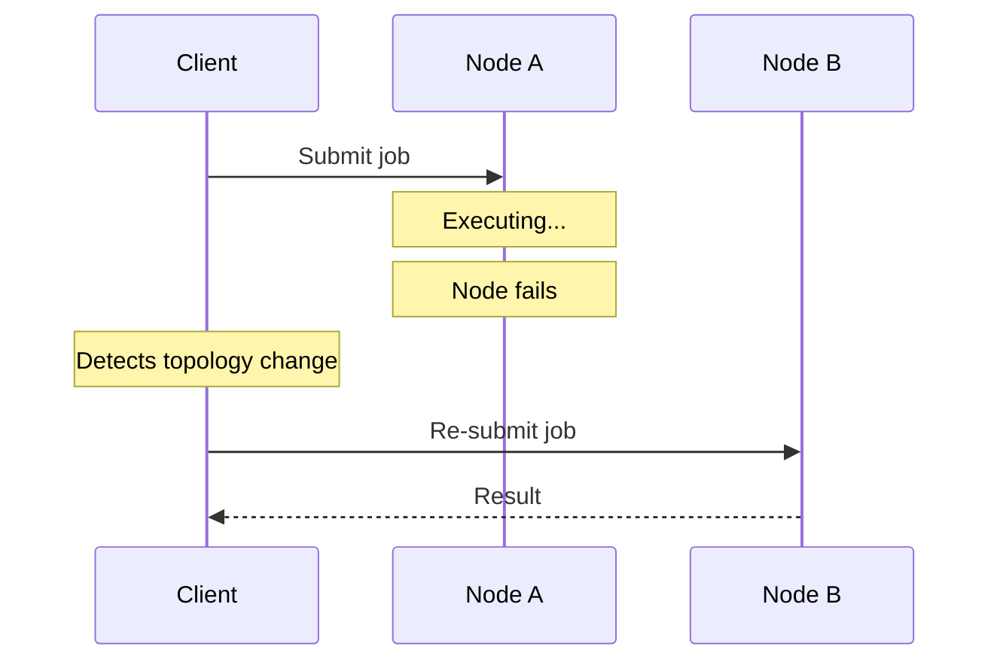
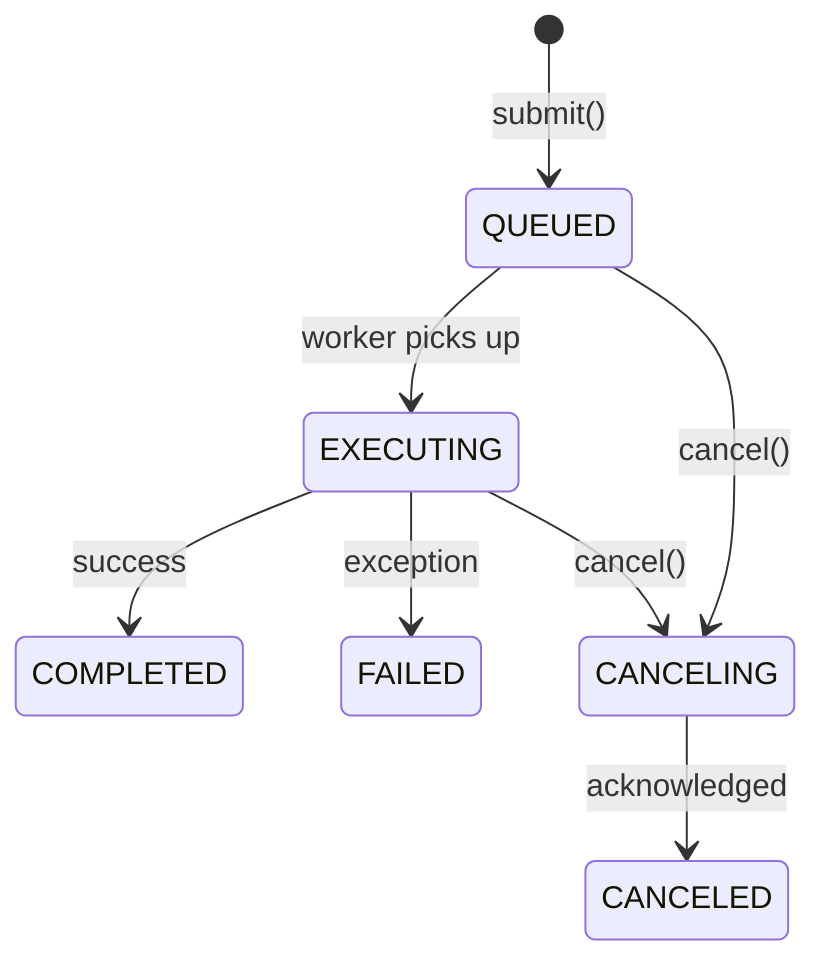
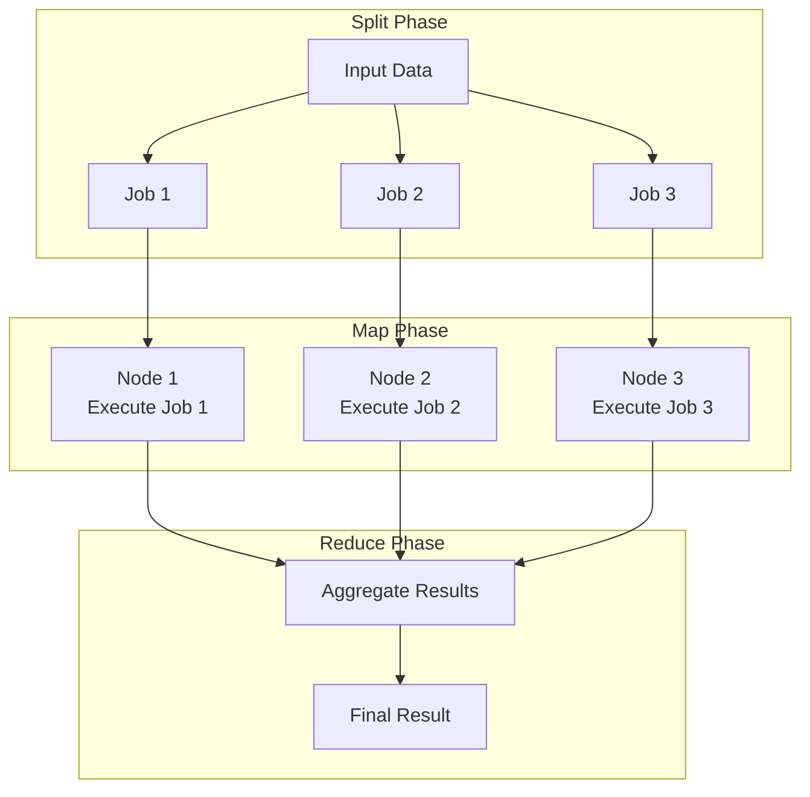
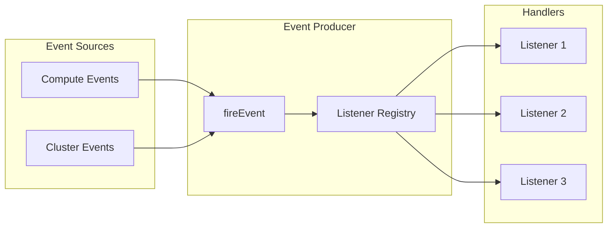

Ignite 3는 클러스터 노드 전체에서 작업을 실행하는 분산 컴퓨트와 클러스터 활동을 모니터링하는 이벤트 시스템을 제공합니다. 컴퓨트 API는 `CompletableFuture`를 기반으로 하는 비동기 우선순위 기반 실행 모델을 사용합니다.

## 분산 컴퓨트 아키텍처 {#distributed-compute-architecture}



주요 특징:

- `CompletableFuture<R>`를 반환하는 비동기 실행
- 대상 유형(모든 노드, 콜로케이션, 브로드캐스트)에 따른 작업 배치
- 구성 가능한 스레드 풀을 사용하는 우선순위 기반 큐
- 노드 이탈 시 자동 장애 조치
- 분할/집계 패턴을 위한 맵리듀스 지원

## 작업 실행 모델 {#job-execution-model}

### ComputeJob 인터페이스 {#computejob-interface}

작업은 `ComputeJob<T, R>` 인터페이스를 구현합니다:

```java
public interface ComputeJob<T, R> {
    CompletableFuture<R> executeAsync(
        JobExecutionContext context,
        T arg
    );
}
```

`JobExecutionContext`는 다음을 제공합니다.

| 속성 | 설명 |
|----------|-------------|
| `ignite()` | 클러스터 연산을 위한 Ignite 인스턴스 |
| `isCancelled()` | 취소 요청 여부 확인 |
| `partition()` | 콜로케이션 작업의 파티션 정보 |

작업 구현 예시:

```java
public class AccountBalanceJob implements ComputeJob<Long, Double> {
    @Override
    public CompletableFuture<Double> executeAsync(
            JobExecutionContext context,
            Long accountId) {

        Table accounts = context.ignite().tables().table("accounts");
        RecordView<Tuple> view = accounts.recordView();

        Tuple key = Tuple.create().set("id", accountId);
        Tuple record = view.get(null, key);

        return CompletableFuture.completedFuture(
            record.doubleValue("balance")
        );
    }
}
```

### 작업 대상 {#job-targets}

작업 대상은 작업이 실행될 위치를 결정합니다.



| 대상 | 사용 사례 | 반환 타입 |
|--------|----------|-------------|
| **모든 노드** | 상태 비저장 연산 | `JobExecution<R>` |
| **콜로케이션** | 데이터 근접 처리 | `JobExecution<R>` |
| **브로드캐스트** | 클러스터 전역 작업 | `BroadcastExecution<R>` |

#### 모든 노드 실행 {#any-node-execution}

사용 가능한 노드 중 하나에서 실행합니다.

```java
JobDescriptor<Long, Double> descriptor = JobDescriptor
    .<Long, Double>builder(AccountBalanceJob.class)
    .build();

JobExecution<Double> execution = client.compute()
    .submit(JobTarget.anyNode(client.clusterNodes()), descriptor, accountId);

Double balance = execution.resultAsync().join();
```

#### 콜로케이션 실행 {#colocated-execution}

특정 데이터를 보유한 노드에서 실행합니다.

```java
// Execute where account 42's data lives
JobExecution<Double> execution = client.compute().submit(
    JobTarget.colocated("accounts", Tuple.create().set("id", 42L)),
    descriptor,
    42L
);
```

데이터 집약적 작업에서 네트워크 전송을 없앱니다.

#### 브로드캐스트 실행 {#broadcast-execution}

지정한 모든 노드에서 실행합니다.

```java
BroadcastExecution<String> execution = client.compute().submitBroadcast(
    client.clusterNodes(),
    JobDescriptor.builder(NodeInfoJob.class).build(),
    null
);

// Get results from all nodes
Map<ClusterNode, String> results = execution.resultsAsync().join();
```

## 작업 스케줄링 {#job-scheduling}

작업은 우선순위 기반 큐 시스템을 통해 실행됩니다.



구성 옵션:

| 설정 | 기본값 | 설명 |
|---------|---------|-------------|
| `threadPoolSize` | max(CPU cores, 8) | 워커 스레드 수 |
| `queueMaxSize` | Integer.MAX_VALUE | 큐에 담을 수 있는 최대 작업 수 |
| `statesLifetimeMillis` | 60,000 | 작업 상태 보존 기간 |

### 작업 우선순위 {#job-priority}

제출 시 우선순위를 설정합니다.

```java
JobDescriptor<String, String> descriptor = JobDescriptor
    .<String, String>builder(MyJob.class)
    .priority(5)  // Higher number = lower priority
    .build();
```

실행 중에 우선순위를 변경합니다.

```java
JobExecution<String> execution = client.compute().submit(target, descriptor, arg);
execution.changePriorityAsync(1);  // Move to higher priority
```

우선순위가 같은 작업은 FIFO 순서로 실행됩니다.

## 작업 장애 조치 {#job-failover}

Ignite는 작업 실행 중 발생하는 노드 장애를 자동으로 처리합니다.



장애 조치 동작:

- 노드 이탈 시에만 실행됨(작업 예외로는 실행되지 않음)
- 남은 후보 중에서 다음 워커를 선택
- 후보가 모두 소진될 때까지 계속
- 애플리케이션 예외는 재시도 없이 호출자에게 전파됨

애플리케이션 수준 재시도를 사용하려면:

```java
JobDescriptor<String, String> descriptor = JobDescriptor
    .<String, String>builder(MyJob.class)
    .maxRetries(3)  // Retry on job failure
    .build();
```

## 작업 상태 관리 {#job-state-management}

작업 실행 상태를 추적합니다.



작업 상태를 조회합니다.

```java
JobExecution<String> execution = client.compute().submit(target, descriptor, arg);

JobState state = execution.stateAsync().join();
System.out.println("Status: " + state.status());
System.out.println("Created: " + state.createTime());
System.out.println("Started: " + state.startTime());
```

| 상태 | 설명 |
|-------|-------------|
| QUEUED | 우선순위 큐에서 대기 중 |
| EXECUTING | 워커 스레드에서 실행 중 |
| COMPLETED | 성공적으로 완료됨 |
| FAILED | 예외로 종료됨 |
| CANCELING | 취소 진행 중 |
| CANCELED | 요청으로 취소됨 |

## 맵리듀스 태스크 {#map-reduce-tasks}

분할/집계 연산 패턴에는 `MapReduceTask`를 사용합니다.



태스크 인터페이스를 구현합니다:

```java
public class WordCountTask implements MapReduceTask<String, String, Map<String, Long>, Map<String, Long>> {

    @Override
    public CompletableFuture<List<MapReduceJob<String, Map<String, Long>>>> splitAsync(
            TaskExecutionContext context,
            String input) {

        // Split input into chunks for parallel processing
        List<MapReduceJob<String, Map<String, Long>>> jobs = Arrays.stream(input.split("\n\n"))
            .map(chunk -> MapReduceJob.<String, Map<String, Long>>builder()
                .jobDescriptor(JobDescriptor.builder(CountWordsJob.class).build())
                .args(chunk)
                .build())
            .toList();

        return CompletableFuture.completedFuture(jobs);
    }

    @Override
    public CompletableFuture<Map<String, Long>> reduceAsync(
            TaskExecutionContext context,
            Map<UUID, Map<String, Long>> results) {

        // Aggregate word counts from all jobs
        Map<String, Long> totals = new HashMap<>();
        for (Map<String, Long> partial : results.values()) {
            partial.forEach((word, count) ->
                totals.merge(word, count, Long::sum));
        }
        return CompletableFuture.completedFuture(totals);
    }
}
```

태스크를 제출합니다:

```java
TaskDescriptor<String, Map<String, Long>> descriptor = TaskDescriptor
    .<String, Map<String, Long>>builder(WordCountTask.class)
    .build();

TaskExecution<Map<String, Long>> execution = client.compute()
    .submitMapReduce(descriptor, document);

Map<String, Long> wordCounts = execution.resultAsync().join();
```

## 이벤트 시스템 {#event-system}

Ignite는 클러스터와 컴퓨트 활동을 모니터링하는 이벤트 시스템을 제공합니다.

### 이벤트 아키텍처 {#event-architecture}



### 컴퓨트 이벤트 {#compute-events}

| 이벤트 | 트리거 |
|-------|---------|
| COMPUTE_JOB_QUEUED | 작업이 큐에 추가됨 |
| COMPUTE_JOB_EXECUTING | 작업이 실행을 시작함 |
| COMPUTE_JOB_COMPLETED | 작업이 성공적으로 완료됨 |
| COMPUTE_JOB_FAILED | 작업이 오류로 종료됨 |
| COMPUTE_JOB_CANCELING | 취소가 요청됨 |
| COMPUTE_JOB_CANCELED | 작업이 취소됨 |

### 이벤트 리스너 {#event-listeners}

특정 이벤트에 리스너를 등록합니다.

```java
EventListener<ComputeEventParameters> listener = params -> {
    System.out.println("Job " + params.jobId() + " status: " + params.status());
    return CompletableFuture.completedFuture(false);  // Keep listening
};

client.compute().listen(IgniteEventType.COMPUTE_JOB_COMPLETED, listener);
```

리스너 반환값:

| 반환값 | 동작 |
|--------|----------|
| `false` | 리스너를 계속 활성 상태로 유지 |
| `true` | 이 이벤트 처리 후 리스너 제거 |

동기 핸들러를 사용하려면:

```java
EventListener<ComputeEventParameters> listener = EventListener.fromConsumer(params -> {
    log.info("Job completed: {}", params.jobId());
});
```

## 코드 배포 {#code-deployment}

작업을 실행하려면 해당 클래스가 실행 노드에서 사용 가능해야 합니다. 배포 단위를 사용해 코드를 배포합니다.

```java
// Create deployment unit from JAR
DeploymentUnit unit = DeploymentUnit.fromPath(
    "my-jobs",
    "1.0.0",
    Path.of("my-jobs.jar")
);

// Deploy to cluster
client.deployment().deployAsync(unit).join();

// Reference in job descriptor
JobDescriptor<String, String> descriptor = JobDescriptor
    .<String, String>builder("com.example.MyJob")
    .deploymentUnits(List.of(new DeploymentUnit("my-jobs", "1.0.0")))
    .build();
```

## 설계 제약 {#design-constraints}

1. **상태 비저장 작업**: 작업은 실행 간 상태를 유지해서는 안 됩니다. 필요하다면 테이블에 상태를 저장하세요.

2. **직렬화 가능한 인수**: 작업 인수와 결과는 네트워크 전송을 위해 직렬화할 수 있어야 합니다.

3. **장애 조치 범위**: 자동 장애 조치는 인프라 장애만 처리합니다. `maxRetries`를 구성하지 않으면 애플리케이션 예외는 재시도 없이 전파됩니다.

4. **이벤트 순서**: 리스너는 이벤트별로 등록 순서대로 실행되지만, 노드 간 전역 순서는 보장되지 않습니다.

5. **일회성 리스너**: `true`를 반환하면 자동으로 구독이 해제됩니다. 특정 이벤트를 기다릴 때 유용합니다.

6. **스레드 풀 제한**: 실행기 스레드 풀은 크기가 제한되어 있습니다. 오래 실행되는 작업이 다른 작업을 막을 수 있습니다.

## 관련 주제 {#related-topics}

- 자세한 API 사용법은 [Compute API](/develop/work-with-data/compute)를 참고하세요
- 배포 패턴은 [코드 배포](/develop/work-with-data/code-deployment)를 참고하세요
- 이벤트 처리 세부 사항은 [이벤트](/develop/work-with-data/events)를 참고하세요
