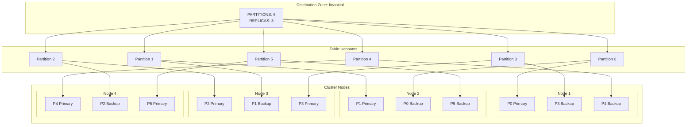
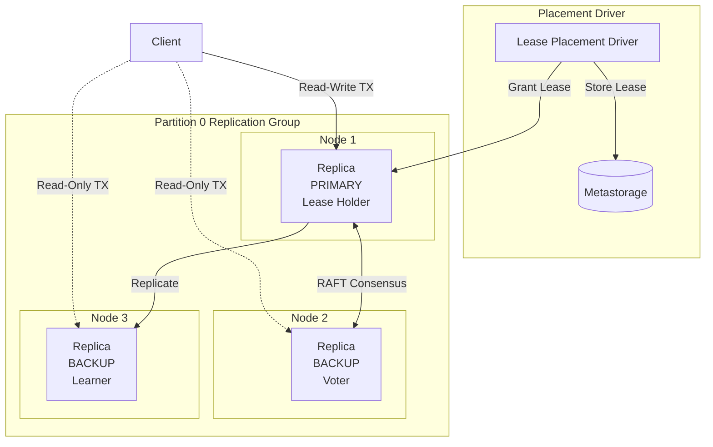
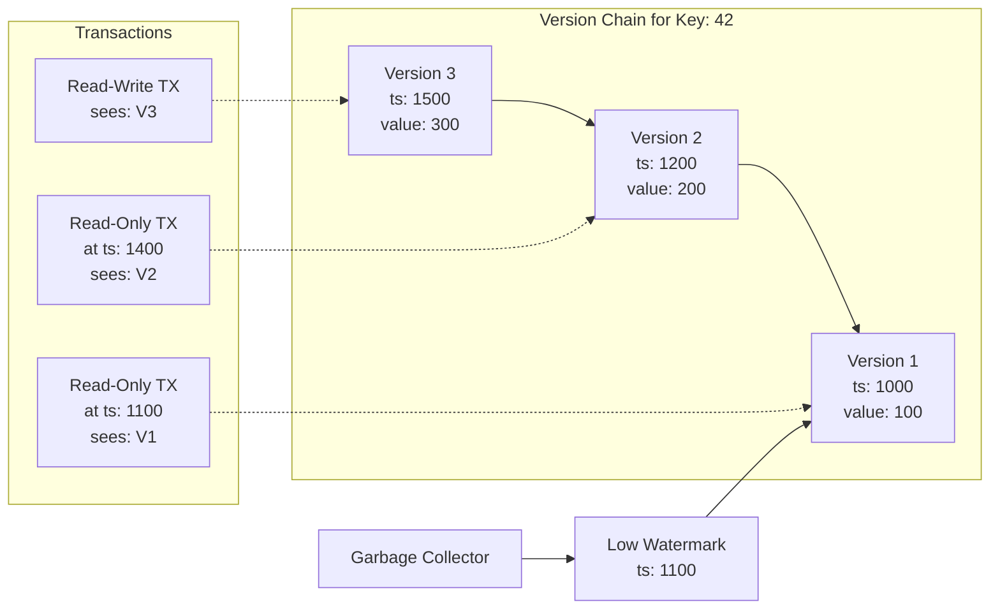

# 데이터 파티셔닝

데이터 파티셔닝(data partitioning)은 테이블 데이터를 파티션(partition)이라는 고정 크기 조각으로 나누어 클러스터 노드에 분산합니다. 이렇게 분산하면 수평 확장이 가능합니다. 노드를 추가하면 저장 용량과 쿼리 처리량이 함께 늘어납니다.

## 파티션 분산 {#partition-distribution}

테이블은 분산 영역(distribution zone)에 속하며, 분산 영역은 데이터를 어떻게 파티셔닝하고 복제할지 정의합니다. 영역의 `PARTITIONS` 매개변수는 파티션 수를, `REPLICAS`는 각 파티션의 복사본 수를 설정합니다.



주요 동작:

- 각 파티션은 번호(0부터 PARTITIONS-1까지)로 식별됩니다
- 같은 파티션의 복제본(replica)은 가능하면 서로 다른 노드에 배치됩니다
- 같은 영역의 테이블은 파티션-노드 매핑을 공유하므로 콜로케이션(colocation)이 가능합니다
- Fair 분산 알고리즘은 배치 결정을 메타스토리지(metastorage)에 저장하고, 일관된 할당을 위해 이를 재사용합니다

[노드 구성](/configure-and-operate/reference/node-configuration)에서 노드가 관련 정보를 저장하는 방식을 구성할 수 있습니다.

- `ignite.system.partitionsBasePath`는 파티션이 저장되는 폴더를 지정합니다. 기본적으로 파티션은 `work/partitions` 폴더에 저장됩니다.
- `ignite.system.partitionsLogPath`는 파티션별 RAFT 로그가 저장되는 폴더를 지정합니다. 이 로그에는 RAFT 선출과 합의(consensus)에 관한 정보가 담깁니다.
- `ignite.system.metastoragePath`는 클러스터 메타데이터가 저장되는 폴더를 지정합니다. 메타데이터는 파티션과 별도의 장치에 저장하는 것을 권장합니다.

### 파티션 수 {#partition-number}

분산 영역을 만들 때 `PARTITIONS` 매개변수로 파티션 수를 직접 설정할 수 있습니다. 예를 들면 다음과 같습니다.

```sql
CREATE ZONE IF NOT EXISTS exampleZone (PARTITIONS 10) STORAGE PROFILES ['default'];
```

파티션은 클러스터 전체에 분산되므로, 클러스터 크기와 사용 가능한 코어 수에 따라 파티션 수를 설정하는 것을 권장합니다.

대부분의 경우 전체 사용 가능한 코어 수를 복제본 수로 나눈 값의 2배, 3배 또는 4배를 파티션 수로 사용하는 것을 권장합니다. 예를 들면 다음과 같습니다.

- 노드 3개, 각 노드에 코어 8개, 데이터 복제본 3개인 클러스터라면 파티션 16개, 24개 또는 32개를 권장합니다.
- 노드 7개, 각 노드에 코어 16개, 데이터 복제본 3개인 클러스터라면 파티션 75개, 112개 또는 150개를 권장합니다.

파티션이나 복제본 수를 지나치게 크게 설정하는 것은 권장하지 않습니다. 파티션과 그 분산을 유지하는 작업이 클러스터 성능을 떨어뜨릴 수 있기 때문입니다.

이 값을 설정하지 않으면 Apache Ignite가 권장 파티션 수를 자동으로 계산합니다.

```text
dataNodesCount * coresOnNode * 2 / replicas
```

여기서 `dataNodesCount`는 분산 영역이 생성될 때 [필터](/sql/reference/language-definition/distribution-zones)와 [스토리지 프로파일](/understand/architecture/storage-architecture)에 따라 해당 영역에 포함될 것으로 추정되는 노드 수입니다. 최소 1개의 파티션은 항상 생성됩니다.

### 복제본 수 {#replica-number}

분산 영역을 만들 때 `REPLICAS` 매개변수로 *복제본*(클러스터에 저장되는 데이터의 개별 사본) 수를 구성할 수 있습니다. 기본적으로 추가 복제본은 생성되지 않습니다. 복제본을 늘리면 데이터의 사본이 클러스터에 추가로 저장되고, 노드가 클러스터를 떠나더라도 데이터 가용성을 보장하도록 자동으로 분산됩니다.

각 파티션의 복제본은 RAFT 그룹을 형성하며, 파티션을 업데이트하려면 그 그룹의 [정족수](/sql/reference/language-definition/distribution-zones)(quorum)가 필요합니다. 기본 정족수 크기는 분산 영역의 복제본 수에 따라 달라집니다. 분산 영역에 복제본이 5개 이상이면 정족수로 3개, 2개에서 4개 사이면 2개, 데이터 복제본이 1개뿐이면 1개가 필요합니다.

일부 복제본은 합의 그룹(consensus group)의 구성원으로 선택됩니다. 이 노드는 투표 구성원이 되어 복제 그룹의 모든 데이터 변경을 확정하고, 나머지 복제본은 *러너(learner)*가 되어 그룹 리더로부터 데이터를 수동적으로 전달받기만 하며 선출에 참여하지 않습니다.

합의 그룹의 과반을 잃으면 파티션은 `Read-only` 상태로 전환됩니다. 이 상태에서는 데이터를 쓸 수 없고, 명시적인 읽기 전용 트랜잭션으로만 데이터를 조회할 수 있습니다. 분산 영역이 [확장](/sql/reference/language-definition/distribution-zones)되거나 축소되면(대개 노드가 클러스터에 합류하거나 떠나기 때문), 새로운 복제본이 합의 그룹으로 선택됩니다.

합의 그룹의 크기는 정족수 크기를 바탕으로 자동 계산됩니다.

```text
quorumSize * 2 - 1
```

예를 들어 복제본이 5개이고 정족수 크기가 2이면, 복제본 3개가 합의 그룹에 속하고 2개는 러너가 됩니다. 이 경우 노드 2개를 잃으면 일부 파티션이 합의 그룹의 과반을 잃어 사용할 수 없게 됩니다. 이 때문에 5개 노드 클러스터에서는 정족수 크기를 3으로 두는 것을 권장합니다.

복제본 수는 항상 홀수로, 그리고 데이터 복제본을 클러스터에 최소 3개 두는 것을 권장합니다. 데이터 복제본이 2개뿐이면 하나만 잃어도 항상 과반을 잃게 되지만, 데이터 복제본이 3개나 5개이면 [네트워크 분할](/configure-and-operate/operations/lifecycle) 상황에서도 클러스터가 계속 동작할 수 있습니다.

`REPLICAS ALL` 매개변수로 영역을 만들어 클러스터의 모든 노드에 데이터 복제본을 저장할 수도 있습니다. 이렇게 하면 데이터가 클러스터에서 항상 사용 가능한 상태로 유지됩니다.

## 프라이머리 복제본과 리스 {#primary-replicas-and-leases}

파티션이 분산되고 나면 Apache Ignite는 각 파티션마다 복제 그룹을 형성합니다. 각 그룹은 RAFT 합의로 리더를 선출하고, 배치 드라이버(placement driver)는 리스(lease)를 부여해 복제본 하나를 프라이머리로 지정합니다.



리스 메커니즘은 다음을 제공합니다.

- **쓰기 선형화**: 프라이머리 복제본만 읽기-쓰기 트랜잭션을 처리합니다
- **리스 갱신**: 리스는 연속성을 유지하기 위해 주기적으로 연장됩니다
- **자동 장애 조치**: 리스가 만료되면 배치 드라이버가 새 프라이머리를 협상합니다

읽기-쓰기 트랜잭션의 작업은 프라이머리 복제본만 처리합니다. 파티션의 다른 복제본은 읽기 전용 트랜잭션으로 읽을 수 있습니다.

새 복제본이 리스를 받도록 선택되면, 먼저 저장된 데이터를 바탕으로 자신이 복제 그룹과 최신 상태인지 확인합니다. 복제 그룹이 더 이상 동작할 수 없는 상황(예: 노드가 예기치 않게 클러스터를 떠나 그룹이 과반을 잃는 경우)에서는 [재해 복구](/configure-and-operate/operations/disaster-recovery-partitions) 절차를 따르며, 파티션을 수동으로 재설정해야 할 수도 있습니다.

### 복제본에서 데이터 읽기 {#reading-data-from-replicas}

읽기-쓰기 [트랜잭션](/develop/work-with-data/transactions)의 일부로 데이터를 읽는 작업은 항상 프라이머리 데이터 복제본이 처리합니다.

읽기 전용 트랜잭션은 트랜잭션의 구체적인 상황에 따라 백업 복제본이나 프라이머리 복제본이 처리합니다.

## 버전 저장 {#version-storage}

Apache Ignite는 MVCC(Multi-Version Concurrency Control, 다중 버전 동시성 제어)를 지원하기 위해 각 행의 여러 버전을 유지합니다. 행이 업데이트되면 이전 버전은 즉시 삭제되지 않고 버전 체인(version chain)에 보존됩니다.



버전 가시성:

- 읽기-쓰기 트랜잭션은 최신 버전을 봅니다
- 읽기 전용 트랜잭션은 시작 타임스탬프 시점에 유효한 버전을 봅니다
- 하한 워터마크(low watermark)보다 오래된 버전은 가비지 컬렉션(garbage collection) 대상이 됩니다

하한 워터마크의 기본값은 600000 ms(10분)입니다. 이 임계값을 넘은 버전은 가비지 컬렉터가 정리하지만, 활성 트랜잭션에 아직 그 데이터가 필요하면 정리가 미뤄집니다.

마찬가지로 [삭제된 테이블](/sql/reference/language-definition/ddl#drop-table)도 하한 워터마크 지점에 도달하기 전까지는 디스크에서 제거되지 않습니다. 다만 이런 테이블에는 더 이상 쓸 수 없습니다. 이런 테이블에서 데이터를 가져오려는 읽기 전용 트랜잭션은 테이블이 삭제되기 이전 타임스탬프의 데이터를 읽는다면 성공하며, 트랜잭션을 완료하는 데 필요하다면 하한 워터마크 지점을 지연시킵니다.

하한 워터마크에 도달하면 이전 버전의 데이터는 가비지로 간주되어 다음 정리 때 가비지 컬렉터가 제거합니다. 가비지 컬렉션은 즉시 이루어지는 과정이 아니므로, 이 데이터는 사용할 수 있을 수도 있고 없을 수도 있습니다. 하한 워터마크에 도달하기 전에 이미 시작된 트랜잭션이 있다면, 가비지 컬렉션이 일어나더라도 필요한 데이터는 트랜잭션이 끝날 때까지 사용할 수 있도록 유지됩니다. 또한 Apache Ignite는 데이터를 정리하기 전에 오래된 데이터가 클러스터 어디에서도 필요하지 않은지 확인합니다.

## 분산 재설정 {#distribution-reset}

오랜 기간에 걸쳐 테이블이 생성되고 토폴로지 변경이 함께 일어난 클러스터에서는 데이터 콜로케이션이 최적이 아니게 되어 SQL 쿼리 성능이 저하될 수 있습니다. 이 문제를 해결하려면 [CLI](/tools/cli-commands)나 [REST API](/tools/rest-api)로 파티션 분산을 재설정(재계산)할 수 있습니다.

:::note
재설정은 파티션 리밸런싱으로 이어질 가능성이 높으며, 이 작업은 오래 걸릴 수 있습니다.
:::

## 파티션 리밸런싱 {#partition-rebalance}

[클러스터 크기가 변경되면](/sql/reference/language-definition/distribution-zones) Apache Ignite는 분산 영역 속성인 `AUTO SCALE UP` 또는 `AUTO SCALE DOWN`에 지정된 타임아웃만큼 기다린 다음, 파티션 분산 알고리즘에 따라 파티션을 재분배하고 복제 그룹과 최신 상태가 되도록 데이터를 전송합니다. 이 과정을 *데이터 리밸런싱*이라고 합니다.
