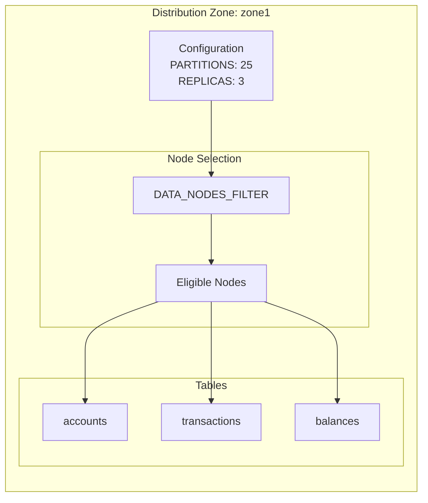
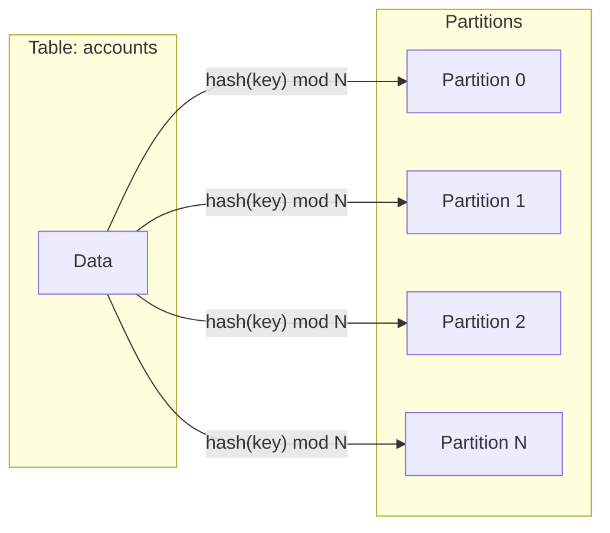
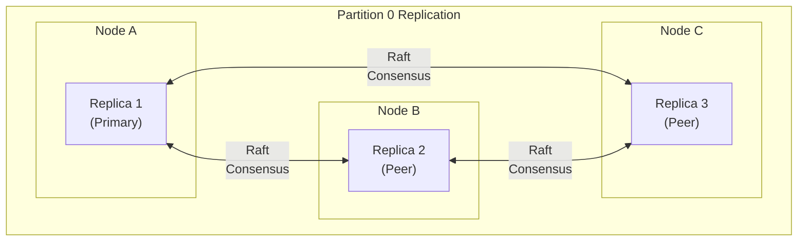
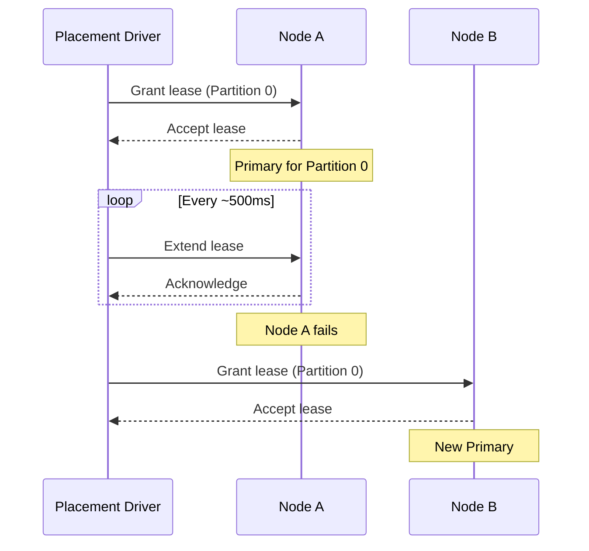
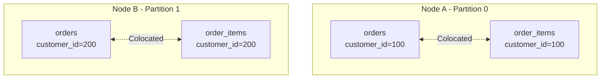
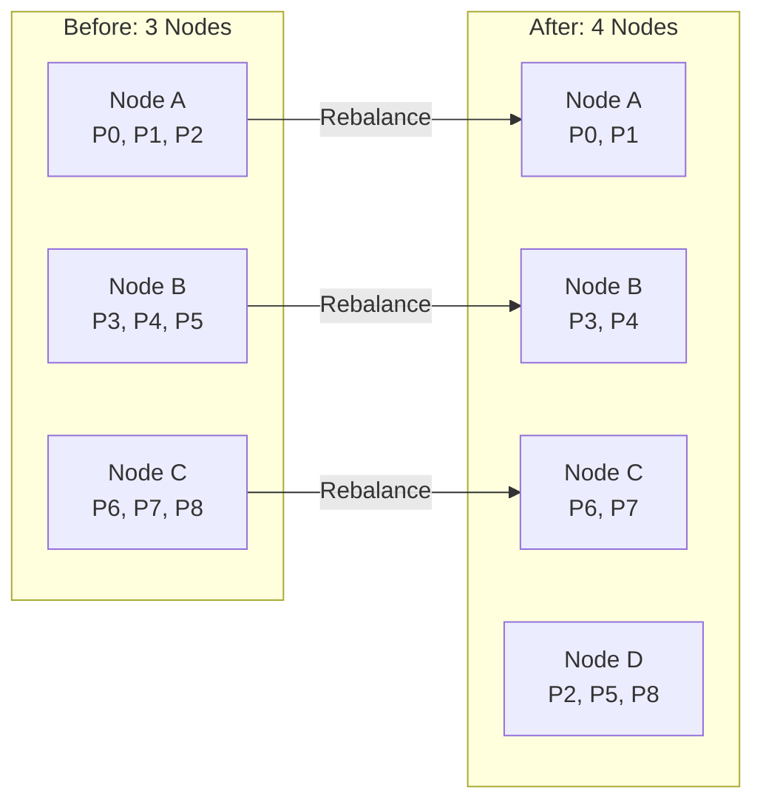

데이터 분산은 Ignite가 클러스터 노드 전체에 데이터를 퍼뜨리는 방식을 결정합니다. 콜로케이션은 연관된 데이터가 같은 노드에 위치하도록 보장해 노드 간 데이터 이동 없이 효율적으로 조인하고 트랜잭션을 처리합니다.

## 분산 영역 {#distribution-zones}

분산 영역(distribution zone)은 클러스터 전체에서 데이터를 배치하는 규칙을 정의합니다. 각 테이블은 정확히 하나의 분산 영역에 속하며, 이 영역은 다음을 제어합니다.

- 파티션 수
- 복제 계수
- 데이터를 저장할 수 있는 노드
- 노드 확장(scale-up)과 축소(scale-down) 시 동작



다음 예시는 분산 영역을 생성합니다.

```sql
CREATE ZONE my_zone WITH
    PARTITIONS = 25,
    REPLICAS = 3,
    DATA_NODES_FILTER = '$[?(@.region == "us-east")]',
    DATA_NODES_AUTO_ADJUST_SCALE_UP = 300,
    DATA_NODES_AUTO_ADJUST_SCALE_DOWN = 600
    STORAGE_PROFILES = 'default';
```

## 파티셔닝 {#partitioning}

테이블을 만들면 영역 구성에 따라 데이터가 파티션으로 나뉩니다. 각 파티션은 0부터 `PARTITIONS - 1`까지의 번호로 식별됩니다.



### 랑데부 해싱 {#rendezvous-hashing}

Ignite는 파티션을 노드에 배정할 때 랑데부 해싱(rendezvous hashing, Highest Random Weight라고도 함)을 사용합니다. 각 파티션에 대해 알고리즘은 다음을 수행합니다.

1. 각 노드의 ID와 파티션 번호를 결합해 해시를 계산합니다
2. 해시 값을 기준으로 노드를 내림차순 정렬합니다
3. 점수가 가장 높은 노드에 파티션을 배정합니다

이 방식은 다음을 제공합니다.

- **결정적 배치**: 클러스터 토폴로지가 같으면 같은 파티션은 항상 같은 노드로 매핑됩니다
- **최소 리밸런싱**: 노드를 추가하거나 제거해도 이동이 필요한 파티션에만 영향을 줍니다
- **안정적 순서**: 모든 노드에서 일관된 복제본 순서를 유지합니다

### 파티션 수 가이드라인 {#partition-count-guidelines}

클러스터 크기와 사용 가능한 코어 수를 기준으로 파티션 수를 설정합니다.

```text
recommended_partitions = (node_count * cores_per_node * 2) / replica_count
```

예시:

- 노드 3개, 코어 각 8개, 복제본 3개: 파티션 16~32개
- 노드 7개, 코어 각 16개, 복제본 3개: 파티션 75~150개

테이블당 최대 파티션 수는 65,000개입니다. 권장치보다 훨씬 많은 파티션을 사용하면 파티션 관리와 분산 추적에서 오버헤드가 발생합니다.

## 복제 {#replication}

각 파티션은 장애 허용성을 위해 여러 노드에 복제됩니다. `REPLICAS` 매개변수는 사본 수를 제어합니다.



### 합의 그룹 {#consensus-groups}

복제본은 RAFT 합의(consensus) 그룹을 형성합니다. 그룹에는 두 가지 구성원 유형이 있습니다.

| 유형 | 역할 |
|------|------|
| **피어(peer)** | 쓰기에 투표하고 정족수(quorum)에 기여하며, 프라이머리가 될 수 있음 |
| **러너(learner)** | 데이터를 비동기로 수신하며 투표에 참여하지 않고, 읽기 확장에 사용됨 |

합의 그룹 크기는 투표에 참여하는 피어 수를 결정합니다.

```text
consensus_group_size = (quorum_size * 2) - 1
```

복제본 5개, 정족수 크기 2인 경우: 피어 3개와 러너 2개입니다.

### 정족수 요구 사항 {#quorum-requirements}

쓰기가 완료되려면 피어 정족수의 확인이 필요합니다. 합의 그룹의 과반을 잃으면 파티션은 읽기 전용 상태가 됩니다.

| 복제본 | 기본 정족수 | 합의 피어 |
|----------|----------------|-----------------|
| 1개 | 1 | 1 |
| 2~4개 | 2 | 3 |
| 5개 이상 | 3 | 5 |

고가용성을 위해 복제본을 홀수 개(3개 또는 5개)로 사용해 정족수를 잃지 않고 노드 장애를 처리하세요.

## 프라이머리 복제본과 리스 {#primary-replicas-and-leases}

각 파티션에는 모든 읽기-쓰기 트랜잭션을 처리하는 프라이머리 복제본이 하나 있습니다. 프라이머리는 배치 드라이버(placement driver)가 관리하는 리스(lease) 메커니즘으로 결정됩니다.



리스 속성:

- **짧은 수명**: 갱신하지 않으면 몇 초 뒤 리스가 만료됩니다
- **철회 불가**: 만료 전에는 리스를 철회할 수 없습니다
- **단일 보유자**: 특정 시점에 파티션의 리스는 노드 하나만 보유합니다
- **협상 필요**: 후보 노드는 프라이머리가 되기 전에 리스를 수락해야 합니다

## 데이터 콜로케이션 {#data-colocation}

콜로케이션은 서로 다른 테이블의 연관된 데이터가 같은 파티션에 저장되도록 보장하며, 다음과 같은 이점을 제공합니다.

- 노드 간 데이터 전송 없는 조인
- 분산 조율 없이 연관된 데이터에 접근하는 트랜잭션
- 필요한 데이터를 모두 로컬에서 접근하는 콜로케이션된 컴퓨트 작업

### 콜로케이션 키 {#colocation-keys}

테이블은 다음 조건이 같으면 함께 배치됩니다.

- 분산 영역
- 값이 일치하는 콜로케이션 키 컬럼



테이블을 만들 때 다음과 같이 콜로케이션을 정의합니다.

```sql
-- Parent table
CREATE TABLE customers (
    customer_id INT PRIMARY KEY,
    name VARCHAR(100)
) WITH PRIMARY_ZONE = 'my_zone';

-- Child table colocated by customer_id
CREATE TABLE orders (
    order_id INT,
    customer_id INT,
    total DECIMAL(10,2),
    PRIMARY KEY (order_id, customer_id)
) COLOCATE BY (customer_id)
  WITH PRIMARY_ZONE = 'my_zone';

-- Another colocated table
CREATE TABLE order_items (
    item_id INT,
    order_id INT,
    customer_id INT,
    product_id INT,
    quantity INT,
    PRIMARY KEY (item_id, customer_id)
) COLOCATE BY (customer_id)
  WITH PRIMARY_ZONE = 'my_zone';
```

### 콜로케이션 요구 사항 {#colocation-requirements}

콜로케이션이 동작하려면 다음 조건을 만족해야 합니다.

1. **같은 영역**: 테이블은 같은 분산 영역을 사용해야 합니다
2. **일치하는 컬럼**: 콜로케이션 키 컬럼은 호환되는 타입이어야 합니다
3. **기본 키 포함**: 콜로케이션 컬럼은 기본 키의 일부여야 합니다
4. **일관된 해싱**: 콜로케이션된 모든 테이블은 콜로케이션 키에 같은 해시 함수를 사용합니다

### 쿼리 최적화 {#query-optimization}

SQL 엔진은 콜로케이션된 테이블을 감지해 조인 실행을 최적화합니다.

```sql
-- This join executes locally on each node without data shuffling
SELECT o.order_id, c.name, o.total
FROM orders o
JOIN customers c ON o.customer_id = c.customer_id
WHERE o.customer_id = 100;
```

콜로케이션이 없으면 같은 쿼리라도 노드 간 데이터 전송이 필요합니다.

## 파티션 리밸런싱 {#partition-rebalancing}

클러스터 토폴로지가 변경되면 Ignite는 균형 잡힌 데이터 분산을 유지하기 위해 파티션을 재분배합니다.



리밸런싱은 확장/축소 타이머로 제어됩니다.

- `DATA_NODES_AUTO_ADJUST_SCALE_UP`: 새 노드를 데이터 분산에 추가하기 전 지연 시간(기본값: 즉시)
- `DATA_NODES_AUTO_ADJUST_SCALE_DOWN`: 이탈한 노드를 분산에서 제거하기 전 지연 시간(기본값: 즉시)

지연 시간을 설정하면 롤링 재시작이나 일시적인 네트워크 문제로 발생하는 불필요한 리밸런싱을 방지합니다.

## 노드 필터링 {#node-filtering}

`DATA_NODES_FILTER` 매개변수는 노드 속성에 대한 JSONPath 표현식을 사용해 영역에 참여할 노드를 선택합니다.

```sql
-- Only nodes in us-east region
CREATE ZONE us_east_zone WITH
    DATA_NODES_FILTER = '$[?(@.region == "us-east")]',
    STORAGE_PROFILES = 'default';

-- Nodes with SSD storage and at least 32GB RAM
CREATE ZONE high_performance WITH
    DATA_NODES_FILTER = '$[?(@.storage == "ssd" && @.memory >= 32)]',
    STORAGE_PROFILES = 'default';
```

노드 속성은 각 노드의 구성 파일에서 설정합니다.

## 설계 제약 {#design-constraints}

1. **영역 불변성**: 테이블이 한 번 영역에 할당되면 다른 영역으로 옮길 수 없습니다
2. **고정된 파티션 수**: 영역을 생성한 뒤에는 파티션 수를 변경할 수 없습니다
3. **생성 시 콜로케이션 지정**: 콜로케이션은 테이블을 생성할 때 지정해야 합니다
4. **단일 리스홀더**: 특정 시점에 파티션의 프라이머리가 될 수 있는 노드는 하나뿐입니다
5. **합의 과반**: 합의 피어의 과반을 잃으면 파티션이 읽기 전용이 됩니다

## 관련 주제 {#related-topics}

- 영역 DDL 구문은 [분산 영역 SQL 참조](/sql/reference/language-definition/distribution-zones)를 참고하세요
- 파티션 내부 구조는 [데이터 파티셔닝](/understand/core-concepts/data-partitioning)을 참고하세요
- 파티션 장애 처리는 [재해 복구](/configure-and-operate/operations/disaster-recovery-partitions)를 참고하세요
