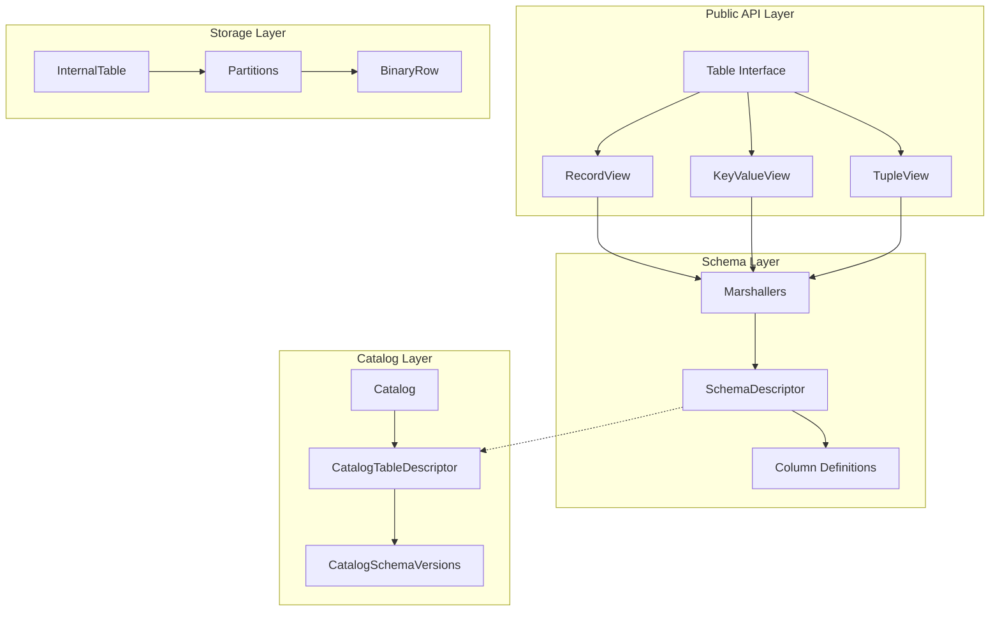
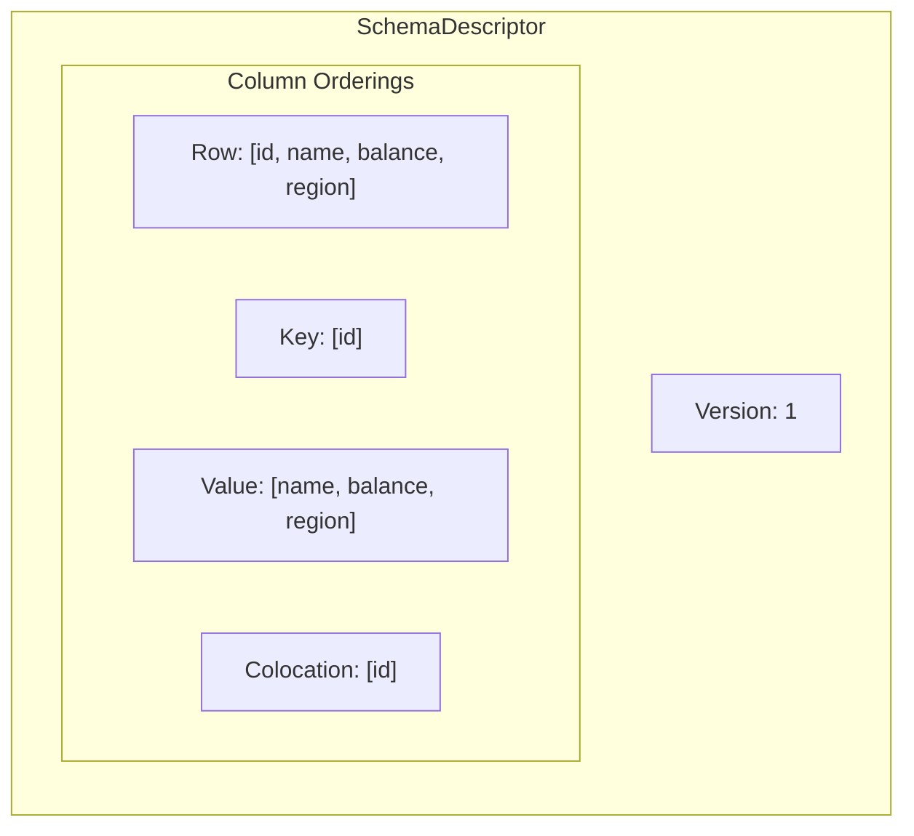
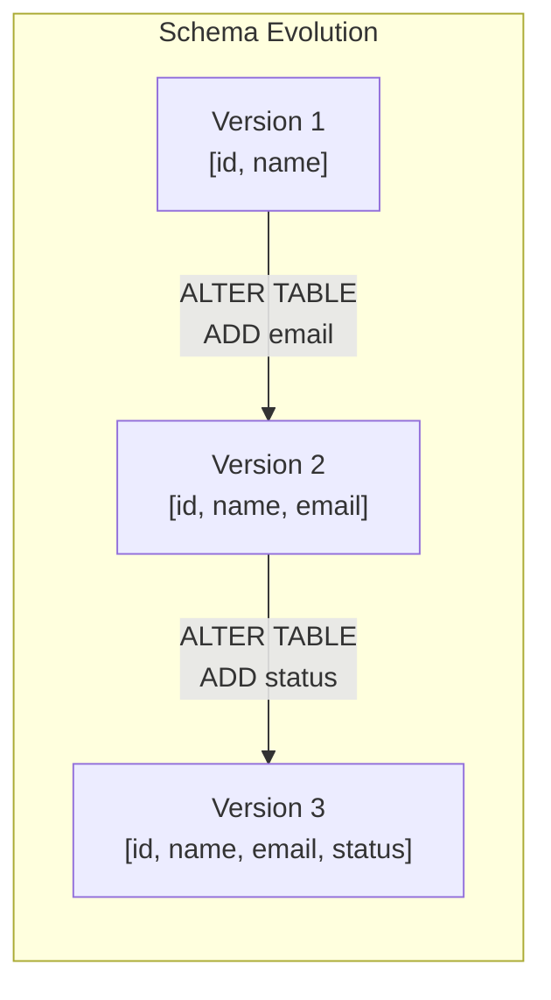
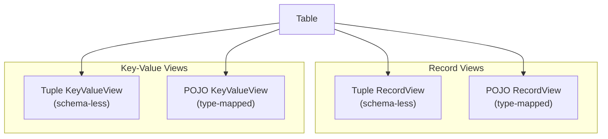
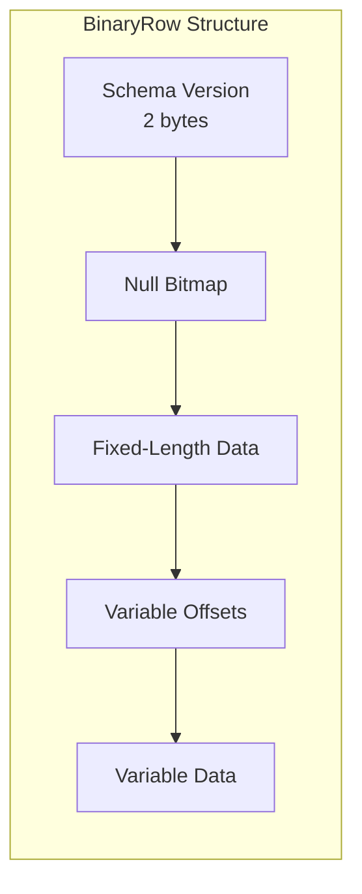

테이블은 Ignite 3의 기본 데이터 구조입니다. 바이너리 객체(Binary Objects)를 사용하는 Ignite 2의 캐시 기반 모델과 달리, Ignite 3는 SQL과 호환되는 스키마를 갖춘 테이블에 데이터를 저장합니다. 이 구조는 SQL API와 Key-Value API를 하나의 데이터 모델로 통합합니다.

## 아키텍처 개요 {#architecture-overview}

테이블 시스템은 세 개의 계층으로 구성됩니다.



- **카탈로그 계층**: 스키마, 테이블, 인덱스, 분산 영역(distribution zone)의 버전별 메타데이터를 유지합니다
- **스키마 계층**: 컬럼 타입을 정의하고, 바이너리 직렬화를 처리하며, 스키마 진화를 관리합니다
- **스토리지 계층**: 바이너리 행 형식을 사용해 파티셔닝된 데이터 저장을 관리합니다

## 스키마 구조 {#schema-structure}

각 테이블에는 구조를 정의하는 `SchemaDescriptor`가 있습니다. 이 디스크립터는 여러 컬럼 정렬을 유지합니다.

| 정렬 | 용도 |
|----------|---------|
| 행 위치 | 전체 행 직렬화 순서 |
| 키 위치 | 기본 키 컬럼만 |
| 값 위치 | 키가 아닌 컬럼만 |
| 콜로케이션 위치 | 파티션 배정에 사용되는 컬럼 |



스키마는 이 정렬에 걸친 컬럼 위치를 추적합니다. 특정 정렬에 없는 컬럼은 위치가 `-1`입니다.

## 컬럼 타입 {#column-types}

Ignite 3는 네이티브 타입을 두 가지 범주로 지원합니다.

### 고정 길이 타입 {#fixed-length-types}

| 타입 | 크기(바이트) | Java 매핑 |
|------|--------------|--------------|
| BOOLEAN | 1 | `boolean` |
| INT8 | 1 | `byte` |
| INT16 | 2 | `short` |
| INT32 | 4 | `int` |
| INT64 | 8 | `long` |
| FLOAT | 4 | `float` |
| DOUBLE | 8 | `double` |
| UUID | 16 | `java.util.UUID` |
| DATE | 3 | `java.time.LocalDate` |

### 가변 길이 타입 {#variable-length-types}

| 타입 | 최대 크기 | Java 매핑 |
|------|----------|--------------|
| STRING | 65536(기본값) | `String` |
| BYTES | 65536(기본값) | `byte[]` |
| DECIMAL | 정밀도/스케일 | `BigDecimal` |
| TIME | 정밀도(0-9) | `java.time.LocalTime` |
| DATETIME | 정밀도(0-9) | `java.time.LocalDateTime` |
| TIMESTAMP | 정밀도(0-9) | `java.time.Instant` |

:::note
Ignite 3는 시간 관련 타입에 JavaTime API를 요구합니다. `java.util.Date`, `java.sql.Date`, `java.sql.Time`, `java.sql.Timestamp` 같은 레거시 타입은 지원되지 않습니다.
:::

## 기본 키 {#primary-keys}

모든 테이블에는 기본 키가 필요합니다. Ignite 3는 두 가지 기본 키 유형을 지원합니다:

- **해시 기본 키**: 데이터 분산에 해시 기반 파티셔닝을 사용합니다
- **정렬 기본 키**: 콜레이션 순서에 따른 범위 기반 파티셔닝을 사용합니다

기본 키 제약 조건:

- 모든 기본 키 컬럼은 NULL을 허용하지 않아야 합니다
- 키 정의에는 중복 컬럼을 허용하지 않습니다
- 모든 키 컬럼은 테이블 스키마에 존재해야 합니다
- 기본 키 인덱스는 자동으로 생성됩니다

```sql
CREATE TABLE accounts (
    account_id INT PRIMARY KEY,
    name VARCHAR(100),
    balance DECIMAL(10, 2)
);
```

복합 키의 경우:

```sql
CREATE TABLE order_items (
    order_id INT,
    item_id INT,
    quantity INT,
    PRIMARY KEY (order_id, item_id)
);
```

## 스키마 버전 관리 {#schema-versioning}

Ignite 3는 추가 전용(append-only) 스키마 버전 관리를 사용합니다. `ALTER TABLE` 연산을 실행할 때마다 카탈로그 버전이 증가하고 테이블에 새 스키마 버전이 생성됩니다.



주요 버전 관리 동작:

- **불변 버전**: 스키마 버전은 생성된 후 절대 수정되지 않습니다
- **연속 번호 부여**: 버전은 빈틈없이 1씩 증가합니다
- **컬럼 매퍼**: 자동 데이터 마이그레이션을 위해 버전 간 전환을 추적합니다
- **바이너리 행 버전 관리**: 저장된 각 행은 자신의 스키마 버전을 함께 기록합니다

이전 스키마 버전으로 기록된 데이터를 읽으면, Ignite는 `ColumnMapper`를 사용해 행을 자동으로 업그레이드합니다. 새 컬럼은 기본값을 받습니다.

## 테이블 뷰 {#table-views}

테이블은 다양한 접근 패턴에 맞춰 여러 뷰 추상화를 제공합니다.



### RecordView

기본 키를 포함해 모든 필드가 담긴 완전한 행 레코드를 다룹니다.

```java
RecordView<Account> accounts = table.recordView(Account.class);

Account account = new Account(123, "John Doe", 1000.00);
accounts.insert(null, account);

Account retrieved = accounts.get(null, new Account(123));
```

### KeyValueView

키와 값을 분리합니다. 기본 키가 논리적으로 도메인 객체에 속하지 않을 때 사용합니다.

```java
KeyValueView<Long, Account> accounts = table.keyValueView(
    Mapper.of(Long.class),
    Mapper.of(Account.class)
);

accounts.put(null, 123L, new Account("John Doe", 1000.00));
Account account = accounts.get(null, 123L);
```

### Tuple 뷰 {#tuple-views}

사전에 정의한 클래스 없이 스키마 없는 방식으로 접근할 때 사용합니다.

```java
RecordView<Tuple> view = table.recordView();

Tuple record = Tuple.create()
    .set("id", 123)
    .set("name", "John Doe")
    .set("balance", 1000.00);

view.insert(null, record);
```

## 바이너리 행 형식 {#binary-row-format}

데이터는 제로카피(zero-copy) 읽기에 최적화된 간결한 바이너리 형식으로 저장됩니다.



이 형식은 다음을 지원합니다:

- **NULL 추적**: 비트맵으로 자리표시자 데이터 없이 NULL 컬럼을 표시합니다
- **직접 접근**: 고정 길이 컬럼은 역직렬화 없이 오프셋으로 접근합니다
- **가변 길이 효율성**: 오프셋 테이블로 가변 길이 컬럼에 직접 접근할 수 있습니다

## 카탈로그 관리 {#catalog-management}

`Catalog`는 특정 버전에서 분산 스키마의 불변 스냅샷을 유지합니다.

```java
// Tables are created via SQL
client.sql().execute(null,
    "CREATE TABLE accounts (" +
    "  id INT PRIMARY KEY," +
    "  name VARCHAR(100)," +
    "  balance DECIMAL(10,2)" +
    ") WITH PRIMARY_ZONE='default'"
);

// Access table via API
Table accounts = client.tables().table("accounts");
```

스키마 연산은 `CatalogCommand` 구현체를 사용합니다:

- `CreateTableCommand`: 스키마와 함께 새 테이블을 생성합니다
- `AlterTableAddColumnCommand`: 기존 테이블에 컬럼을 추가합니다
- `AlterTableDropColumnCommand`: 컬럼을 제거합니다
- `DropTableCommand`: 테이블을 제거합니다

모든 카탈로그 연산은 원자적이며 버전으로 추적됩니다.

## 설계 제약 조건 {#design-constraints}

테이블을 다룰 때는 다음 사항이 적용됩니다:

1. **테이블 생성에는 SQL이 필요합니다**: Table API는 읽기와 쓰기 연산만 제공합니다. 테이블을 생성, 변경, 삭제하려면 SQL DDL을 사용하세요.

2. **스키마 버전 연속성**: 스키마 버전은 연속으로 증가해야 합니다. 오래된 버전은 정리될 수 있지만 중간 버전은 건너뛸 수 없습니다.

3. **기본 키 불변성**: 기본 키 컬럼은 테이블 생성 후 수정할 수 없습니다.

4. **NULL 허용 여부 자동 추론**: 기본 키 컬럼은 자동으로 NULL을 허용하지 않습니다. NULL을 허용하는 컬럼을 기본 키에 포함하면 검증 오류가 발생합니다.

5. **타입 제약**: 가변 길이 타입에는 최대 길이 제약이 있습니다. DECIMAL은 정밀도와 스케일을 명시적으로 지정해야 합니다.

## 관련 주제 {#related-topics}

- 테이블 뷰 작업 방법은 [Table API](/develop/work-with-data/table-api)를 참고하세요
- 파티션 구성은 [분산 영역](/sql/reference/language-definition/distribution-zones)을 참고하세요
- SQL 타입 매핑은 [데이터 타입](/sql/reference/data-types-and-functions/data-types)을 참고하세요
