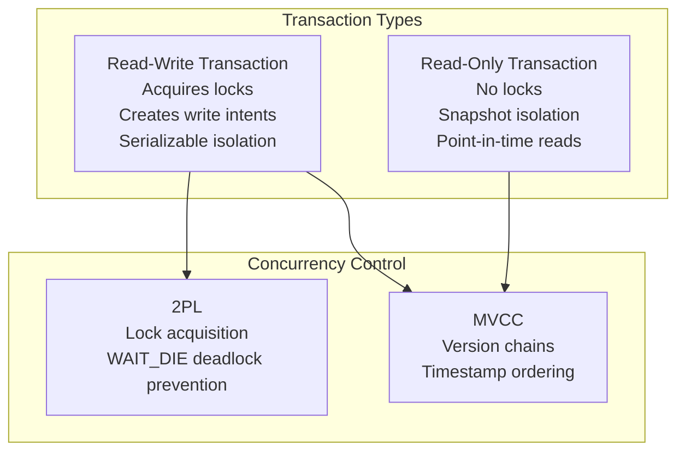
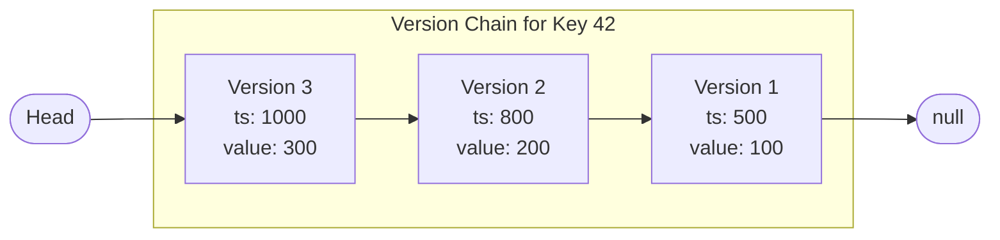
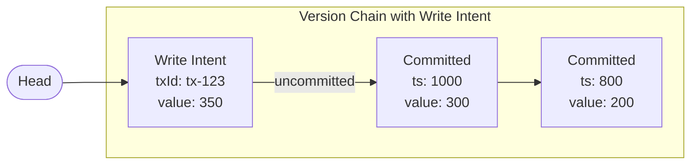
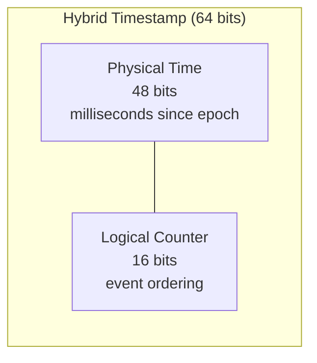
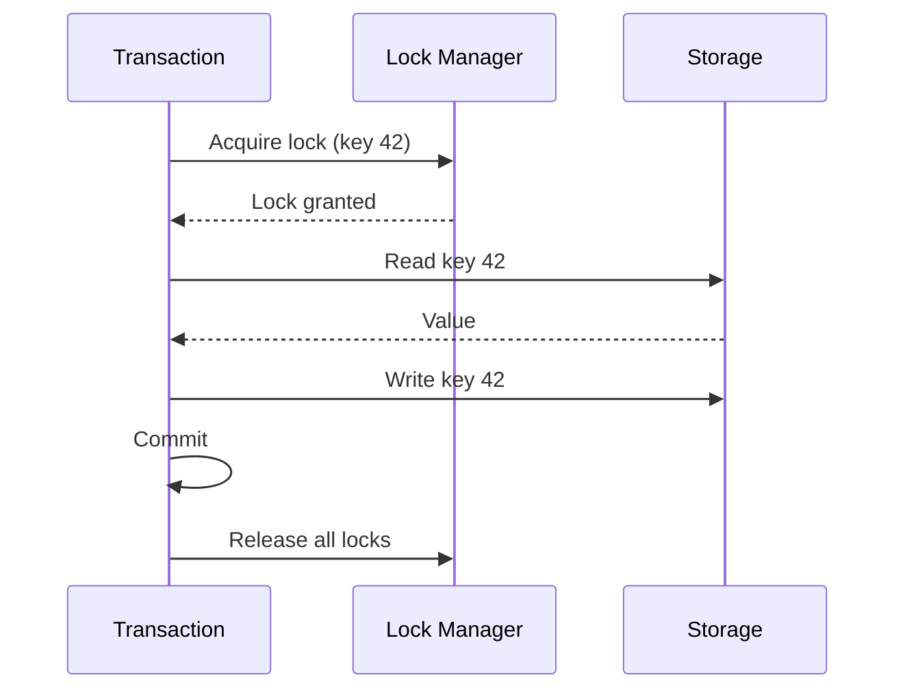
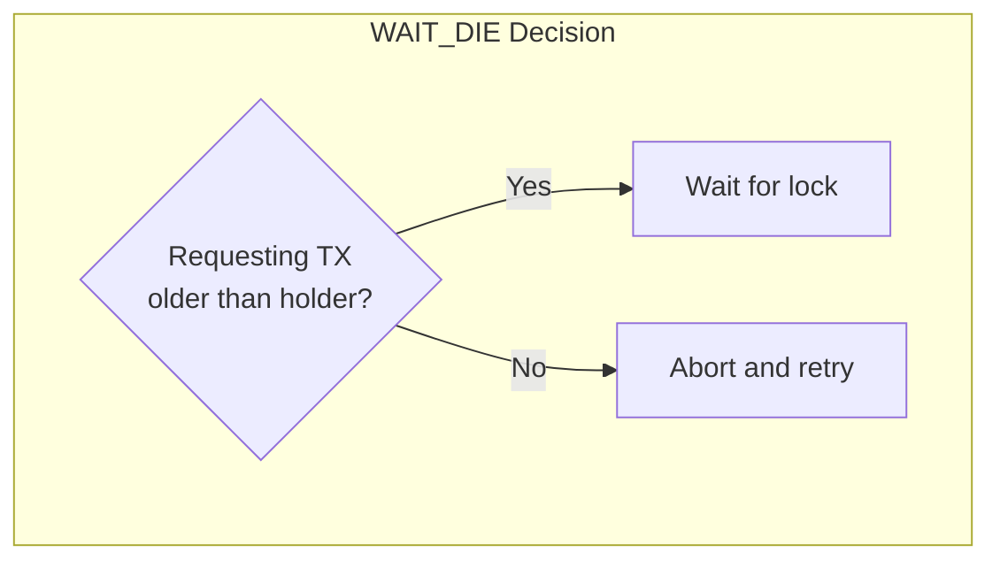
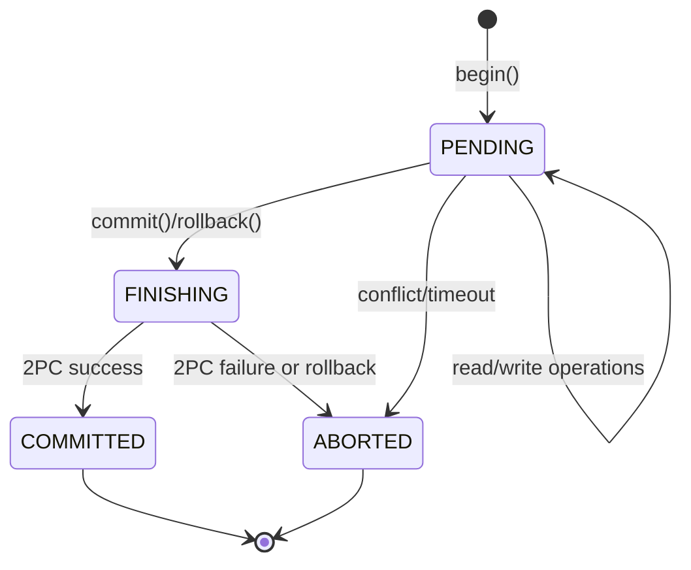
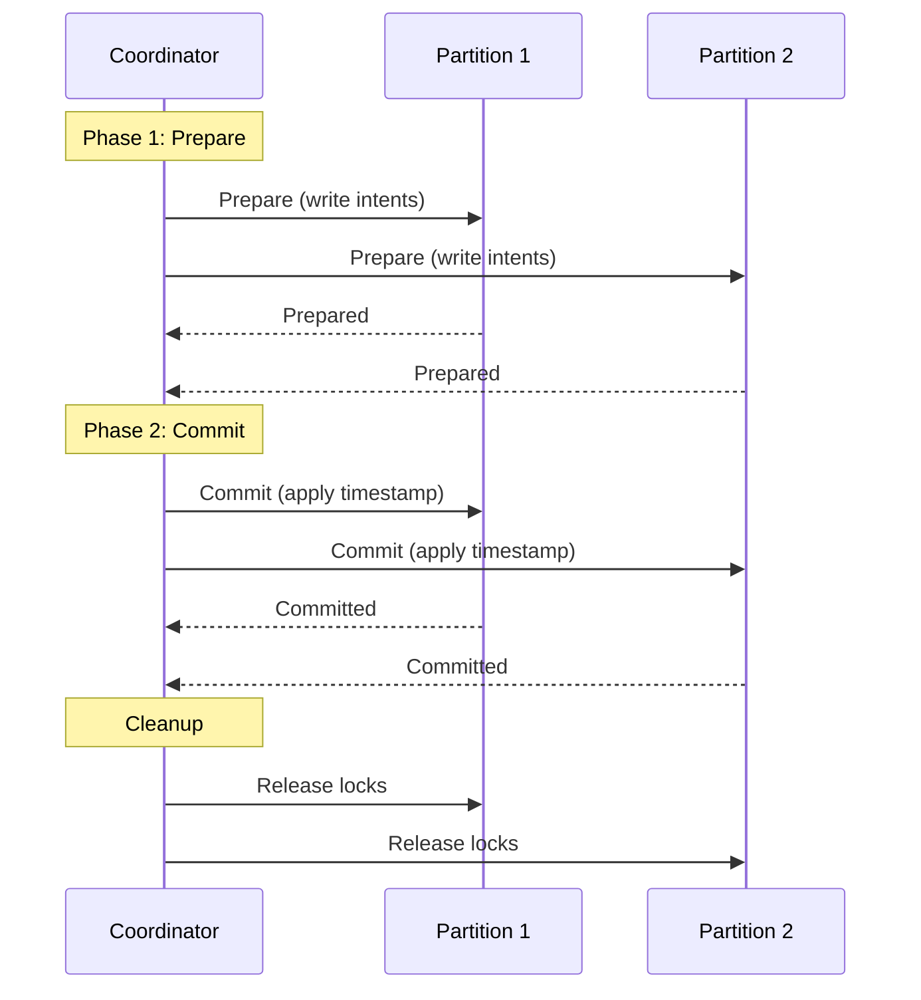
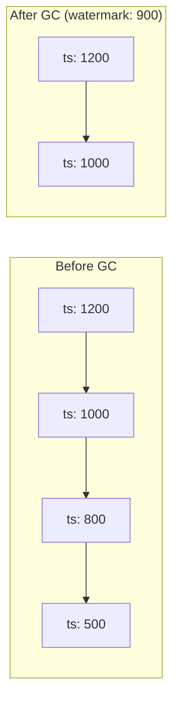

Ignite 3는 다중 버전 동시성 제어(Multi-Version Concurrency Control, MVCC)와 2단계 락킹(two-phase locking, 2PL)을 결합해 ACID 트랜잭션을 제공합니다. 모든 테이블은 기본적으로 트랜잭션을 지원하며 직렬화 가능 격리(serializable isolation)로 동작합니다.

## 트랜잭션 모델 개요 {#transaction-model-overview}



주요 특징:

- 모든 트랜잭션은 읽기-쓰기 작업에서 직렬화 가능합니다
- 읽기 전용 트랜잭션은 락 없이 스냅샷 격리(snapshot isolation)를 사용합니다
- WAIT_DIE 알고리즘이 데드락을 방지합니다
- 2단계 커밋(two-phase commit, 2PC)이 분산 트랜잭션을 조율합니다

## 다중 버전 동시성 제어 {#multi-version-concurrency-control}

MVCC는 각 행의 여러 버전을 유지해, 읽기와 쓰기가 서로를 차단하지 않고 동시에 진행되도록 합니다.

### 버전 체인 {#version-chains}

각 행에는 최신 버전부터 가장 오래된 버전까지 모두 저장하는 버전 체인(version chain)이 있습니다.



각 버전에는 다음 항목이 들어 있습니다.

| 필드 | 설명 |
|-------|-------------|
| 타임스탬프 | 커밋 시점의 하이브리드 타임스탬프(hybrid timestamp), 커밋 전이면 null |
| 트랜잭션 ID | 소유 트랜잭션의 ID(커밋되지 않은 버전에 해당) |
| 값 | 바이너리 행 데이터(툼스톤(tombstone)이나 삭제의 경우 비어 있음) |
| 다음 링크 | 이전 버전을 가리키는 포인터 |

### 쓰기 인텐트 {#write-intents}

커밋되지 않은 변경은 버전 체인의 맨 앞에 쓰기 인텐트(write intent)로 저장됩니다.



쓰기 인텐트가 기록하는 정보는 다음과 같습니다.

- 쓰기를 수행한 트랜잭션의 ID
- 트랜잭션 상태 조회에 쓰이는 커밋 파티션(commit partition) ID
- 커밋되지 않은 값

커밋되면 쓰기 인텐트는 타임스탬프를 받아 일반적인 커밋된 버전이 됩니다. 중단되면 쓰기 인텐트는 제거됩니다.

### 가시성 규칙 {#visibility-rules}

행을 읽을 때 트랜잭션은 자신의 유형과 타임스탬프에 따라 서로 다른 버전을 봅니다.

| 시나리오 | 읽기-쓰기 트랜잭션 | 읽기 전용 트랜잭션 |
|----------|----------------------|---------------------|
| 쓰기 인텐트만 존재 | 쓰기 인텐트를 봄(자신의 트랜잭션인 경우) | 차단되거나 아무것도 보지 못함 |
| 쓰기 인텐트 + 더 오래된 커밋 | 쓰기 인텐트를 봄(자신의 트랜잭션인 경우) 또는 대기 | 더 오래된 커밋을 봄 |
| 읽기 타임스탬프보다 최신인 커밋된 버전 | 해당 버전을 봄 | 더 오래된 버전을 봄 |
| 모든 커밋이 읽기 타임스탬프보다 오래됨 | 가장 최신 버전을 봄 | 해당 타임스탬프 시점의 버전을 봄 |

읽기 전용 트랜잭션은 항상 생성 시점의 타임스탬프로 읽으므로 일관된 스냅샷을 제공합니다.

## 하이브리드 타임스탬프 {#hybrid-timestamps}

Ignite는 물리 시간과 논리 카운터를 결합한 하이브리드 논리 시계(hybrid logical clock, HLC)를 사용합니다.



하이브리드 타임스탬프는 다음을 제공합니다.

- **인과성**: 같은 노드에서 발생한 이벤트가 올바른 순서로 정렬됩니다
- **근사 실제 시각**: 물리 구성 요소로 시간 기반 쿼리를 수행할 수 있습니다
- **조율 없는 생성**: 각 노드가 로컬에서 타임스탬프를 생성합니다

에포크(epoch)는 2021년 1월 1일부터 시작합니다. 논리 카운터는 같은 밀리초 안에서 여러 이벤트가 발생할 때 순서를 보장합니다.

## 트랜잭션 격리 {#transaction-isolation}

### 읽기-쓰기 트랜잭션 {#read-write-transactions}

읽기-쓰기 트랜잭션은 2단계 락킹으로 직렬화 가능 격리를 사용합니다.

1. **확장 단계**: 데이터에 접근하기 전에 락을 획득합니다
2. **수축 단계**: 커밋 또는 중단 시 모든 락을 해제합니다



락 모드는 다음과 같은 호환성 행렬을 이룹니다.

| 락 | IS | IX | S | SIX | X |
|------|----|----|---|-----|---|
| **IS** | 예 | 예 | 예 | 예 | 아니오 |
| **IX** | 예 | 예 | 아니오 | 아니오 | 아니오 |
| **S** | 예 | 아니오 | 예 | 아니오 | 아니오 |
| **SIX** | 예 | 아니오 | 아니오 | 아니오 | 아니오 |
| **X** | 아니오 | 아니오 | 아니오 | 아니오 | 아니오 |

- **IS**(Intention Shared): 하위 항목을 읽으려는 의도
- **IX**(Intention Exclusive): 하위 항목을 쓰려는 의도
- **S**(Shared): 읽기 락
- **SIX**(Shared Intention Exclusive): 읽기 락이면서 하위 항목을 쓰려는 의도
- **X**(Exclusive): 쓰기 락

### 읽기 전용 트랜잭션 {#read-only-transactions}

읽기 전용 트랜잭션은 락을 전혀 사용하지 않습니다.

- 생성 시점에 고정된 읽기 타임스탬프가 부여됩니다
- 프라이머리 복제본뿐 아니라 어떤 복제본에서도 읽습니다
- 파티션 참여나 조율이 필요 없습니다
- 데이터를 수정할 수 없습니다

```java
var tx = client.transactions().begin(
    new TransactionOptions().readOnly(true)
);

// Reads see consistent snapshot at transaction start time
Account account = accounts.get(tx, 42);

tx.commit(); // No-op for read-only
```

## 데드락 방지 {#deadlock-prevention}

Ignite는 WAIT_DIE 알고리즘으로 데드락을 방지하며, 별도의 탐지 과정을 두지 않습니다.



한 트랜잭션이 다른 트랜잭션이 보유한 락을 요청하면 다음과 같이 처리됩니다.

| 요청 트랜잭션의 나이 | 동작 |
|---------------|--------|
| 보유 트랜잭션보다 오래됨 | 락이 해제될 때까지 대기 |
| 보유 트랜잭션보다 최근 | 즉시 중단하고 같은 타임스탬프로 재시도 |

최근 트랜잭션이 항상 오래된 트랜잭션에 양보하므로 순환 대기가 발생하지 않습니다. 같은 타임스탬프로 재시도하면 해당 트랜잭션이 결국 가장 오래된 트랜잭션이 되어 성공합니다.

## 트랜잭션 수명 주기 {#transaction-lifecycle}

### 읽기-쓰기 트랜잭션 흐름 {#read-write-transaction-flow}



상태 설명:

| 상태 | 설명 |
|-------|-------------|
| PENDING | 활성 트랜잭션, 작업 진행 중 |
| FINISHING | 코디네이터가 커밋 또는 롤백을 시작함 |
| COMMITTED | 정상적으로 커밋됨, 변경 사항이 보임 |
| ABORTED | 롤백됨, 변경 사항 폐기 |
| ABANDONED | 코디네이터 소실, 복구 대기 중 |

### 2단계 커밋 프로토콜 {#two-phase-commit-protocol}

분산 트랜잭션은 원자적 커밋을 위해 2PC를 사용합니다.



어느 한 파티션이라도 준비(prepare)에 실패하면 코디네이터는 모든 참여자를 중단시킵니다.

### 트랜잭션 코디네이터 {#transaction-coordinator}

트랜잭션을 시작한 노드가 코디네이터가 되며, 다음을 담당합니다.

- 참여한 파티션 추적
- 상태 저장을 위한 커밋 파티션 지정
- 2PC 프로토콜 조율
- 장애와 시간 초과 처리

코디네이터가 실패하면 다음 순서로 진행됩니다.

1. 트랜잭션이 ABANDONED 상태로 진입합니다
2. 시간 초과 후 고아 트랜잭션 탐지가 작동합니다
3. 커밋 파티션 상태를 기준으로 쓰기 인텐트가 해소됩니다
4. 락이 해제됩니다

## 버전 가비지 컬렉션 {#version-garbage-collection}

버전 체인에는 오래된 버전이 쌓입니다. 가비지 컬렉터(garbage collector)는 하한 워터마크(low watermark)보다 오래된 버전을 제거합니다.



하한 워터마크를 정할 때 고려할 점은 다음과 같습니다.

- 기본값: 600,000 ms(10분)
- 값을 늘리면 읽기 전용 트랜잭션을 더 오래 실행할 수 있습니다
- 값이 클수록 오래된 버전을 저장하는 데 더 많은 스토리지가 필요합니다
- 활성 트랜잭션은 자신이 필요로 할 수 있는 버전의 GC를 막습니다

## 트랜잭션 옵션 {#transaction-options}

생성 시점에 트랜잭션을 구성합니다.

```java
// Read-write with timeout
var rwTx = client.transactions().begin(
    new TransactionOptions()
        .timeoutMillis(30000)  // 30 second timeout
);

// Read-only
var roTx = client.transactions().begin(
    new TransactionOptions()
        .readOnly(true)
);
```

| 옵션 | 기본값 | 설명 |
|--------|---------|-------------|
| `readOnly` | false | 읽기 전용 모드 활성화 |
| `timeoutMillis` | 0(없음) | 시간 초과 후 자동 롤백 |

## 설계 제약 {#design-constraints}

1. **프라이머리 복제본 쓰기**: 모든 읽기-쓰기 작업은 파티션의 프라이머리 복제본을 거칩니다

2. **락 단위**: 락은 행 단위나 테이블 단위가 아니라 키 단위입니다

3. **세이브포인트(savepoint) 없음**: 트랜잭션 내 부분 롤백은 지원하지 않습니다

4. **시계 동기화**: 노드의 시계는 서로 동기화되어 있어야 합니다(`schemaSync.maxClockSkewMillis` 이내)

5. **단일 커밋 파티션**: 각 트랜잭션은 상태 저장에 파티션 하나를 사용하며, 이는 조율 지점이 됩니다

6. **쓰기 인텐트 해소**: 다른 트랜잭션의 쓰기 인텐트를 만나면 대기하거나 중단해야 할 수 있습니다

## 관련 주제 {#related-topics}

- API 사용법은 [트랜잭션 수행](/develop/work-with-data/transactions)을 참고하세요
- 버전 저장 세부 사항은 [데이터 파티셔닝](/understand/core-concepts/data-partitioning)을 참고하세요
