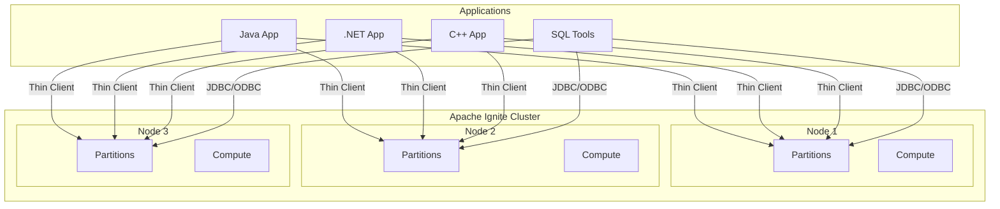
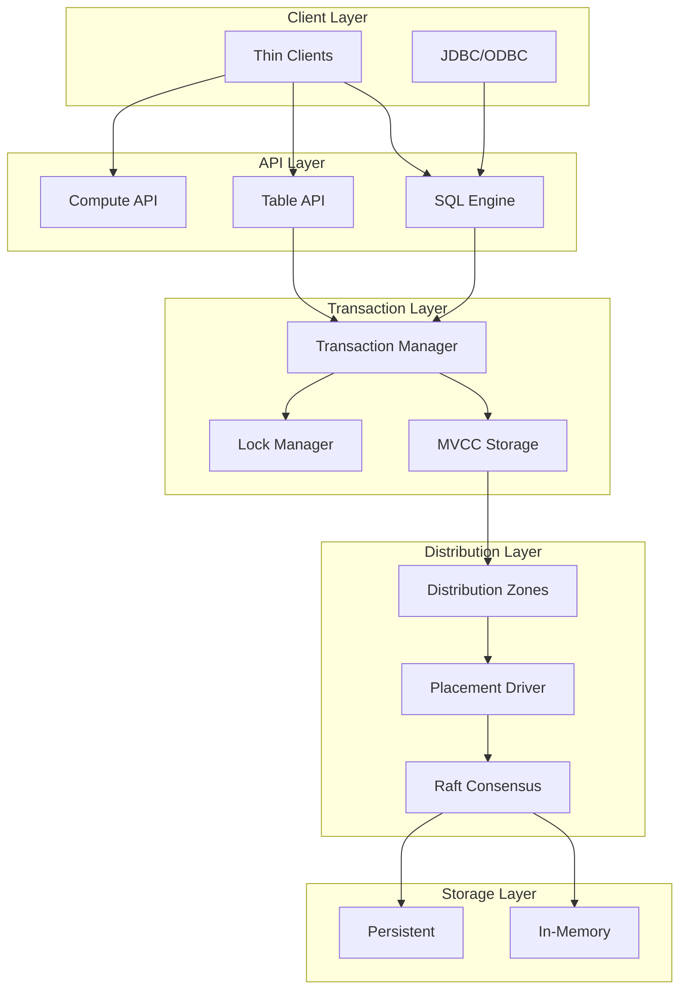
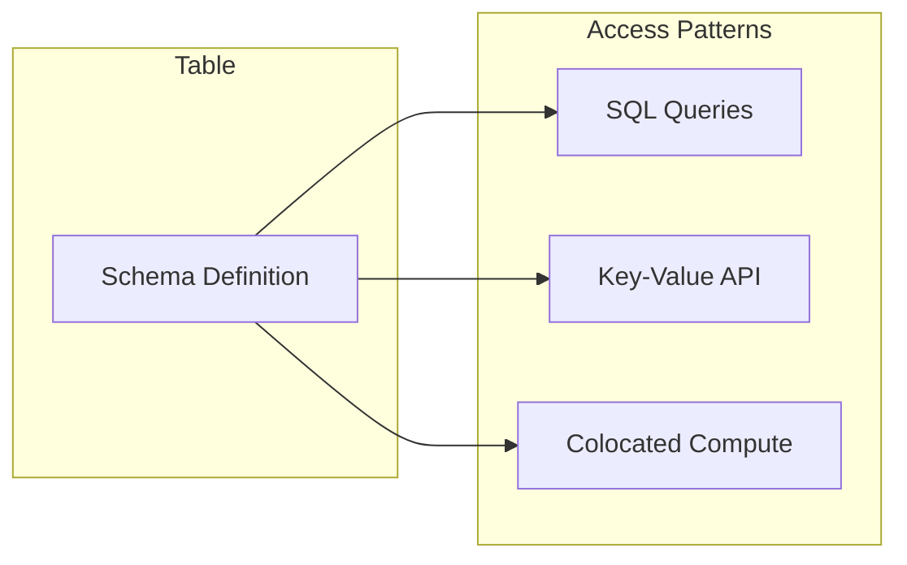
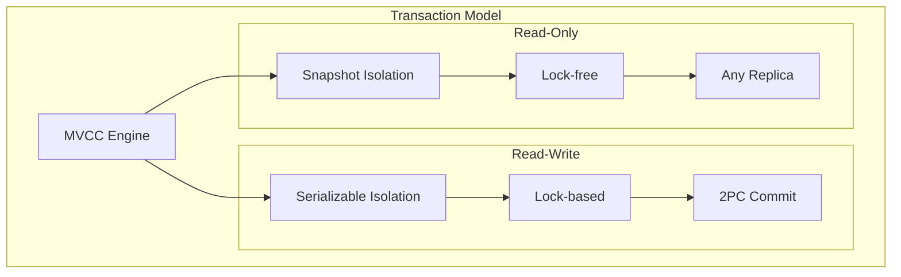
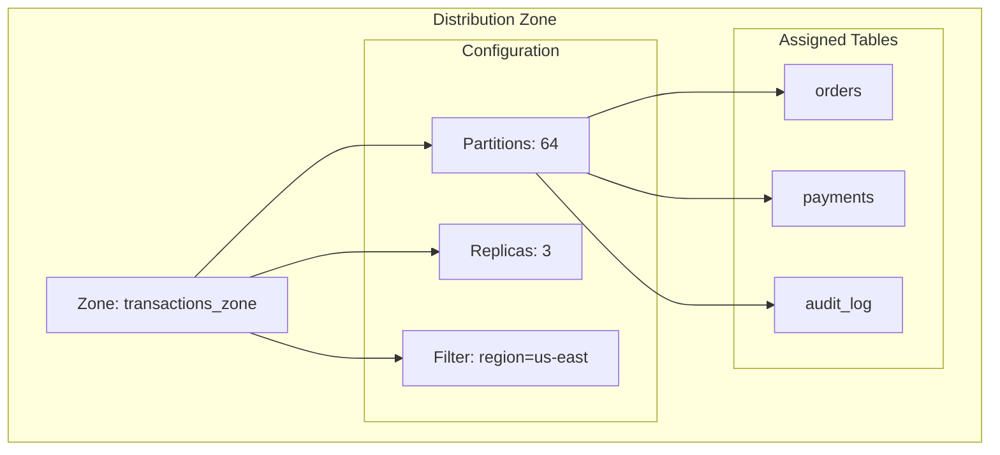
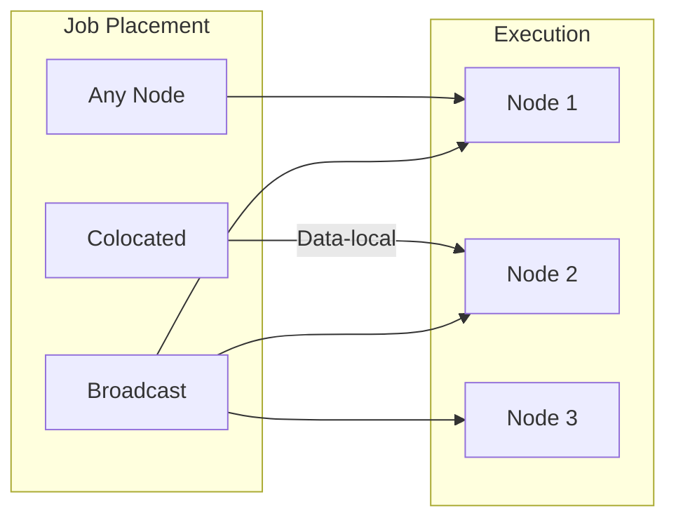
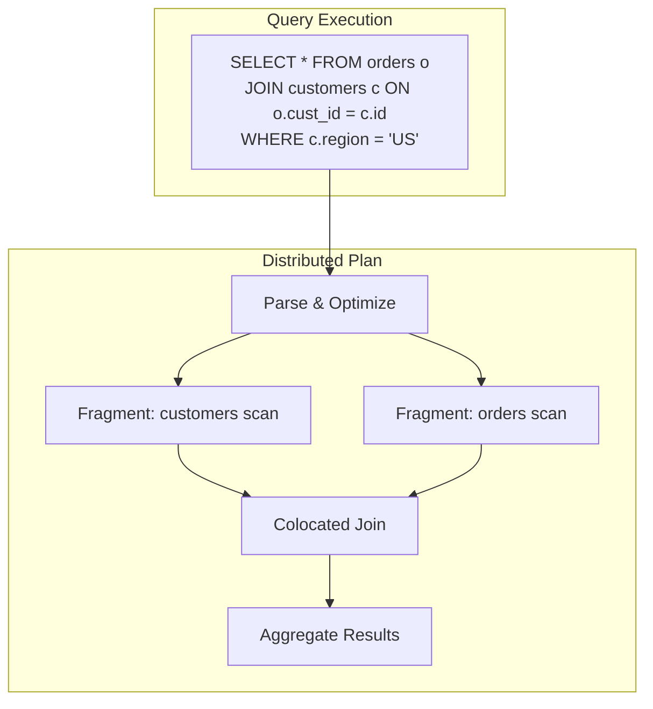
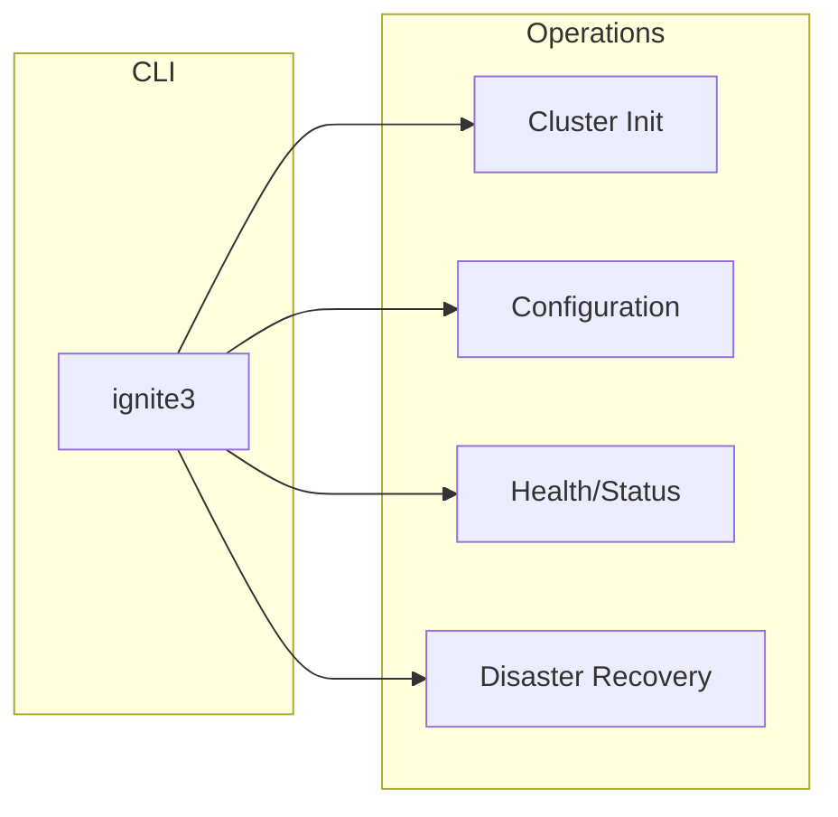
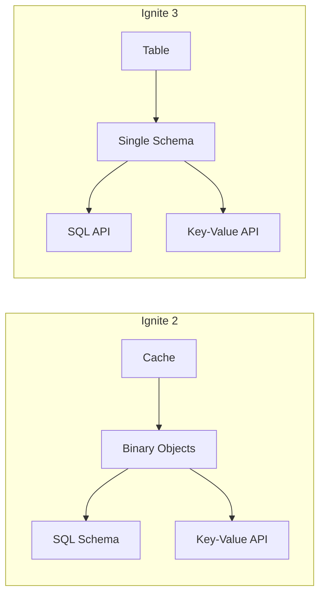

Apache Ignite는 고성능 트랜잭션 및 분석 워크로드에 맞게 설계된 분산 데이터베이스입니다. 인메모리의 속도와 디스크 영속성을 함께 제공하며, ACID 트랜잭션을 완전히 지원하면서 같은 데이터에 SQL과 키-값 두 방식으로 접근할 수 있습니다.

## Ignite가 적합한 경우 {#when-to-use-ignite}

Ignite는 대규모 환경에서 낮은 지연으로 데이터에 접근해야 하는 워크로드에 적합합니다:

| 워크로드 | Ignite의 역할 |
|----------|------------------|
| **고처리량 OLTP** | 인메모리 처리와 영속 스토리지로 초당 수백만 건의 트랜잭션을 처리합니다 |
| **실시간 분석** | 분산 SQL 쿼리가 ETL 없이 파티셔닝된 데이터 전반에서 실행됩니다 |
| **캐싱 계층** | 외부 캐시를 트랜잭션을 지원하고 SQL로 쿼리할 수 있는 데이터 계층으로 대체합니다 |
| **마이크로서비스 데이터** | 강한 일관성(strong consistency)을 보장하는 분산 상태를 공유합니다 |
| **이벤트 처리** | 컴퓨트를 데이터가 있는 곳에 함께 배치해 비즈니스 로직을 실행합니다 |

## 아키텍처 {#architecture}

Ignite 클러스터는 파티셔닝된 데이터를 저장하고 분산 쿼리와 컴퓨트 작업을 실행하는 서버 노드로 구성됩니다. 클라이언트는 클러스터 토폴로지에 합류하지 않고 경량 프로토콜로 연결합니다.



### 구성 요소 계층 {#component-layers}



## 핵심 기능 {#core-features}

### 통합 데이터 모델 {#unified-data-model}

테이블은 SQL과 키-값 연산 모두에 하나의 데이터 구조를 제공합니다. 같은 스키마가 분산 쿼리와 낮은 지연 키 조회를 모두 지원합니다.



SQL로 테이블을 만든 뒤, 어떤 API로든 접근할 수 있습니다:

```sql
CREATE TABLE accounts (
    id INT PRIMARY KEY,
    name VARCHAR(100),
    balance DECIMAL(10,2)
) WITH PRIMARY_ZONE = 'default';
```

```java
// Key-value access to the same table
KeyValueView<Long, Account> kv = table.keyValueView(
    Mapper.of(Long.class), Mapper.of(Account.class));
Account account = kv.get(null, 42L);

// SQL access
ResultSet rs = client.sql().execute(null,
    "SELECT * FROM accounts WHERE balance > ?", 1000);
```

### ACID 트랜잭션 {#acid-transactions}

모든 테이블은 기본적으로 다중 버전 동시성 제어(MVCC)를 사용해 트랜잭션을 지원합니다. 읽기-쓰기 트랜잭션은 직렬화 가능 격리(serializable isolation)로 실행됩니다. 읽기 전용 트랜잭션은 락을 획득하지 않고 스냅샷 격리(snapshot isolation)를 제공합니다.



트랜잭션은 SQL 연산과 키-값 연산에 걸쳐 동작합니다:

```java
var tx = client.transactions().begin();
try {
    // Mix SQL and key-value in same transaction
    client.sql().execute(tx, "UPDATE accounts SET balance = balance - 100 WHERE id = ?", 1);
    kv.put(tx, 2L, new Account("Jane", 100.00));
    tx.commit();
} catch (Exception e) {
    tx.rollback();
}
```

### 분산 영역 {#distribution-zones}

분산 영역(distribution zone)은 클러스터 전반에서 데이터를 어떻게 파티셔닝하고 복제할지 제어합니다. 각 영역은 파티션 수, 복제 계수, 노드 배치 규칙을 정의합니다.



같은 영역에 있으면서 콜로케이션(colocation) 키가 일치하는 테이블은 관련 데이터를 같은 파티션에 저장하므로, 네트워크 전송 없이 효율적으로 조인할 수 있습니다.

### 분산 컴퓨트 {#distributed-compute}

데이터가 있는 위치에서 코드를 실행해 네트워크 오버헤드를 최소화합니다. 작업은 특정 노드를 지정하거나, 데이터 파티션에 함께 배치하거나, 클러스터 전체에 브로드캐스트할 수 있습니다.



콜로케이션 실행은 네트워크 전송 없이 데이터를 처리합니다:

```java
// Execute on node holding account 42's partition
JobExecution<Double> execution = client.compute().submit(
    JobTarget.colocated("accounts", Tuple.create().set("id", 42L)),
    JobDescriptor.builder(CalculateInterestJob.class).build(),
    42L
);
Double interest = execution.resultAsync().join();
```

### 분산 SQL {#distributed-sql}

SQL 엔진은 파티셔닝된 데이터 전반에 걸쳐 ANSI SQL 쿼리를 실행합니다. 쿼리 계획은 조건자를 파티션으로 내려보내고, 결과를 집계하며, 분산 조인을 처리합니다.



표준 JDBC 연결로 기존 SQL 도구를 그대로 사용할 수 있습니다:

```java
try (Connection conn = DriverManager.getConnection("jdbc:ignite:thin://localhost:10800")) {
    PreparedStatement stmt = conn.prepareStatement(
        "SELECT region, SUM(amount) FROM orders GROUP BY region");
    ResultSet rs = stmt.executeQuery();
}
```

### 스토리지 옵션 {#storage-options}

Ignite는 다양한 워크로드에 최적화된 여러 스토리지 엔진을 지원합니다:

| 엔진 | 특성 | 사용 사례 |
|--------|----------------|----------|
| **aimem** | 인메모리 전용, 휘발성 | 캐싱, 세션 데이터 |
| **aipersist** | 디스크 영속성을 갖춘 인메모리 | 주 데이터 저장소 |
| **rocksdb** | 디스크 기반, 메모리 캐시 사용 | RAM을 초과하는 대용량 데이터셋 |

스토리지 프로파일(storage profile)은 스토리지 엔진을 분산 영역에 할당합니다:

```sql
CREATE ZONE large_data WITH
    STORAGE_PROFILES = 'rocksdb_profile',
    PARTITIONS = 128,
    REPLICAS = 3;
```

## 클라이언트와 연결 {#clients-and-connectivity}

Ignite는 네이티브 씬 클라이언트(thin client)와 표준 데이터베이스 연결을 제공합니다:

| 클라이언트 | 언어 | 프로토콜 |
|--------|----------|----------|
| Java 클라이언트 | Java 11+ | 바이너리 |
| .NET 클라이언트 | .NET 6+ | 바이너리 |
| C++ 클라이언트 | C++17 | 바이너리 |
| JDBC 드라이버 | 모든 JVM 언어 | JDBC |
| ODBC 드라이버 | 모든 언어 | ODBC |

씬 클라이언트는 토폴로지에 합류하지 않고 클러스터 노드에 직접 연결합니다:

```java
IgniteClient client = IgniteClient.builder()
    .addresses("node1:10800", "node2:10800", "node3:10800")
    .build();
```

## 관리 {#management}

`ignite3` CLI는 클러스터 관리, 구성, 재해 복구 작업을 제공합니다. 구성은 HOCON 형식을 사용하며, 클러스터 전역 설정과 노드별 설정으로 나뉩니다.



## Ignite 2에서 달라진 점 {#changes-from-ignite-2}

Ignite 2에서 마이그레이션하는 팀을 위해, 다음 섹션에서 아키텍처 변경 사항을 정리합니다.

### 데이터 모델 {#data-model}

Ignite 2는 바이너리 객체(binary object) 형식을 사용해 캐시에 데이터를 저장했습니다. SQL API와 키-값 API는 서로 다른 표현 방식으로 동작했습니다. Ignite 3는 캐시를 테이블로 대체하며, 이 테이블은 모든 접근 패턴에 통합 스키마를 제공합니다.



### 트랜잭션 {#transactions}

Ignite 2 트랜잭션은 캐시 원자성 구성이 필요했고 성능에 영향을 미쳤습니다. Ignite 3는 MVCC 기반 동시성 제어로 모든 테이블이 기본적으로 트랜잭션을 지원하도록 합니다. WAIT_DIE 알고리즘은 별도의 탐지 오버헤드 없이 데드락을 방지합니다.

### 분산 구성 {#distribution-configuration}

Ignite 2는 분산 설정을 어피니티 함수, 백업 구성, 베이스라인 토폴로지(baseline topology)에 나누어 두었습니다. Ignite 3는 이를 분산 영역으로 통합하고, 파티션 수, 복제 계수, 노드 필터를 명시적으로 지정합니다. 사용자 정의 어피니티 함수는 결정적 랑데부 해싱(rendezvous hashing)으로 대체됩니다.

### 클라이언트 모델 {#client-model}

Ignite 2 씩 클라이언트(thick client)는 노드로서 클러스터에 합류했으며, 전체 프로토콜 참여가 필요했습니다. Ignite 3는 표준 작업에 씬 클라이언트만 사용합니다. 임베디드 모드는 특수한 용도로 여전히 사용할 수 있습니다.

### Compute API

Ignite 3는 작업 상태 추적, 우선순위 기반 큐잉, 노드 이탈 시 자동 장애 조치를 더해 Ignite 2의 컴퓨트 기능을 확장합니다. 모든 컴퓨트 연산은 논블로킹 실행을 위해 `CompletableFuture`를 반환합니다.

### 관리 도구 {#management-tools}

Ignite 2는 기능이 중복되는 여러 CLI 스크립트를 사용했습니다. Ignite 3는 대화형 모드와 명령어 자동 완성을 갖춘 단일 `ignite3` CLI를 제공합니다. 구성은 XML에서 HOCON 형식으로 바뀌었습니다.

## 다음 단계 {#next-steps}

- 데이터 모델링은 [테이블과 스키마](./tables-and-schemas)를 참고하세요
- 파티셔닝은 [분산과 콜로케이션](./distribution-and-colocation)을 참고하세요
- 동시성 제어는 [트랜잭션과 MVCC](./transactions-and-mvcc)를 참고하세요
- 분산 처리는 [컴퓨트와 이벤트](./compute-and-events)를 참고하세요
- 첫 클러스터를 배포하려면 [시작하기](/getting-started/)로 이동하세요
