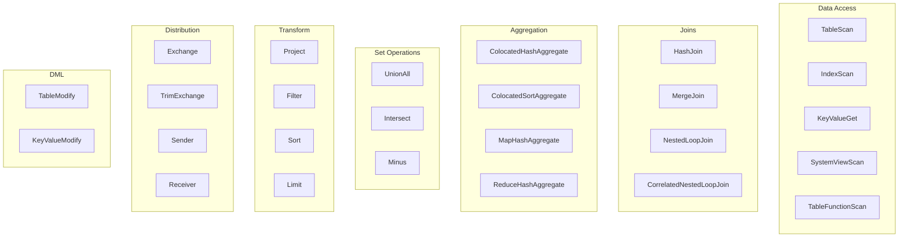

# EXPLAIN 연산자 참조

이 참조 문서는 `EXPLAIN` 출력에 나타나는 모든 연산자를 다룹니다. 연산자는 쿼리 실행에서 수행하는 역할에 따라 카테고리로 나뉩니다.

## 빠른 참조 {#quick-reference}

| 연산자 | 카테고리 | 설명 |
|----------|----------|-------------|
| TableScan | 접근 | 테이블 전체 스캔 |
| IndexScan | 접근 | 경계를 선택적으로 지정할 수 있는 인덱스 기반 스캔 |
| KeyValueGet | 접근 | 직접 키 조회 |
| HashJoin | 조인 | 해시 기반 조인 |
| MergeJoin | 조인 | 정렬된 데이터의 병합 조인 |
| NestedLoopJoin | 조인 | 중첩 반복 조인 |
| ColocatedHashAggregate | 집계 | 단일 패스 해시 집계 |
| MapHashAggregate | 집계 | 분산 집계의 첫 번째 단계 |
| ReduceHashAggregate | 집계 | 분산 집계의 마지막 단계 |
| Project | 변환 | 컬럼 프로젝션 |
| Filter | 변환 | 행 필터링 |
| Sort | 변환 | 행 정렬 |
| Exchange | 분산 | 노드 간 데이터 재분산 |
| Sender/Receiver | 분산 | 프래그먼트 간 통신 |

## ColocatedHashAggregate

집계 연산은 하나 이상의 그룹화 키 집합을 기준으로 입력 데이터를 그룹으로 묶고, 그룹화 키의 각 조합마다 집계 함수를 계산합니다. 콜로케이션된 집계는 데이터가 이미 그룹화 키에 따라 분산되어 있다고 가정하므로, 단일 패스로 로컬에서 집계를 완료합니다. 해시 집계 연산은 동일한 튜플을 통합하기 위해 그룹화 집합마다 해시 테이블을 유지합니다. 출력 행은 다음과 같은 순서로 구성됩니다: 먼저 `group` 속성에 나열된 순서대로 그룹화 키에 참여하는 컬럼이 오고, 그다음 `aggregation` 속성에 나열된 순서대로 누산기 결과가 옵니다.

**속성:**

- `group`: 그룹화 컬럼 집합입니다.
- `aggregation`: 누산기 목록입니다.
- `est`: 예상 출력 행 수입니다.
- `groupSets`: CUBE나 ROLLUP과 같은 고급 그룹화를 위한 그룹화 키 정의 목록입니다. 선택 사항입니다.
- `fieldNames`: 생성된 행의 컬럼 이름 목록입니다. 선택 사항입니다.

## ColocatedSortAggregate

집계 연산은 하나 이상의 그룹화 키 집합을 기준으로 입력 데이터를 그룹으로 묶고, 그룹화 키의 각 조합마다 집계 함수를 계산합니다. 콜로케이션된 집계는 데이터가 이미 그룹화 키에 따라 분산되어 있다고 가정하므로, 단일 패스로 로컬에서 집계를 완료합니다. 정렬 집계 연산은 그룹화 표현식으로 정렬된 데이터를 활용해 각 그룹화 집합의 데이터를 튜플 단위로 스트리밍 방식으로 계산합니다. 출력 행은 다음과 같은 순서로 구성됩니다: 먼저 `group` 속성에 나열된 순서대로 그룹화 키에 참여하는 컬럼이 오고, 그다음 `aggregation` 속성에 나열된 순서대로 누산기 결과가 옵니다.

**속성:**

- `group`: 그룹화 컬럼 집합입니다.
- `aggregation`: 누산기 목록입니다.
- `collation`: 이 연산자가 근거로 삼는 정렬 컬럼과 예상 정렬 순서 목록입니다.
- `est`: 예상 출력 행 수입니다.
- `groupSets`: CUBE나 ROLLUP과 같은 고급 그룹화를 위한 그룹화 키 정의 목록입니다. 선택 사항입니다.
- `fieldNames`: 생성된 행의 컬럼 이름 목록입니다. 선택 사항입니다.

## MapHashAggregate

집계 연산은 하나 이상의 그룹화 키 집합을 기준으로 입력 데이터를 그룹으로 묶고, 그룹화 키의 각 조합마다 집계 함수를 계산합니다. Map 집계는 2단계 집계의 첫 번째 단계입니다. 첫 번째 단계에서는 데이터를 미리 집계한 뒤, 그 결과를 REDUCE가 실행되는 곳으로 전송합니다. 해시 집계 연산은 동일한 튜플을 통합하기 위해 그룹화 집합마다 해시 테이블을 유지합니다. 출력 행은 다음과 같은 순서로 구성됩니다: 먼저 `group` 속성에 나열된 순서대로 그룹화 키에 참여하는 컬럼이 오고, 그다음 `aggregation` 속성에 나열된 순서대로 누산기 결과가 옵니다.

**속성:**

- `group`: 그룹화 컬럼 집합입니다.
- `aggregation`: 누산기 목록입니다.
- `est`: 예상 출력 행 수입니다.
- `groupSets`: CUBE나 ROLLUP과 같은 고급 그룹화를 위한 그룹화 키 정의 목록입니다. 선택 사항입니다.
- `fieldNames`: 생성된 행의 컬럼 이름 목록입니다. 선택 사항입니다.

## ReduceHashAggregate

집계 연산은 하나 이상의 그룹화 키 집합을 기준으로 입력 데이터를 그룹으로 묶고, 그룹화 키의 각 조합마다 집계 함수를 계산합니다. Reduce 집계는 2단계 집계의 두 번째 단계입니다. 두 번째 단계에서는 미리 집계된 모든 데이터를 하나로 병합해 최종 결과를 반환합니다. 해시 집계 연산은 동일한 튜플을 통합하기 위해 그룹화 집합마다 해시 테이블을 유지합니다. 출력 행은 다음과 같은 순서로 구성됩니다: 먼저 `group` 속성에 나열된 순서대로 그룹화 키에 참여하는 컬럼이 오고, 그다음 `aggregation` 속성에 나열된 순서대로 누산기 결과가 옵니다.

**속성:**

- `group`: 그룹화 컬럼 집합입니다.
- `aggregation`: 누산기 목록입니다.
- `est`: 예상 출력 행 수입니다.
- `groupSets`: CUBE나 ROLLUP과 같은 고급 그룹화를 위한 그룹화 키 정의 목록입니다. 선택 사항입니다.
- `fieldNames`: 생성된 행의 컬럼 이름 목록입니다. 선택 사항입니다.

## MapSortAggregate

집계 연산은 하나 이상의 그룹화 키 집합을 기준으로 입력 데이터를 그룹으로 묶고, 그룹화 키의 각 조합마다 집계 함수를 계산합니다. Map 집계는 2단계 집계의 첫 번째 단계입니다. 첫 번째 단계에서는 데이터를 미리 집계한 뒤, 그 결과를 REDUCE가 실행되는 곳으로 전송합니다. 정렬 집계 연산은 그룹화 표현식으로 정렬된 데이터를 활용해 각 그룹화 집합의 데이터를 튜플 단위로 스트리밍 방식으로 계산합니다. 출력 행은 다음과 같은 순서로 구성됩니다: 먼저 `group` 속성에 나열된 순서대로 그룹화 키에 참여하는 컬럼이 오고, 그다음 `aggregation` 속성에 나열된 순서대로 누산기 결과가 옵니다.

**속성:**

- `group`: 그룹화 컬럼 집합입니다.
- `aggregation`: 누산기 목록입니다.
- `collation`: 이 연산자가 근거로 삼는 정렬 컬럼과 예상 정렬 순서 목록입니다.
- `est`: 예상 출력 행 수입니다.
- `groupSets`: CUBE나 ROLLUP과 같은 고급 그룹화를 위한 그룹화 키 정의 목록입니다. 선택 사항입니다.
- `fieldNames`: 생성된 행의 컬럼 이름 목록입니다. 선택 사항입니다.

## ReduceSortAggregate

집계 연산은 하나 이상의 그룹화 키 집합을 기준으로 입력 데이터를 그룹으로 묶고, 그룹화 키의 각 조합마다 집계 함수를 계산합니다. Reduce 집계는 2단계 집계의 두 번째 단계입니다. 두 번째 단계에서는 미리 집계된 모든 데이터를 하나로 병합해 최종 결과를 반환합니다. 정렬 집계 연산은 그룹화 표현식으로 정렬된 데이터를 활용해 각 그룹화 집합의 데이터를 튜플 단위로 스트리밍 방식으로 계산합니다. 출력 행은 다음과 같은 순서로 구성됩니다: 먼저 `group` 속성에 나열된 순서대로 그룹화 키에 참여하는 컬럼이 오고, 그다음 `aggregation` 속성에 나열된 순서대로 누산기 결과가 옵니다.

**속성:**

- `group`: 그룹화 컬럼 집합입니다.
- `aggregation`: 누산기 목록입니다.
- `collation`: 이 연산자가 근거로 삼는 정렬 컬럼과 예상 정렬 순서 목록입니다.
- `est`: 예상 출력 행 수입니다.
- `groupSets`: CUBE나 ROLLUP과 같은 고급 그룹화를 위한 그룹화 키 정의 목록입니다. 선택 사항입니다.
- `fieldNames`: 생성된 행의 컬럼 이름 목록입니다. 선택 사항입니다.

## ColocatedIntersect

기본 입력의 레코드 중 모든 보조 입력에도 존재하는 레코드를 모두 반환합니다. `all`이 `true`이면 반환되는 각 레코드마다 출력에 min(m, n1, n2, …, n)개의 사본이 포함됩니다. 그렇지 않으면 중복이 제거됩니다.

**속성:**

- `all`: `true`이면 출력에 중복이 포함될 수 있습니다.
- `est`: 예상 출력 행 수입니다.
- `fieldNames`: 생성된 행의 컬럼 이름 목록입니다. 선택 사항입니다.

## ColocatedMinus

기본 입력의 레코드 중 보조 입력과 일치하는 레코드를 제외한 나머지를 모두 반환합니다. `all`이 `true`이면 반환되는 각 레코드마다 출력에 max(0, m - sum(n1, n2, …, n))개의 사본이 포함됩니다. 그렇지 않으면 중복이 제거됩니다.

**속성:**

- `all`: `true`이면 출력에 중복이 포함될 수 있습니다.
- `est`: 예상 출력 행 수입니다.
- `fieldNames`: 생성된 행의 컬럼 이름 목록입니다. 선택 사항입니다.

## MapIntersect

기본 입력의 레코드 중 모든 보조 입력에도 존재하는 레코드를 모두 반환합니다. Map 교집합은 2단계 연산의 첫 번째 단계입니다. 첫 번째 단계에서는 데이터를 미리 집계한 뒤, 그 결과를 REDUCE가 실행되는 곳으로 전송합니다.

**속성:**

- `all`: `true`이면 출력에 중복이 포함될 수 있습니다.
- `est`: 예상 출력 행 수입니다.
- `fieldNames`: 생성된 행의 컬럼 이름 목록입니다. 선택 사항입니다.

## ReduceIntersect

기본 입력의 레코드 중 모든 보조 입력에도 존재하는 레코드를 모두 반환합니다. Reduce 교집합은 2단계 연산의 두 번째 단계입니다. 두 번째 단계에서는 미리 집계된 모든 데이터를 하나로 병합해 최종 결과를 반환합니다. `all`이 `true`이면 반환되는 각 레코드마다 출력에 min(m, n1, n2, …, n)개의 사본이 포함됩니다. 그렇지 않으면 중복이 제거됩니다.

**속성:**

- `all`: `true`이면 출력에 중복이 포함될 수 있습니다.
- `est`: 예상 출력 행 수입니다.
- `fieldNames`: 생성된 행의 컬럼 이름 목록입니다. 선택 사항입니다.

## MapMinus

기본 입력의 레코드 중 보조 입력과 일치하는 레코드를 제외한 나머지를 모두 반환합니다. Map 차집합은 2단계 연산의 첫 번째 단계입니다. 첫 번째 단계에서는 데이터를 미리 집계한 뒤, 그 결과를 REDUCE가 실행되는 곳으로 전송합니다.

**속성:**

- `all`: `true`이면 출력에 중복이 포함될 수 있습니다.
- `est`: 예상 출력 행 수입니다.
- `fieldNames`: 생성된 행의 컬럼 이름 목록입니다. 선택 사항입니다.

## ReduceMinus

기본 입력의 레코드 중 보조 입력과 일치하는 레코드를 제외한 나머지를 모두 반환합니다. Reduce 차집합은 2단계 연산의 두 번째 단계입니다. 두 번째 단계에서는 미리 집계된 모든 데이터를 하나로 병합해 최종 결과를 반환합니다. `all`이 `true`이면 반환되는 각 레코드마다 출력에 max(0, m - sum(n1, n2, …, n))개의 사본이 포함됩니다. 그렇지 않으면 중복이 제거됩니다.

**속성:**

- `all`: `true`이면 출력에 중복이 포함될 수 있습니다.
- `est`: 예상 출력 행 수입니다.
- `fieldNames`: 생성된 행의 컬럼 이름 목록입니다. 선택 사항입니다.

## UnionAll

여러 입력의 결과를 중복 제거 없이 이어붙입니다.

**속성:**

- `est`: 예상 출력 행 수입니다.
- `fieldNames`: 생성된 행의 컬럼 이름 목록입니다. 선택 사항입니다.

## Exchange

지정된 분산 방식에 따라 행을 재분산합니다.

**속성:**

- `distribution`: 행이 노드 전체에 어떻게 분산되는지 설명하는 분산 전략입니다. 가능한 값은 다음과 같습니다.
  - `single`: 데이터의 단일 사본이 하나의 노드에 있습니다.
  - `broadcast`: 참여하는 모든 노드가 전체 데이터의 사본을 각자 보유합니다.
  - `random`: 데이터의 단일 사본이 파티셔닝되어 참여하는 모든 노드에 무작위로 퍼집니다.
  - `hash`: 데이터의 단일 사본이 지정된 컬럼의 시스템 정의 해시 함수를 기준으로 파티셔닝되어 노드에 분산됩니다.
  - `table`: 데이터의 단일 사본이 지정된 테이블의 분산 방식에 맞춰 파티셔닝되어 노드에 분산됩니다.
  - `identity`: 데이터가 지정된 컬럼의 값을 기준으로 분산됩니다.
- `est`: 예상 출력 행 수입니다.

## TrimExchange

지정된 분산 방식에 따라 행을 필터링합니다. 이 연산자는 브로드캐스트된 입력, 즉 참여하는 모든 노드가 전체 데이터의 사본을 각자 보유한 입력을 받아, 출력 행이 지정된 분산 방식을 만족하도록 조건자를 적용합니다.

**속성:**

- `distribution`: 행이 노드 전체에 어떻게 분산되는지 설명하는 분산 전략입니다. 가능한 값은 다음과 같습니다.
  - `random`: 데이터의 단일 사본이 파티셔닝되어 참여하는 모든 노드에 무작위로 퍼집니다.
  - `hash`: 데이터의 단일 사본이 지정된 컬럼의 시스템 정의 해시 함수를 기준으로 파티셔닝되어 노드에 분산됩니다.
  - `table`: 데이터의 단일 사본이 지정된 테이블의 분산 방식에 맞춰 파티셔닝되어 노드에 분산됩니다.
- `est`: 예상 출력 행 수입니다.

## Filter

지정된 조건자에 따라 행을 필터링합니다.

**속성:**

- `predicate`: 필터링 조건입니다.
- `est`: 예상 출력 행 수입니다.

## HashJoin

조인 연산은 조인 표현식을 기준으로 두 개의 개별 입력을 하나의 출력으로 결합합니다. 해시 조인 연산자는 조인 키 집합을 기준으로 오른쪽 입력으로 해시 테이블을 만듭니다. 그런 다음 왼쪽 입력을 대상으로 이 해시 테이블을 탐색해 일치하는 항목을 찾습니다.

**속성:**

- `predicate`: 왼쪽 집합의 각 행이 오른쪽 집합의 행과 "일치"하는지를 나타내는 불리언 조건입니다.
- `type`: 조인 유형입니다(INNER, LEFT, SEMI 등).
- `est`: 예상 출력 행 수입니다.
- `fieldNames`: 생성된 행의 컬럼 이름 목록입니다. 선택 사항입니다.

## MergeJoin

조인 연산은 조인 표현식을 기준으로 두 개의 개별 입력을 하나의 출력으로 결합합니다. 병합 조인은 조인 키를 기준으로 정렬된 두 집합을 활용해 조인을 수행합니다. 이 덕분에 조인 연산을 스트리밍 방식으로 수행합니다.

**속성:**

- `predicate`: 왼쪽 집합의 각 행이 오른쪽 집합의 행과 "일치"하는지를 나타내는 불리언 조건입니다.
- `type`: 조인 유형입니다(INNER, LEFT, SEMI 등).
- `est`: 예상 출력 행 수입니다.
- `fieldNames`: 생성된 행의 컬럼 이름 목록입니다. 선택 사항입니다.

## NestedLoopJoin

조인 연산은 조인 표현식을 기준으로 두 개의 개별 입력을 하나의 출력으로 결합합니다. 중첩 루프 조인 연산자는 오른쪽 입력 전체를 보유한 상태에서 왼쪽 입력으로 이를 반복 처리하며, 모든 행의 카티션 곱의 각 조합에 조인 표현식을 평가해 표현식이 참인 행만 출력합니다.

**속성:**

- `predicate`: 왼쪽 집합의 각 행이 오른쪽 집합의 행과 "일치"하는지를 나타내는 불리언 조건입니다.
- `type`: 조인 유형입니다(INNER, LEFT, SEMI 등).
- `est`: 예상 출력 행 수입니다.
- `fieldNames`: 생성된 행의 컬럼 이름 목록입니다. 선택 사항입니다.

## CorrelatedNestedLoopJoin

조인 연산은 조인 표현식을 기준으로 두 개의 개별 입력을 하나의 출력으로 결합합니다. 상관 중첩 루프 조인 연산자는 왼쪽 입력의 행을 기준으로 상관 변수를 컨텍스트에 설정한 뒤, 갱신된 컨텍스트로 오른쪽 입력을 다시 평가하는 방식으로 조인을 수행합니다.

**속성:**

- `correlates`: 현재 관계형 연산자가 설정하는 상관 변수 집합입니다.
- `predicate`: 왼쪽 집합의 각 행이 오른쪽 집합의 행과 "일치"하는지를 나타내는 불리언 조건입니다.
- `type`: 조인 유형입니다(INNER, LEFT, SEMI 등).
- `est`: 예상 출력 행 수입니다.
- `fieldNames`: 생성된 행의 컬럼 이름 목록입니다. 선택 사항입니다.

## IndexScan

지정된 인덱스를 사용해 행을 스캔합니다. `searchBounds`는 인덱스 스캔이나 조회의 경계를 지정하는 데 사용됩니다. 따라서 지정하지 않으면 모든 행을 읽습니다. `predicate`는 `projection`보다 먼저 적용됩니다. `projection`을 지정하지 않으면 `fieldNames`가 테이블에서 반환되는 컬럼을 나열합니다.

**속성:**

- `table`: 접근하는 테이블입니다.
- `searchBounds`: 범위 스캔이나 포인트 조회의 경계를 나타내는 경계값 목록입니다. 선택 사항입니다.
- `est`: 예상 출력 행 수입니다.
- `predicate`: 필터링 조건입니다. 선택 사항입니다.
- `projection`: 평가할 표현식 목록입니다. 선택 사항입니다.
- `fieldNames`: 생성된 행의 컬럼 이름 목록입니다. 선택 사항입니다.

## TableScan

테이블에서 모든 행을 스캔합니다. `predicate`는 `projection`보다 먼저 적용됩니다. `projection`을 지정하지 않으면 `fieldNames`가 테이블에서 반환되는 컬럼을 나열합니다.

**속성:**

- `table`: 접근하는 테이블입니다.
- `est`: 예상 출력 행 수입니다.
- `predicate`: 필터링 조건입니다. 선택 사항입니다.
- `projection`: 평가할 표현식 목록입니다. 선택 사항입니다.
- `fieldNames`: 생성된 행의 컬럼 이름 목록입니다. 선택 사항입니다.

## KeyValueGet

키 기반 조회 쿼리에서 Key-Value API를 활용하는 최적화된 연산자입니다.

**속성:**

- `table`: 접근하는 테이블입니다.
- `key`: 조회에 사용할 키 표현식입니다.
- `est`: 예상 출력 행 수입니다.
- `predicate`: 필터링 조건입니다. 선택 사항입니다.
- `projection`: 평가할 표현식 목록입니다. 선택 사항입니다.
- `fieldNames`: 생성된 행의 컬럼 이름 목록입니다. 선택 사항입니다.

## KeyValueModify

DML 쿼리에서 Key-Value API를 활용하는 최적화된 연산자입니다.

**속성:**

- `table`: 접근하는 테이블입니다.
- `type`: 데이터 변경 작업의 유형입니다(예: INSERT, UPDATE, DELETE).
- `est`: 예상 출력 행 수입니다.
- `sourceExpression`: INSERT 작업에서 행을 계산하는 데 사용하는 소스 표현식입니다. 선택 사항입니다.
- `key`: DELETE 작업에서 행을 계산하는 데 사용하는 소스 표현식입니다. 선택 사항입니다.
- `fieldNames`: 생성된 행의 컬럼 이름 목록입니다. 선택 사항입니다.

## Limit

반환되는 행 수를 제한하며, 오프셋을 선택적으로 지정할 수 있습니다.

**속성:**

- `est`: 예상 출력 행 수입니다.
- `fetch`: 반환할 최대 행 수입니다. 선택 사항입니다.
- `offset`: 건너뛸 행 수입니다. 선택 사항입니다.

## Project

입력에서 지정된 표현식이나 컬럼으로 프로젝션을 수행합니다.

**속성:**

- `projection`: 평가할 표현식 목록입니다.
- `est`: 예상 출력 행 수입니다.
- `fieldNames`: 생성된 행의 컬럼 이름 목록입니다. 선택 사항입니다.

## Receiver

분산 쿼리 실행 중 `Sender`가 전송한 데이터를 수신합니다.

**속성:**

- `sourceFragmentId`: 소스 프래그먼트의 식별자로, 프래그먼트 간 데이터 흐름 엣지의 출발점을 나타냅니다.
- `est`: 예상 출력 행 수입니다.
- `fieldNames`: 생성된 행의 컬럼 이름 목록입니다. 선택 사항입니다.

## Sender

분산 쿼리 실행 중 `Receiver`로 데이터를 전송합니다.

**속성:**

- `targetFragmentId`: 대상 프래그먼트의 식별자로, 프래그먼트 간 데이터 흐름 엣지의 출발점을 나타냅니다.
- `distribution`: 행이 노드 전체에 어떻게 분산되는지 설명하는 분산 전략입니다. 가능한 값은 다음과 같습니다.
  - `single`: 데이터의 단일 사본이 하나의 노드에 있습니다.
  - `broadcast`: 참여하는 모든 노드가 전체 데이터의 사본을 각자 보유합니다.
  - `random`: 데이터의 단일 사본이 파티셔닝되어 참여하는 모든 노드에 무작위로 퍼집니다.
  - `hash`: 데이터의 단일 사본이 지정된 컬럼의 시스템 정의 해시 함수를 기준으로 파티셔닝되어 노드에 분산됩니다.
  - `table`: 데이터의 단일 사본이 지정된 테이블의 분산 방식에 맞춰 파티셔닝되어 노드에 분산됩니다.
  - `identity`: 데이터가 지정된 컬럼의 값을 기준으로 분산됩니다.
- `est`: 예상 출력 행 수입니다.

## SelectCount

다양한 비트랜잭션 `SELECT COUNT(*)` 쿼리 변형을 위한 최적화된 연산자입니다.

**속성:**

- `table`: 접근하는 테이블입니다.
- `projection`: 평가할 표현식 목록입니다.
- `est`: 예상 출력 행 수입니다.
- `fieldNames`: 생성된 행의 컬럼 이름 목록입니다. 선택 사항입니다.

## Sort

지정된 정렬 기준에 따라 행을 정렬합니다. `fetch` 속성이 지정되면 `Sort` 노드는 Top-N 방식으로 동작하며, 정렬 단계에서 `fetch` + `offset` 개의 행만 메모리에 저장합니다.

**속성:**

- `collation`: 정렬 기준이 되는 필드 목록입니다(하나 이상).
- `est`: 예상 출력 행 수입니다.
- `fetch`: 반환할 최대 행 수입니다. 선택 사항입니다.
- `offset`: 건너뛸 행 수입니다. 선택 사항입니다.

## SystemViewScan

시스템 뷰에서 모든 행을 스캔합니다. `predicate`는 `projection`보다 먼저 적용됩니다. `projection`을 지정하지 않으면 `fieldNames`가 시스템 뷰에서 반환되는 컬럼을 나열합니다.

**속성:**

- `table`: 접근하는 시스템 뷰입니다.
- `est`: 예상 출력 행 수입니다.
- `predicate`: 필터링 조건입니다. 선택 사항입니다.
- `projection`: 평가할 표현식 목록입니다. 선택 사항입니다.
- `fieldNames`: 생성된 행의 컬럼 이름 목록입니다. 선택 사항입니다.

## TableFunctionScan

결과 집합을 생성하는 함수를 대상으로 스캔합니다.

**속성:**

- `invocation`: 소스 결과 집합을 생성하는 함수의 이름입니다.
- `est`: 예상 출력 행 수입니다.
- `fieldNames`: 생성된 행의 컬럼 이름 목록입니다. 선택 사항입니다.

## TableModify

테이블에 DML 작업을 적용합니다(INSERT, UPDATE, DELETE).

**속성:**

- `table`: 접근하는 테이블입니다.
- `type`: 데이터 변경 작업의 유형입니다(예: INSERT, UPDATE, DELETE).
- `est`: 예상 출력 행 수입니다.
- `fieldNames`: 생성된 행의 컬럼 이름 목록입니다. 선택 사항입니다.

## Values

리터럴 인메모리 행을 입력으로 생성합니다(예: `VALUES (1), (2)`).

**속성:**

- `tuples`: 반환할 리터럴 튜플 목록입니다.
- `est`: 예상 출력 행 수입니다.
- `fieldNames`: 생성된 행의 컬럼 이름 목록입니다. 선택 사항입니다.
