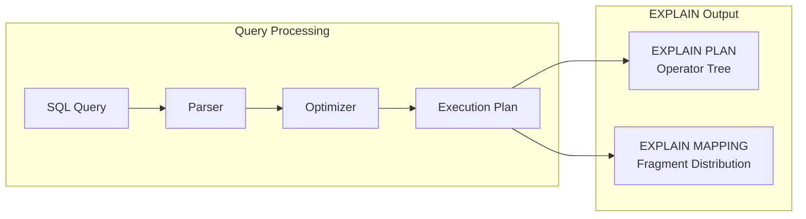
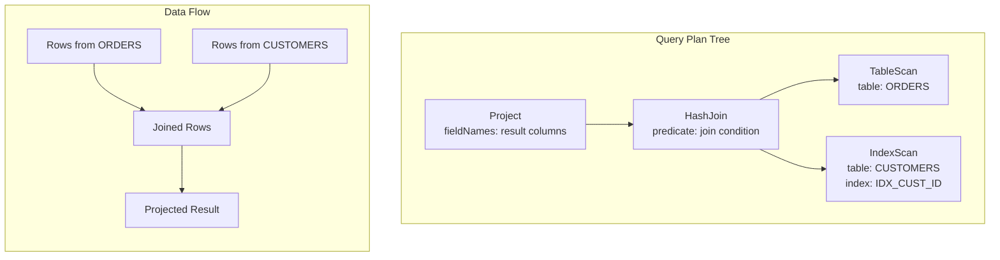
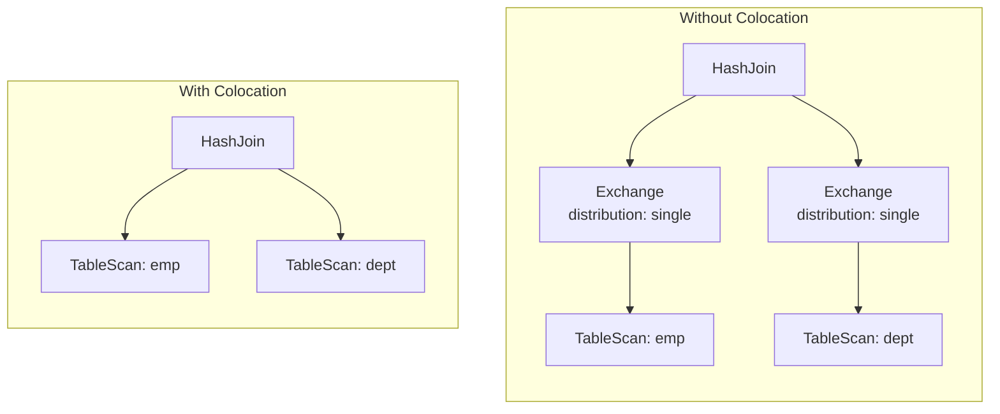

# EXPLAIN 명령어 사용

`EXPLAIN` 명령어는 SQL 쿼리를 실행하지 않고 실행 계획을 표시합니다. 이 명령으로 쿼리 옵티마이저가 쿼리를 처리하는 방식을 파악하고 성능 병목 지점을 찾을 수 있습니다.



실행 계획은 다음을 보여줍니다.

- 테이블 접근 순서와 방식(전체 스캔 대 인덱스 스캔)
- 조인 알고리즘(해시 조인, 병합 조인, 중첩 루프)
- 인덱스 사용 여부와 검색 범위
- 각 단계의 예상 행 수
- 클러스터 노드 전반의 데이터 분산(MAPPING 사용 시)

## EXPLAIN 명령어 구문 {#explain-command-syntax}

Apache Ignite는 `EXPLAIN` 명령어의 두 가지 변형을 지원합니다.

```sql
EXPLAIN [PLAN | MAPPING] FOR <query>
```

`PLAN`과 `MAPPING`을 모두 지정하지 않으면 `PLAN`이 기본으로 적용됩니다.

매개변수:

- `PLAN` - 쿼리를 관계형 연산자 트리 형태로 설명합니다. 이 표현 방식은 옵티마이저와 관련된 성능 문제를 조사하는 데 적합합니다.
- `MAPPING` - 프래그먼트가 클러스터의 특정 노드에 매핑되는 방식으로 쿼리를 설명합니다. 이 표현 방식은 데이터 콜로케이션과 관련된 성능 문제를 조사하는 데 적합합니다.

예시:

```sql
EXPLAIN SELECT * FROM lineitem;
EXPLAIN PLAN FOR SELECT * FROM lineitem;
EXPLAIN MAPPING FOR SELECT * FROM lineitem;
```

## 출력 이해하기 {#understanding-the-output}

각 쿼리 계획은 관계형 연산자로 구성된 트리입니다. 데이터는 리프 노드(테이블 스캔)에서 시작해 변환 노드(조인, 정렬)를 거쳐 루트 노드(최종 결과)로 흘러갑니다.



각 연산자 노드는 다음 정보를 포함합니다.

- **Name**: 사용된 알고리즘(TableScan, HashJoin, Sort 등)
- **Attributes**: 연산자별 세부 정보(테이블 이름, 조건자, 필드 이름)
- **Estimate**: 이 단계에서 예상되는 행 수(`est: (rows=N)`)

```text
OperatorName
    attribute1: value1
    attribute2: value2
    est: (rows=N)
```

### 연산자 범주 {#operator-categories}

| 범주 | 연산자 | 목적 |
|----------|-----------|---------|
| **스캔** | TableScan, IndexScan, SystemViewScan | 테이블에서 데이터를 읽습니다 |
| **조인** | HashJoin, MergeJoin, NestedLoopJoin | 여러 소스의 행을 결합합니다 |
| **집계** | ColocatedHashAggregate, MapSortAggregate | GROUP BY 연산을 수행합니다 |
| **변환** | Project, Filter, Sort, Limit | 결과의 형태와 순서를 조정합니다 |
| **분산** | Exchange, Sender, Receiver | 노드 간 데이터를 이동합니다 |

전체 연산자 목록은 [EXPLAIN 연산자 참조](./explain-operators)를 확인하세요.

### 계획 구조 {#plan-structure}

- **리프 노드**: 데이터 소스(TableScan, IndexScan)
- **내부 노드**: 변환(Join, Sort, Aggregate)
- **루트 노드**: 쿼리 결과를 생성하는 최종 연산자

## 일반적인 쿼리 최적화 문제 {#common-query-optimization-issues}

SQL EXPLAIN 출력을 분석하면 느린 쿼리 실행을 최적화하는 데 도움이 됩니다. 다음 지침을 따르면 SQL 실행에서 흔히 발생하는 병목을 피할 수 있습니다.

- 테이블 전체를 스캔하지 마세요.
- 최적이 아닌 인덱스를 스캔하지 마세요.
- 최적이 아닌 조인 순서나 조인 알고리즘을 피하세요.
- 쿼리에 최적의 데이터 콜로케이션을 보장하세요.

다음 절에서는 쿼리에서 흔히 발생하는 문제와 이를 발견하고 해결하는 방법을 살펴봅니다.

## 인덱스 스캔 대신 전체 스캔 {#full-scan-instead-of-index-scan}

관련 SQL 실행 흐름이 다음과 같다고 가정합니다.

```sql
CREATE TABLE t (id INT PRIMARY KEY, col1 VARCHAR);
CREATE INDEX t_col1_idx ON t(col1);

SELECT id FROM t WHERE col1 = '1';
```

가능한 EXPLAIN 출력은 다음과 같습니다.

```sql
   TableScan
       table: PUBLIC.T
       predicate: =(COL1, _UTF-8'1')
       fieldNames: [ID]
       est: (rows=1)
```

:::note
간단히 하기 위해 이 예시와 이후 예시에서는 EXPLAIN 출력 중 예시와 관련 없는 정보를 생략합니다.
:::

조건자가 있는 전체 스캔(*TableScan* 연산자)이 보입니다. 실행 플래너는 어떤 스캔 구현(**TableScan** 또는 **IndexScan**)을 사용할지 선택합니다. 인덱스 스캔이 더 낫다고 판단되면 `FORCE_INDEX` 힌트로 `IndexScan` 방식을 직접 강제할 수 있습니다.

```sql
SELECT /*+ FORCE_INDEX(t_col1_idx) */ id FROM t WHERE col1 = '1';
```

다음과 같이 다른 계획이 표시됩니다.

```sql
   IndexScan
       table: PUBLIC.T
       index: T_COL1_IDX
       type: SORTED
       predicate: =(COL1, _UTF-8'1')
       searchBounds: [ExactBounds [bound=_UTF-8'1']]
       fieldNames: [ID]
       collation: []
       est: (rows=1)
```

## 최적이 아닌 인덱스 {#suboptimal-indexes}

예측력이 낮은 인덱스가 선택되기도 합니다. 예를 들어 스키마와 쿼리는 다음과 같습니다.

```sql
CREATE TABLE t (id INT PRIMARY KEY, col1 VARCHAR, col2 VARCHAR);
CREATE INDEX t_col1_col2_idx ON T(col1, col2);
CREATE INDEX t_col1_idx ON t(col1);

SELECT id FROM t WHERE col1 = '1' AND col2 = '2';
```

가능한 계획은 다음과 같습니다.

```sql
   IndexScan
       table: PUBLIC.T
       index: T_COL1_IDX
       ...
```

실행에 **T_COL1_IDX** 인덱스가 사용된 것을 확인할 수 있는데, **COL1 = '1' AND COL2 = '2'** 두 조건자가 모두 관련되어 있어 **T_COL1_COL2_IDX** 인덱스가 더 적합합니다. 이 경우 최적의 계획은 다음과 같습니다.

```sql
   IndexScan
       table: PUBLIC.T
       index: T_COL1_COL2_IDX
       ...
```

이를 위해 `FORCE_INDEX` 힌트를 사용할 수도 있습니다.

```sql
SELECT /*+ FORCE_INDEX(t_col1_col2_idx) */ id FROM t WHERE col1 = '1' AND col2 = '2';
```

## 예상치 못한 정렬 연산 {#unexpected-sort-operation}

기본적으로 정렬된 인덱스는 항목을 오름차순으로 저장합니다. ASC 또는 DESC 옵션을 포함하면 정렬된 인덱스의 순서를 조정할 수 있습니다.

스키마와 관련 쿼리가 다음과 같다고 가정합니다.

```sql
CREATE TABLE t1 (id INT PRIMARY KEY, col1 VARCHAR);
CREATE TABLE t2 (id INT PRIMARY KEY, col1 VARCHAR);
CREATE INDEX t1_col1_desc_idx ON t1(col1 DESC);
CREATE INDEX t2_col1_idx ON t2(col1);

SELECT t1.id as t1id, t2.id as t2id FROM t1 JOIN t2 USING (col1);
```

가능한 실행 계획은 다음과 같습니다.

```sql
   MergeJoin
         ...
       Sort
           collation: [COL1 ASC]
           ...
       IndexScan
           index: T2_COL1_IDX
           ...
```

위 예시에서 플래너는 **IndexScan**을 수행하기 전에 **Sort** 연산을 추가하는데, 사용된 인덱스가 내림차순으로 정렬되어 있지만 오름차순이 필요하기 때문입니다.

추가 **Sort** 연산은 성능 비용을 늘리며, 적절한 정렬 순서로 인덱스를 생성하면 이를 피할 수 있습니다.

```sql
CREATE INDEX t1_col1_idx ON t1(col1);
```

이제 계획에 **Sort** 연산이 더 이상 표시되지 않아 쿼리 실행 속도가 향상됩니다.

```sql
   MergeJoin
         ...
       IndexScan
           index: T1_COL1_IDX
           ...
       IndexScan
           index: T2_COL1_IDX
           ...
```

## 상관 서브쿼리의 성능 영향 {#performance-impact-of-correlated-subqueries}

SQL-99 표준은 쿼리 내 거의 모든 위치에서 중첩 서브쿼리를 허용하므로, Ignite 3는 상관 서브쿼리와 비상관 서브쿼리를 모두 포함한 중첩 서브쿼리를 지원합니다. 일부 복잡한 상관 서브쿼리는 성능이 충분하지 않을 수 있습니다. 상관 쿼리 예시를 살펴봅니다.

```sql
CREATE TABLE emp(dept_id INTEGER PRIMARY KEY, name VARCHAR, salary INTEGER);
CREATE TABLE dept(id INTEGER PRIMARY KEY, name VARCHAR);

SELECT emp.name, (SELECT dept.name FROM dept WHERE emp.dept_id=dept.id)
FROM emp
WHERE emp.salary > 1000;
```

여기서 중첩된 상관 서브쿼리가 보입니다. 계획을 살펴봅니다.

```sql
   CorrelatedNestedLoopJoin
         ...
       TableScan
           table: PUBLIC.EMP
           predicate: >(SALARY, 1000)
           ...
     ColocatedHashAggregate
         ...
         TableScan
             table: PUBLIC.DEPT
             predicate: =($cor1.DEPT_ID, ID)
             ...
```

위 예시는 느린 **CorrelatedNestedLoopJoin** 연산을 보여줍니다. 이 연산이 포함된 쿼리는 다음과 같은 여러 문제를 일으킬 수 있습니다.

- 이러한 서브쿼리는 병목이 될 수 있습니다.
- 쿼리가 높은 CPU 부하를 유발할 수 있습니다.
- 특정 쿼리는 예상보다 느리게 실행될 수 있습니다.

비슷한 쿼리에서 성능 문제가 발견되면 중첩 서브쿼리 없이 쿼리를 다시 작성하는 편이 더 효율적입니다. 예를 들면 다음과 같습니다.

```sql
SELECT emp.name, dept.name
FROM emp, dept
WHERE emp.salary > 1000 AND emp.dept_id=dept.id;
```

새 계획은 다음과 같습니다.

```sql
     HashJoin
         predicate: =(DEPT_ID, ID)
         ...
       TableScan
           table: PUBLIC.EMP
           predicate: >(SALARY, 1000)
           ...
         TableScan
             table: PUBLIC.DEPT
             ...
```

**CorrelatedNestedLoopJoin** 연산이 사라졌으므로 이 쿼리는 이전 쿼리보다 성능이 훨씬 좋아집니다.

## 과도한 정렬 {#excessive-sorting}

두 컬럼으로 구성된 인덱스가 있고, 그중 하나는 조건자에, 다른 하나는 정렬에 사용된다고 가정합니다. SQL로는 다음과 같습니다.

```sql
CREATE TABLE emp(dept_id INTEGER PRIMARY KEY, name VARCHAR, salary INTEGER);
CREATE INDEX emp_salary_name_idx ON emp(salary, name);

SELECT dept_id FROM emp WHERE salary = 1 ORDER BY name;
```

예상되는 동작:

- 여기서는 인덱스가 사용되어야 합니다.
- 인덱스가 **name** 컬럼으로 정렬되어 있어 원래 쿼리의 정렬 조건을 충족하므로 추가 정렬이 필요하지 않습니다.

하지만 실제 실행 계획은 다른 결과를 보여줍니다.

```sql
     Sort
         collation: [NAME ASC]
         ...
       TableScan
           table: PUBLIC.EMP
           predicate: =(SALARY, 1)
           ...
```

불필요한 **Sort** 연산자가 보입니다. 쿼리를 약간 리팩터링하면 과도한 정렬을 피할 수 있습니다.

```sql
SELECT dept_id FROM emp WHERE salary = 1 ORDER BY salary, name;
```

계획은 다음과 같이 바뀝니다.

```sql
     IndexScan
         table: PUBLIC.EMP
         index: EMP_SALARY_NAME_IDX
         predicate: =(SALARY, 1)
         ...
```

## SELECT COUNT 최적화 {#select-count-optimization}

일부 쿼리는 최적화를 거쳐 더 효율적인 계획을 사용하게 되면서 성능이 향상됩니다. 예를 들어 다음 쿼리의 계획은:

```sql
SELECT COUNT(*) FROM emp;
```

다음과 같을 수 있습니다.

```sql
 SelectCount
     table: PUBLIC.EMP
     est: (rows=43)
     ...
```

하지만 이 최적화가 적용되지 않는 경우도 많습니다. 이런 경우 계획이 달라질 수 있고 실행에 더 많은 시간이 걸릴 수 있습니다.

위와 같은 쿼리라도 명시적 트랜잭션을 사용하면 다른 계획이 나올 수 있습니다. 예를 들면:

```sql
   ReduceSortAggregate
       ...
       MapSortAggregate
           ...
         TableScan
             table: PUBLIC.EMP
             est: (rows=43)
             ...
```

## 정확한 검색 범위가 없는 인덱스 스캔 {#index-scan-without-exact-search-bounds}

테이블 스캔은 직접 테이블 스캔과 인덱스를 통한 스캔, 두 가지 방식으로 구현됩니다. 인덱스 스캔은 조건자와 검색 범위를 포함합니다. 조건자는 최종 행 비교를 수행합니다. 검색 범위가 없으면 쿼리는 인덱스 스캔을 통한 테이블 스캔(추가 저장소 조회 필요)으로 저하되고, 이후 조건자 비교까지 거치면서 추가 성능 오버헤드 비용이 발생합니다.

다음과 같은 스키마와 쿼리가 있다고 가정합니다.

```sql
CREATE TABLE t (id INTEGER PRIMARY KEY, col1 DECIMAL(5, 3));
CREATE INDEX t_col1_idx ON t(col1);

SELECT id FROM t WHERE col1 = 43;
```

가능한 계획은 다음과 같습니다.

```sql
   IndexScan
       table: PUBLIC.T
       index: T_COL1_IDX
       predicate: =(CAST(COL1):DECIMAL(13, 3), 43.000)
       ...
```

여기서는 **조건자**만 있고 **searchBounds**는 없습니다. 이는 인덱스의 **모든** 행이 조건자를 거치면서 추가 성능 저하를 유발한다는 의미입니다.

여기서는 두 가지 해결 방법이 가능합니다.

- 최적이 아닌 인덱스 사용을 금지할 수 있습니다.
- 타입 유추를 명시적으로 지정해 플래너를 도울 수 있습니다.

### 인덱스 사용 금지 {#prohibit-index-usage}

첫 번째 방법에서는 **NO_INDEX** 힌트로 인덱스 사용을 금지합니다.

```sql
SELECT /*+ NO_INDEX */ id FROM t WHERE col1 = 43;

-- or with direct index mention:

SELECT /*+ NO_INDEX(t_col1_idx) */ id FROM t WHERE col1 = 43;
```

그 결과 다음과 비슷한 계획을 얻습니다.

```sql
   TableScan
       table: PUBLIC.T
       predicate: =(CAST(COL1):DECIMAL(13, 3), 43.000)
       ...
```

### 수동 타입 캐스팅 {#manual-type-casting}

동일한 쿼리에 캐스트를 추가하면 데이터를 특정 타입으로 명시적으로 캐스팅할 수 있습니다.

```sql
SELECT id FROM t WHERE col1 = 43::DECIMAL(5, 3);
```

```sql
   IndexScan
       table: PUBLIC.T
       index: T_COL1_IDX
       predicate: =(COL1, 43.000)
       searchBounds: [ExactBounds [bound=43.000:DECIMAL(5, 3)]]
       ...
```

여기서는 **searchBounds**와 **조건자**가 모두 있습니다. 이는 인덱스를 통한 정확한 조회만 수행된다는 의미입니다.

위와 같은 상황을 조금 더 복잡한 쿼리로도 살펴봅니다.

```sql
CREATE TABLE t (id INT PRIMARY KEY, col1 INT);
CREATE INDEX t_col1_asc_idx ON t (col1);

SELECT * FROM t WHERE col1::varchar = SUBSTR(CURRENT_DATE::varchar, 4);
```

가능한 계획:

```sql
   IndexScan
       table: PUBLIC.T
       index: T_COL1_IDX
       predicate: =(CAST(COL1):VARCHAR CHARACTER SET "UTF-8", SUBSTR(CAST(CURRENT_DATE):VARCHAR CHARACTER SET "UTF-8" NOT NULL, 4))
       ...
```

여기에는 **검색 범위**도 없습니다.

다음과 같이 변경해 보세요.

```sql
SELECT * FROM t WHERE col1 = SUBSTR(CURRENT_DATE::varchar, 4)::int;
```

그러면 가능한 계획은 다음과 같이 바뀝니다.

```sql
   IndexScan
       table: PUBLIC.T
       index: T_COL1_ASC_IDX
       predicate: =(COL1, CAST(SUBSTR(CAST(CURRENT_DATE):VARCHAR CHARACTER SET "UTF-8" NOT NULL, 4)):INTEGER NOT NULL)
       searchBounds: [ExactBounds [bound=CAST(SUBSTR(CAST(CURRENT_DATE):VARCHAR CHARACTER SET "UTF-8" NOT NULL, 4)):INTEGER]]
       ...
```

**searchBounds**가 있으므로 여기서는 더 효율적인 실행 흐름이 예상됩니다.

## 콜로케이션 사용 {#colocation-usage}

데이터 콜로케이션은 관련된 행이 같은 노드에 위치하도록 보장해 조인 시 네트워크 전송을 없앱니다. EXPLAIN 출력은 이를 Exchange 연산자로 보여줍니다.



Exchange 연산자는 노드 간 데이터 이동을 나타냅니다. Exchange 연산자가 적을수록 네트워크 오버헤드가 줄어듭니다.

예를 들어 콜로케이션을 고려하지 않고 테이블을 생성하면:

```sql
-- by default, the table is implicitly colocated by PRIMARY KEY
CREATE TABLE emp(dept_id INTEGER, name VARCHAR, salary INTEGER, PRIMARY KEY(dept_id, name));

-- implicitly colocated by PRIMARY KEY
CREATE TABLE dept(id INTEGER, name VARCHAR, PRIMARY KEY(name, id));
```

쿼리는 다음과 같습니다.

```sql
SELECT emp.name, dept.name FROM emp JOIN dept ON emp.dept_id = dept.id AND emp.salary > 1000;
```

다음과 같은 계획이 나옵니다.

```sql
   HashJoin
       predicate: =(DEPT_ID, ID)
       ...
     Exchange
         ...
       TableScan
           table: PUBLIC.EMP
           ...
     Exchange
         ...
       TableScan
           table: PUBLIC.DEPT
           ...
```

**Exchange** 연산자가 두 개 보이는데, 이는 모든 행이 단일 노드로 전송된 후 조인된다는 의미입니다. 이 실행 흐름은 성능 비용을 유발해 쿼리 실행 속도를 늦춥니다.

**dept** 테이블에 **ID** 컬럼 기준의 명시적 콜로케이션을 추가해 이를 개선해 봅니다.

```sql
-- implicitly colocated by PRIMARY KEY
CREATE TABLE emp(dept_id INTEGER, name VARCHAR, salary INTEGER, PRIMARY KEY(dept_id, name));
-- explicitly colocated by ID
CREATE TABLE dept(id INTEGER, name VARCHAR, PRIMARY KEY(name, id)) COLOCATE BY (id);
```

이제 **emp** 테이블의 종속된 행은 **DEPT.ID** 분산에 따라 **dept**가 행을 보유한 적절한 노드로 전송됩니다.

```sql
     HashJoin
         predicate: =(DEPT_ID, ID)
         ...
       Exchange
           distribution: table PUBLIC.DEPT in zone "Default" by [DEPT_ID]
           ...
         TableScan
             table: PUBLIC.EMP
             ...
       TableScan
           table: PUBLIC.DEPT
           ...
```

이제 **Exchange** 연산자가 하나만 있으며, 이는 다시 한번 **emp** 테이블에서 적절한 **dept** 노드로만 행이 전송된다는 의미입니다.

마지막으로 조인 조건자와 관련된 두 컬럼이 모두 콜로케이션됩니다.

:::note
다음 콜로케이션 예시는 **emp**와 **dept** 테이블이 같은 분산 영역에 속할 때만 동작합니다.
:::

```sql
-- explicitly colocated by DEPT_ID
CREATE TABLE emp(dept_id INTEGER, name VARCHAR, salary INTEGER, PRIMARY KEY(dept_id, name)) COLOCATE BY(dept_id);
-- explicitly colocated by ID
CREATE TABLE dept(id INTEGER, name VARCHAR, PRIMARY KEY(id, name)) COLOCATE BY(id);
```

이제 **emp**와 **dept** 테이블은 모두 콜로케이션되었습니다.

최종 계획은 다음과 같습니다.

```sql
     HashJoin
        predicate: =(DEPT_ID, ID)
         ...
       TableScan
           table: PUBLIC.EMP
           ...
       TableScan
           table: PUBLIC.DEPT
           ...
```

설명에 **Exchange** 연산자가 전혀 없으며, 이는 불필요한 행 전송이 발생하지 않았다는 의미입니다.

## 추가 EXPLAIN 예시 {#additional-explain-examples}

### 예시: 복잡한 조인 쿼리 {#example-complex-join-query}

```sql
EXPLAIN PLAN FOR
 SELECT
      U.UserName, P.ProductName, R.ReviewText, R.Rating
   FROM Users U, Reviews R, Products P
  WHERE U.UserID = R.UserID
    AND R.ProductID = P.ProductID
    AND P.ProductName = 'Product_' || ?::varchar
```

결과 출력은 다음과 같습니다.

```text
Project
    fieldNames: [USERNAME, PRODUCTNAME, REVIEWTEXT, RATING]
    projection: [USERNAME, PRODUCTNAME, REVIEWTEXT, RATING]
    est: (rows=16650)
  HashJoin
      predicate: =(USERID$0, USERID)
      fieldNames: [PRODUCTID, USERID, REVIEWTEXT, RATING, PRODUCTID$0, PRODUCTNAME, USERID$0, USERNAME]
      type: inner
      est: (rows=16650)
    HashJoin
        predicate: =(PRODUCTID, PRODUCTID$0)
        fieldNames: [PRODUCTID, USERID, REVIEWTEXT, RATING, PRODUCTID$0, PRODUCTNAME]
        type: inner
        est: (rows=16650)
      Exchange
          distribution: single
          est: (rows=50000)
        TableScan
            table: PUBLIC.REVIEWS
            fieldNames: [PRODUCTID, USERID, REVIEWTEXT, RATING]
            est: (rows=50000)
      Exchange
          distribution: single
          est: (rows=1665)
        TableScan
            table: PUBLIC.PRODUCTS
            predicate: =(PRODUCTNAME, ||(_UTF-8'Product_', CAST(?0):VARCHAR CHARACTER SET "UTF-8"))
            fieldNames: [PRODUCTID, PRODUCTNAME]
            est: (rows=1665)
    Exchange
        distribution: single
        est: (rows=10000)
      TableScan
          table: PUBLIC.USERS
          fieldNames: [USERID, USERNAME]
          est: (rows=10000)
```

이 실행 계획은 `USERS`, `REVIEWS`, `PRODUCTS` 세 테이블을 조인하고, 제품명으로 필터링한 뒤 네 개의 필드를 선택하는 쿼리를 나타냅니다.

- **Project**(루트 노드): 최종 선택 필드(USERNAME, PRODUCTNAME, REVIEWTEXT, RATING)를 출력합니다.
- **HashJoins**(두 단계): 내부 조인을 수행합니다.
  - 첫 번째(가장 아래) 조인은 PRODUCTID를 기준으로 REVIEWS와 PRODUCTS를 조인합니다.
  - 두 번째 조인은 그 결과를 USERID를 기준으로 USERS와 조인합니다.
- **TableScans**: 각 테이블을 스캔합니다.
  - REVIEWS는 전체 스캔됩니다.
  - PRODUCTS는 PRODUCTNAME 필터를 적용해 스캔됩니다.
  - USERS는 전체 스캔됩니다.
- **Exchange** 노드: 연산자 간 데이터 재분산을 나타냅니다.

각 노드는 다음을 포함합니다.

- `fieldNames`: 해당 단계의 출력 컬럼입니다.
- `predicate`: 조인 또는 필터 조건입니다.
- `est`: 계획의 해당 지점에서 예상되는 행 수입니다.

### 예시: 쿼리 매핑 {#example-query-mapping}

EXPLAIN MAPPING 명령어의 결과에는 쿼리가 클러스터 토폴로지에 어떻게 매핑되는지 파악할 수 있는 추가 메타데이터가 포함됩니다. 예를 들어 다음과 같은 명령어에 대해:

```sql
EXPLAIN MAPPING FOR
 SELECT
      U.UserName, P.ProductName, R.ReviewText, R.Rating
   FROM Users U, Reviews R, Products P
  WHERE U.UserID = R.UserID
    AND R.ProductID = P.ProductID
    AND P.ProductName = 'Product_' || ?::varchar
```

결과 출력은 다음과 같습니다.

```text
Fragment#0 root
  distribution: single
  executionNodes: [node_1]
  tree:
    Project
        fieldNames: [USERNAME, PRODUCTNAME, REVIEWTEXT, RATING]
        projection: [USERNAME, PRODUCTNAME, REVIEWTEXT, RATING]
        est: (rows=1)
      HashJoin
          predicate: =(USERID$0, USERID)
          fieldNames: [PRODUCTID, USERID, REVIEWTEXT, RATING, PRODUCTID$0, PRODUCTNAME, USERID$0, USERNAME]
          type: inner
          est: (rows=1)
        HashJoin
            predicate: =(PRODUCTID, PRODUCTID$0)
            fieldNames: [PRODUCTID, USERID, REVIEWTEXT, RATING, PRODUCTID$0, PRODUCTNAME]
            type: inner
            est: (rows=1)
          Receiver
              fieldNames: [PRODUCTID, USERID, REVIEWTEXT, RATING]
              sourceFragmentId: 1
              est: (rows=1)
          Receiver
              fieldNames: [PRODUCTID, PRODUCTNAME]
              sourceFragmentId: 2
              est: (rows=1)
        Receiver
            fieldNames: [USERID, USERNAME]
            sourceFragmentId: 3
            est: (rows=1)

Fragment#1
  distribution: random
  executionNodes: [node_1, node_2, node_3]
  partitions: [REVIEWS=[node_1={0, 2, 5, 6, 7, 8, 9, 10, 12, 13, 20}, node_2={1, 3, 11, 19, 21, 22, 23, 24}, node_3={4, 14, 15, 16, 17, 18}]]
  tree:
    Sender
        distribution: single
        targetFragmentId: 0
        est: (rows=50000)
      TableScan
          table: PUBLIC.REVIEWS
          fieldNames: [PRODUCTID, USERID, REVIEWTEXT, RATING]
          est: (rows=50000)

Fragment#2
  distribution: table PUBLIC.PRODUCTS in zone "Default"
  executionNodes: [node_1, node_2, node_3]
  partitions: [PRODUCTS=[node_1={0, 2, 5, 6, 7, 8, 9, 10, 12, 13, 20}, node_2={1, 3, 11, 19, 21, 22, 23, 24}, node_3={4, 14, 15, 16, 17, 18}]]
  tree:
    Sender
        distribution: single
        targetFragmentId: 0
        est: (rows=1665)
      TableScan
          table: PUBLIC.PRODUCTS
          predicate: =(PRODUCTNAME, ||(_UTF-8'Product_', CAST(?0):VARCHAR CHARACTER SET "UTF-8"))
          fieldNames: [PRODUCTID, PRODUCTNAME]
          est: (rows=1665)

Fragment#3
  distribution: table PUBLIC.USERS in zone "Default"
  executionNodes: [node_1, node_2, node_3]
  partitions: [USERS=[node_1={0, 2, 5, 6, 7, 8, 9, 10, 12, 13, 20}, node_2={1, 3, 11, 19, 21, 22, 23, 24}, node_3={4, 14, 15, 16, 17, 18}]]
  tree:
    Sender
        distribution: single
        targetFragmentId: 0
        est: (rows=10000)
      TableScan
          table: PUBLIC.USERS
          fieldNames: [USERID, USERNAME]
          est: (rows=10000)
```

여기서:

- **Fragment#0**은 id=0인 프래그먼트를 의미합니다.
- **root**는 루트 프래그먼트로 간주되는 프래그먼트, 즉 사용자 커서를 나타내는 프래그먼트를 표시합니다.
- **distribution** 속성은 해당 프래그먼트에 어떤 매핑 전략이 적용되었는지 알려줍니다.
- **executionNodes** 속성은 이 프래그먼트가 실행될 노드 목록을 제공합니다.
- **partitions** 속성은 어떤 테이블의 어떤 파티션이 어떤 노드에서 읽히는지 알려줍니다.
- **tree** 속성은 관계형 트리의 어느 부분이 이 프래그먼트에 해당하는지 지정합니다.

위 출력은 쿼리가 여러 실행 프래그먼트로 나뉘어 클러스터 전체에 분산되는 방식을 보여주며, 논리적 실행 계획과 이것이 물리적 토폴로지에 매핑되는 방식을 모두 담고 있습니다.

쿼리는 계획의 루트 역할을 하는 *Fragment#0*에서 실행을 시작합니다(최종 결과가 여기서 생성됩니다). 이 프래그먼트는 단일 노드(`node_1`)에서 실행되며, 프로젝션과 두 개의 중첩 해시 조인을 포함한 쿼리의 주요 로직을 담고 있습니다. 테이블을 직접 스캔하는 대신, `Receiver` 연산자를 통해 다른 프래그먼트로부터 데이터를 받습니다. 이렇게 들어오는 스트림은 `REVIEWS`, `PRODUCTS`, `USERS` 테이블에 해당합니다.

실제 테이블 스캔은 각각 관련 테이블 하나씩을 담당하는 *Fragment 1부터 3*에서 발생합니다. 이 프래그먼트는 클러스터 전체에서 병렬로 동작합니다. 각 프래그먼트는 해당 테이블을 스캔한 뒤 결과를 Fragment#0으로 돌려보냅니다.

- *Fragment#1*은 `REVIEWS` 테이블을 처리합니다. 모든 노드에서 실행되며 랜덤 분산 전략을 사용합니다. 데이터는 노드 전체에 파티셔닝되어 있고, 테이블 스캔 후 결과가 상위로 전송됩니다.
- *Fragment#2*는 `PRODUCTS` 테이블을 담당합니다. 이 역시 모든 노드에서 실행되지만 테이블의 파티셔닝과 연결된 영역 기반 분산을 따릅니다. `PRODUCTNAME`에 필터가 적용되어 루트로 전송되는 데이터양이 줄어듭니다.
- *Fragment#3*은 `USERS` 테이블을 다룹니다. 다른 프래그먼트와 마찬가지로 분산되어 있으며 클러스터 전체에 퍼져 있는 테이블 파티션에서 데이터를 읽습니다.

각 프래그먼트에는 실행되는 노드, 데이터 파티셔닝 방식, 프래그먼트 간 결과 전송 방식 같은 메타데이터가 포함됩니다. 이 구조는 쿼리가 논리적으로 어떻게 처리되는지뿐 아니라, 분산 환경에서 워크로드가 어떻게 나뉘어 조율되는지도 명확히 보여줍니다.
